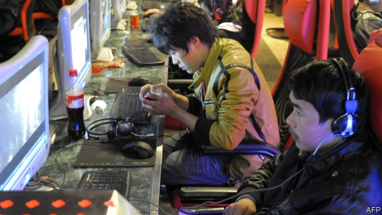
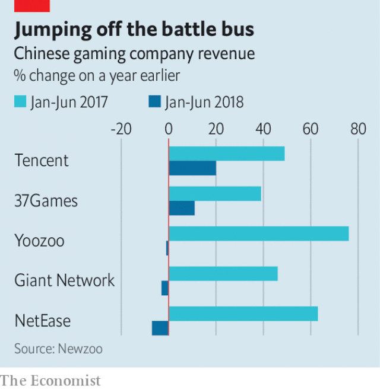

###### Game on

# China ends a long freeze on new video games 

##### Its new approval regime involves censoring porn, gambling and violence 

 

> Jan 3rd 2019 

 

THE BACKLOG of new titles awaiting approval has probably surpassed 5,000, so the news on December 29th that 80 new video games had received the blessing of the Chinese government might have seemed underwhelming. But for game developers, any let-up is welcome. After a reshuffle in March that put the new media regulator, the State Administration of Press and Publication, under direct control of the Communist Party’s propaganda department, the firms were forced to forgo profits for the year on all new games. 

 

China’s gaming market, which in 2016 became the world’s largest, generates over $30bn in revenue a year. Among its heavy-hitters are Tencent, which called the unclogging “decidedly inspiring”, and NetEase. Shares in each firm have fallen by about 30% over the past year, as revenue growth slowed sharply (see chart). When the news came their share prices ticked up a little. Both companies’ titles were absent from the first lot of licence approvals, which was dominated by small developers, most of which rely on just a game or two to make money. Observers reckon the backlog is being worked through in the order that the titles were submitted, and that the titans’ titles will be approved in due course. 

Over time, their fat budgets relative to smaller firms should help them stay in lockstep with the government as it tightens protections on young gamers—it fears for their eyesight and mental health—and expunges content not in line with “core socialist values”. Tencent has already been regulating itself. It has launched an “anti-addiction” measure for “Honour of Kings”, one of its blockbusters, to limit the play time of under-12s to one hour a day (with a night-time curfew), and that of teens to two hours. Since November it has been expanding this, as well as new ID checks by facial recognition, to all its games. 

Karen Chan of Jefferies, a bank, anticipates that larger batches will continue to receive licences this year, but that their numbers are likely to be less than half those before the freeze, then of 700-800 a month. The government has also warned that it will set a cap on the number of new games; this will mostly crimp developers of low-quality copycats, as well as poker and mah-jong platforms, reckons Niko Partners, a technology consultancy. Even though the latter are played for virtual tokens not cash, they are perceived as unsavoury by the government. In September Tencent shut down its well-loved “Texas Hold ’Em” poker game. 

A sweeping sanitisation of content is likely to affect a wider array of games. In December the propaganda department announced a new ethics committee to scrutinise video games. How it operates is fuzzy, but the department has said that among its targets are violence, porn and the rewriting of history. One media outlet that is close to the party criticised “Honour of Kings” for misleading children by giving its characters the name of Chinese historical figures but changing their story—by, for example, turning a Tang-dynasty poet into an assassin, and allowing China’s first physician to cure as well as poison. The department will also put out industry guidelines on how to “abide by social morality”. Among the first set of 20 (undisclosed) titles that it reviewed, the committee requested edits to 11 and rejected nine outright. 

Demand from gamers is as buoyant as ever. Rather than wait, some indie developers launched their unlicensed games on Steam, an American distribution platform, of which a local version is soon set to start officially. Chinese gamers who accessed them there made titles such as “The Scrolls of Taiwu”, a martial-arts fantasy, and “Chinese Parents” (in which the player is the child of a tiger mum trying to balance parents’ educational expectations with mental health) into strong sellers. 

Undimmed too is a surge in female enthusiasm. Nearly half of all gamers in China are now women, compared with two-fifths in America, owing to a mix of social media, sleek game design and mobile adoption. Ever more games are aimed at them, such as “Love and the Producer”, which involves dating four virtual supermen. It has been wildly popular with women in their 20s. About the same number of women play the mobile version of “Honour of Kings” as do men. One forecast puts revenue from female gamers at 57bn yuan ($8bn) within two years, up by a third from 2017. For the most dexterous developers, there are plenty of rewards left to unlock. 

