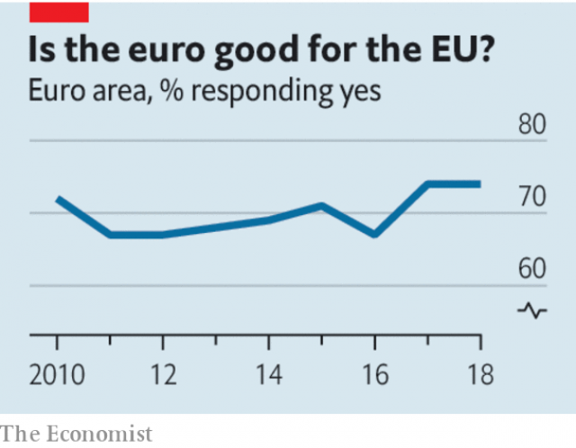

###### EUR not safe yet

# The euro still needs fixing 

##### How to make the single currency’s next 20 years better than the first 20 

 

> Jan 3rd 2019 

 

THE BIRTH of the euro on January 1st 1999 was at once unifying and divisive. It united Europe’s leaders, who hailed a new era of tighter integration, easier trade and faster growth, thinking they were building a currency to rival the dollar. But the euro divided economists, some of whom warned that binding Europe’s disparate economies to a single monetary policy was an act of historic folly. They preferred a comparison with emerging markets, whose dependence on distant central banks fosters frequent crises. Milton Friedman predicted that a downturn in the global economy could pull the new currency apart. 

For years the sovereign-debt crisis that engulfed Europe after 2010 seemed close to fulfilling Friedman’s prediction. But the euro did not collapse. It stumbled on, often thanks to last-minute fixes by leaders who, though deeply divided, showed a steely commitment to saving the single currency. Public support for the project remains strong. Over three in five euro-zone residents say the single currency is good for their country. Three-quarters say it is good for the EU. 

However, that support does not reflect economic or policy success. Euro-zone countries have never looked as if they all belong in one currency union, stripped of independent monetary policies and the ability to devalue their exchange rates. Italy’s living standards are barely higher than they were in 1999. Spain and Ireland have recently enjoyed decent growth following laudable structural reforms, but their adjustments have been long and hard, and remain incomplete. In Spain the youth unemployment rate is 35%. Wage growth is slow almost everywhere. 

 

The euro’s history is littered with errors by technocrats. The worst was to fail to recognise quickly in 2010 that Greece’s debts were unpayable and that its bondholders would have to bear losses. Greece has endured a prolonged depression and its economy is almost a quarter smaller than it was a decade ago. The European Central Bank has an ignominious history of setting monetary policy that is too restrictive for the euro zone as a whole, let alone its depressed areas. It was slow to react to the financial crash in 2008, arrogantly viewing it as an American problem. In 2011 it helped to tip Europe back into recession by raising interest rates too early. The ECB’s finest hour—Mario Draghi’s promise in 2012 to do “whatever it takes” to save the euro—was an impromptu act. 

Leaders may be committed to the euro, but they cannot agree on how to fix it (see Briefing). The crisis exposed the depth of the divide between creditor and debtor countries: northern voters simply will not pay for fecklessness elsewhere. Economic stagnation helped populists to power in Greece and Italy. Because reform has been slow, the crisis could flare up again. If so, Europe will have to withstand it in a political environment that is much more divided than it was in 2010. 

Technically, the path to a stable euro is clear. The first step is ensuring that banks and sovereigns are less liable to drag each other down in a crisis. Europe’s banks are parochial, preferring to hold the sovereign debt of their respective home countries. Instead, they should be encouraged to hold a new safe asset, composed of the debt of many member states. Otherwise, when a country gets into debt trouble, its banks will face a simultaneous crisis, damaging the economy. Similarly, sovereigns must be shielded from banking crises. A central fund to recapitalise distressed banks is already being beefed up, but deposit insurance should also be pooled. This has been more or less agreed on in principle, but countries disagree over the speed of the transition. 

Other necessary reforms are still more contentious. If the euro zone’s disparate economies are to see off local economic shocks, like collapsing housing bubbles, they need a replacement for their lost monetary independence. Were countries to run a tight ship during booms, in line with the EU’s rules, they would have more leeway for fiscal stimulus in crunches. But that advice is of no use to countries like Italy that are hemmed in by decades-old debts. Residents of indebted states cannot be expected to endure perpetual stagnation. 

Instead, the euro zone should have some centralised counter-cyclical fiscal policy, as Emmanuel Macron, France’s president, has called for. This does not mean letting countries off reform; it should not mean paying off their creditors. But it might include targeted investment spending, say, or shared unemployment insurance, to shield against deep economic downturns. The aim should be to avoid a repeat of the self-defeating fiscal contractions after the latest crisis. 

This degree of risk-sharing may involve more transfers than northern voters can bear. But without it, the euro’s next 20 years will be little better than the last 20. And when crisis strikes, Europe’s leaders may find that political will, however substantial it was last time, is not enough. 

