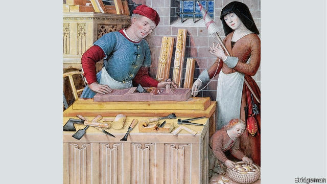

###### History

# In the Middle Ages there was no such thing as childhood 

##### How perceptions of children have changed through history 

 

> Jan 5th 2019 

 

FOR MOST of Western history, childhood was nasty, brutish and short, or even non-existent. Before modern medicine and public-health standards, many infants did not live to see their first birthday—and if they did, they were expected to grow up at the double. In the two millennia from antiquity to the 17th century, children were mostly seen as imperfect adults. Medieval works of art typically depict them as miniature grown-ups. In 1960 one of the first historians of childhood, Philippe Ariès, declared that in medieval Europe the idea of childhood did not exist. Most people were not even sure of their own age. 

For much of that time newborns were considered intrinsically evil, burdened with original sin from which they had to be redeemed through instruction and education. That changed in the 17th century, when children instead began to be seen as innocents who must be protected from harm and corruption by the adult world. Childhood came to be regarded as a separate stage of life. John Locke, a 17th-century English thinker, saw the mind of a newborn child as a blank sheet, to be filled in by its elders and betters. A few decades later Jean-Jacques Rousseau, a Swiss philosopher, argued that children had their own way of seeing, thinking, feeling and reasoning and should be left to develop as nature intended. In the late 18th and early 19th century the Romantics went one better, crediting children with deeper wisdom than adults. 

Parents’ relative lack of interest in their children in the Middle Ages may have been a rational response to a distressingly high infant mortality rate, reckoned to have been around 200-300 per 1,000 live births in the first year of life, compared with single figures per 1,000 in rich countries now. Many others were wiped out by diseases and accidents before the age of ten. Parents would not want to get too attached to a child who might not be around for long. Besides, in the absence of reliable birth control, families tended to be large, so less attention would be focused on each individual sibling. 

Young children were encouraged to take part in adult activities as soon as they were able, usually starting between the ages of five and seven, and begin to work alongside grown-ups as they became more capable. In agrarian societies they had always been expected to help out at home and in the fields from an early age. In post-revolutionary America they were expected to become independent as soon as possible because labour was in short supply, which made the relationship between the generations less hierarchical than in Europe. 

The Industrial Revolution turned children into an indispensable source of income for many poor families, often before they were fully grown. In Britain a parliamentary report in 1818-19 on children in cotton mills around Stockport and Manchester put the average age for starting work at around 11½. 

But by the end of the 19th century the state had begun to clamp down on the exploitation of children in the West. Education for the younger age groups became mandatory in ever more countries. Children were seen as in need of protection, and their period of economic dependency lengthened in both Europe and America. The scene was set for the emergence of what Viviana Zelizer, a sociologist at Princeton, has memorably described as “the economically useless but emotionally priceless child”. 

