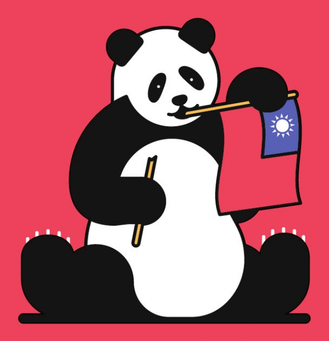

###### Banyan

# Even as Taiwan perfects its democracy, China is sabotaging it 

##### Voters decide on everything except the thing that really matters 

 

> Jan 10th 2019 

 

“POWER TO THE people” read the words newly emblazoned across the floor of the grandest old building in Taipei. The slogan is part of an exhibit about the history of the structure, which was built to house the offices of the colonial governor sent from Japan. It later served as the seat of administrators dispatched from Beijing and then of the dictators who ruled Taiwan after its split from China in 1949. For the past 22 years, however, it has hosted Taiwan’s democratically elected presidents. The ground floor is open to the public every weekday morning—no booking required. 

Such openness is one of the many ways in which power does indeed rest with the people in Taiwan. On a recent visit Banyan faced tighter security getting into his hotel than into the offices of members of parliament. He was also slightly befuddled to be told by Audrey Tang, the minister in charge of digital outreach, that she practised a policy of “radical transparency” and that transcripts of all her meetings, including any interviews, are published online ten working days after the event (she leaves the room when the cabinet starts talking about national security). 

Then there is the law on referendums, which was amended in 2017 to make it easier to get them on the ballot. Even though there are competitive elections, a free and diverse press and an ingrained culture of mass protest about everything from nuclear power to public pensions, the ruling Democratic Progressive Party (DPP) decided that it was not easy enough for ordinary people to make their voices heard. Now any question for which activists can muster the signatures of 1.5% of the electorate earns a spot on the ballot. At nationwide local elections in November, nine made the cut. The government must act on the results, provided the turnout is high enough—which it was. 

By any standard, let alone that of most countries in the region, democracy in Taiwan is thriving. Yet, by the admission of Tsai Ing-wen, the president, it faces a potentially fatal threat: “China’s attempts to use the openness and freedom of our democratic system to interfere in Taiwan’s internal politics and social development”. Her government, which did very badly in the elections, accused China of meddling in them by spreading disinformation, steering money to the opposition and inducing Taiwanese media to provide slanted coverage. China’s president, Xi Jinping, seemed implicitly to acknowledge such a campaign earlier this month when he gleefully declared that China had won “a great victory in frustrating the Taiwan independence movement”—an apparent reference to the electoral defeat of Ms Tsai’s DPP, which would like to abandon the idea that Taiwan and China will eventually be unified and instead officially declare Taiwan a separate country. 

Ms Tang talks excitedly about countering Chinese disinformation by getting the government to respond faster to online falsehoods. She wants official denials to appear within four hours. Ms Tsai says she has instructed the security services to prepare countermeasures. That is all well and good, but it is really another way of saying that the government does not know what it can do. Big Taiwanese firms have invested heavily in China. It is the easiest thing in the world for the Chinese government to signal to them that, if they want their investments to prosper, they should donate money to certain politicians back home, or even purchase a media outlet that propagates views considered distasteful by the Chinese leadership, to institute friendlier coverage. 

There are plenty of ways for China to influence humbler voters, too. It cut off the flow of package tourists to signal its disapproval after Ms Tsai was elected in 2016, hurting small businesses. Analysts expect a flood of tourists to Kaohsiung, the third-biggest city and a DPP stronghold, after it unexpectedly chose a mayor from the opposition Kuomintang, which advocates warmer relations with China. And since a tenth of working-age Taiwanese live in China, and 29% of exports go there, voters are reluctant to antagonise their looming neighbour. 

There is a horrible irony in the fact that Taiwan has succeeded in instituting a model democracy in which all big decisions are up to voters except the one that seems most important: whether Taiwan should be a country at all. Indeed, the referendum law makes that explicit, by allowing votes on any subject except cross-strait relations. Taiwan may have transferred power to its people, in short, but China has already begun to yank it away from them. 

