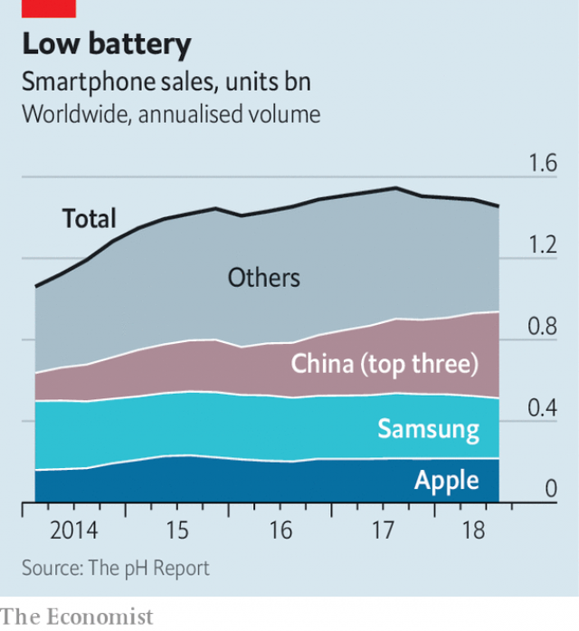
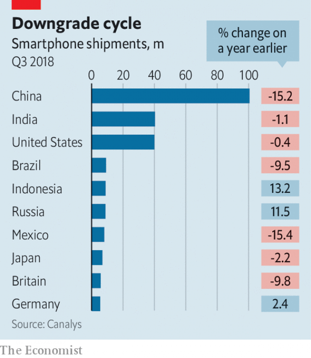

###### Cracks in the glass

# Apple succumbs to the smartphone malaise 

##### A decade-long boom is ending as consumers hang on to devices for longer 

 

> Jan 10th 2019 

 

LAST SUMMER the market value of Apple passed $1trn, a first for any publicly traded Western company. It did not stay there for long. In November it passed the $1trn mark again, travelling in the other direction. Last week Tim Cook, the smartphone maker’s boss, cut revenue forecasts for the first time in over a decade. Apple’s shares plunged a further 10% on the news, dragging the world’s jittery stockmarkets down with them. 

Mr Cook blamed the firm’s woes on an economic slowdown in China, which accounts for about 18% of Apple’s sales. Analysts talked gloomily about a slowing global economy, and pondered whether the trade war between America and China might be starting to affect buying habits. 

But there are also simpler forces at work. Smartphones revolutionised everything from shopping and dating to politics and computing itself. They are some of the most popular products ever put on sale. But after a decade-long boom, devices once seen as miraculous have become ubiquitous and even slightly boring. 

 

Global smartphone sales fell in each of the past four quarters (see chart), the first full-year decline. Industry watchers think 2019 will be anaemic, with either more falls or very modest growth. Apple’s new forecasts show it is feeling the same chill that is affecting the rest of the industry. 

A common diagnosis among those who watch the tech business is that what is happening is what occurs, in the end, with almost any technology. “With a car, a TV, a phone or anything, the first model you sell, in retrospect, is not very good,” says Pierre Ferragu at New Street Research, a firm of analysts. “So the value you bring with the second generation is enormous, and that drives rapid replacement.” But as engineers and firms learn what works, the process runs quickly into diminishing returns. 

Sales of personal computers, the smartphone’s predecessors as mass-market computing devices, peaked in 2011, once PCs had become good enough for most of the things consumers wanted them for. Something similar is happening with phones, with replacement cycles lengthening. CCS Insight, another firm of analysts, reckons that the length of time for which consumers hang on to their phones in Western Europe has risen from 26 months in 2010 to 39 months today. 

Only the most devoted Apple followers these days are ready to camp overnight to get their hands on the latest and greatest model. New features attract polite interest at best, and sometimes jokes (Nokia’s plans for a five-camera phone, for example, have drawn wry comparisons with razor-makers’ penchant for adding ever more blades to their products). And consumers have plenty of other high-tech gizmos competing for their cash, from home-assistant systems such as Amazon’s Echo to the battery-powered skateboards and home-automation devices on show at electronics trade fairs (see next story). 

For Apple’s shareholders, comparisons with personal computing will make uncomfortable reading. As with the smartphone, it was a market that Apple helped pioneer. But its strategy of selling high-priced, aspirational gear eventually saw it relegated to the status of also-ran, sustained by a fan base of hipsters and creative types while ceding almost the entire market to cheaper, more flexible machines built to IBM’s PC standard and running Microsoft’s Windows operating system. These days, ruthless competition comes from high-quality smartphones made by Chinese firms such as Huawei or Xiaomi which sell for a fraction of the price of Apple’s products, and which run some version of Android, an operating system developed by Google. 

Apple’s prices were bound to limit its reach, particularly outside the rich world. But smartphones are much more personal and intimate devices than desktop computers ever were, says Tim Hatt of GSMA Intelligence, the research arm of a trade association, and its customers are strikingly loyal. For the moment, therefore, Apple has chosen to double down on its strategy, releasing increasingly expensive phones in the hope that squeezing customers can make up for lower volumes. To a degree, at least, that seems to be working. Early indications are that the iPhone XS Max, which starts at $1,099 and is Apple’s most expensive phone, is selling better than the plain old XS, which is $100 cheaper. 

Even for Apple’s well-heeled customers, though, such a strategy can only go so far. The firm is heavily reliant on hardware sales. iPhone sales made up 59% of its $63bn revenue in the third quarter of 2018, but that understates its dependence. Its growing services division accounted for another 16% of revenue, and Mr Cook wants it to double in size by 2020 compared with 2016. For now much of it consists of things like extended warranties or revenues from the app store, which are linked to iPhone use. Apple is trying hard to diversify further. It may launch a TV-streaming service later in the year. On January 6th Samsung, Apple’s arch-rival in the smartphone business, said that iTunes, Apple’s online film and music shop, would be coming to its televisions. 

 

At the same time, it is exploring new kinds of hardware. It has its own entry in the home-assistant market, though this has failed to trouble Amazon or Google, the market leaders. There are no official sales figures for the Apple Watch, but Ben Stanton, an analyst at Canalys, reckons the product is “very profitable” and that it dominates the market for smart watches. It has let the firm dip its toes into the health-care market, offering users the ability to keep track of their heart rhythms. Apple has also signed deals with American health-insurance firms, though the highly regulated medical-device market is very different from the consumer-tech space it is used to. The dream, says Mr Hatt, would be to come up with a new mass-market computing platform, in the hope that the firm could repeat the success of the iPhone. 

While Apple is busy raising its prices, though, the opposite is happening in the Android world, which accounts for more than 85% of global smartphone users. Users wanting an Android phone can choose from many suppliers in every segment of the market, from sub-$100 budget models to $1,000 “flagships”. That has always made for fierce competition between handset manufacturers. Falling sales have made that competition tougher still. The results have been vicious price wars, heavy discounting and a rapid fall in the price of even the most capable devices. 

This has been further fuelled, as in so many other industries, by the rise of Chinese manufacturers, which in 2018 accounted for more than half of all smartphone sales worldwide. Samsung, a South Korean firm, is still the world’s biggest smartphone maker. But its sales have been dropping sharply. The charge is being led by Huawei, whose sales rose by 33% between the third quarters of 2017 and 2018, and which has nudged Apple into third place. Nipping at Huawei’s heels are a host of other Chinese firms less familiar to Western consumers, such as Xiaomi, Oppo and Vivo, all with big ambitions. Xiaomi, for instance, has several phone factories in India, where it has overtaken Samsung in market share. 

The steady commoditisation of good-quality smartphone hardware is making life hard for smaller players such as LG, Sony or Nokia, which lack the scale of Samsung or the low-cost base of the Chinese newcomers. Some of those smaller players, reckons Marina Koytcheva at CCS Insight, may choose to abandon the market entirely. 

The big question is how long the slump will last. Optimists (and phonemakers) argue that a new wave of innovation could rejuvenate demand. Samsung, for instance, is due to launch a foldable phone later this year, which can function as a smartphone or a tablet depending on whether it is open or closed. Phones compatible with ultra-fast fifth-generation (“5G”) phone networks are expected later in 2019. 

Yet such advances feel evolutionary rather than revolutionary. Folding phones are considerably thicker than the svelte “slablets” to which consumers have become accustomed. There is as yet no obvious “killer app” for 5G devices, and early phones are likely to be expensive and have lower battery life, blunting their appeal. 

Even if those features fail to juice the market, there is still room for penetration to rise. GSMA Intelligence reckons that the next seven years will see more than a billion new internet users, mostly in poor countries and mostly using cheap Android phones, the parts for which cost as little as $50. Users are more dependent on their phones than ever (which makes Apple’s emphasis on services look like a wise bet). And there is plenty of room to make money in an industry that still ships 355m phones every three months. Just, perhaps, less than there was. 

