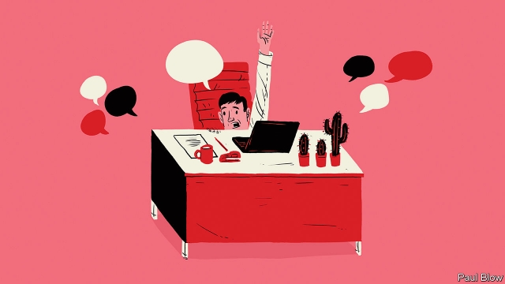

###### Bartleby

# Companies will perform better if employees are not cowed into silence 

##### Keeping schtum can lead to poor business decisions or be dangerous 

 

> Jan 10th 2019 

 

IN “DAD’S ARMY”, a British sitcom about a home-defence force, Sergeant Wilson would often query his commander’s various orders with the languid phrase “Do you think that’s wise, sir?” His scepticism, although it was often ignored, was usually justified. 

Many employees must be tempted to echo Sgt. Wilson on a daily basis when they see their bosses headed down the wrong track. But caution, for fear of appearing insubordinate or foolish and thus possibly at risk of losing their jobs, often leads workers to keep silent. 

A culture of silence can be dangerous, argues a new book, “The Fearless Organisation”*, by Amy Edmondson, a professor at Harvard Business School. Some of her examples are from the airline industry. One was its deadliest accident: a crash between Boeing 747s in the Canary Islands in 1977 when a co-pilot felt unable to query his captain’s decision to take off based on a misunderstanding of instructions from air-traffic control. Another case was that of the Columbia space shuttle in 2003; an engineer who may have diagnosed damage to the shuttle’s wing before the flight felt unable to speak as he was “too low down” at NASA. 

The stakes may be lower than life or death in most organisations, but companies also suffer when people keep schtum, Ms Edmondson believes. The mis-selling scandal in 2016 at Wells Fargo, an American bank, for example, related to its culture. The lender encouraged staff to persuade clients to buy additional products and for a while achieved levels of “cross-selling” that were twice the industry average rate. 

Pressure on employees was intense. At some branches, staff were not allowed to leave until they met their daily target. Bonuses were based on sales figures and people who failed to meet the targets were fired. This was not a place where workers were likely to question the wisdom of the strategy. It is hardly surprising that employees resorted to subterfuge such as opening fake accounts to meet their goals. 

Similar problems emerged at Volkswagen, which was caught up in a scandal over diesel emissions from 2015. The engines of its diesel models did not meet American emissions standards and engineers devised a system to fool the regulators. Ms Edmondson says the company’s culture had been one based on intimidation and fear; Ferdinand Piëch, its longtime boss, boasted of telling engineers they had six weeks to improve the bodywork fitting on pain of dismissal. In the circumstances, engineers were understandably unwilling to mention the bad news on emissions standards and instead worked around the problem. 

In a corporate culture based on fear and intimidation, it may appear that targets are being achieved in the short term. But in the long run the effect is likely to be counterproductive. Studies show that fear inhibits learning. And when confronted with a problem, scared workers find ways of covering it up or getting around it with inefficient practices. 

The answer is to create an atmosphere of “psychological safety” whereby workers can speak their minds. In a sense, this is the equivalent of Toyota’s “lean manufacturing” process, which allows any worker who spots a problem to stop the production line. 

This does not mean that workers, or their ideas, are immune from criticism, or that they should complain incessantly. The book describes how the success of the second “Toy Story” film was due to a rigorous editing process, in which the early script was revamped. Pixar, the production firm, created what it called a “Braintrust” to give feedback to film directors. The rules were that feedback should be constructive and about the idea, not the person, and that filmmakers should not be defensive in response. 

And psychological safety is not about whistleblowing. Indeed, if an employee feels the need to act as a whistleblower by speaking to external authorities, that suggests managers have not created an environment within the firm where criticism can be aired. 

Nor is such a culture only about safety or avoiding mistakes. As mundane tasks are automated, and workers rely on computers for data analysis, the added value of humans will stem from their creativity. But as Ms Edmondson’s book amply demonstrates, it is hard to be either constructive or creative if you are not confident about speaking out. 

* Subtitled “Creating Psychological Safety in the Workplace for Learning, Innovation and Growth”. Published by Wiley. 

