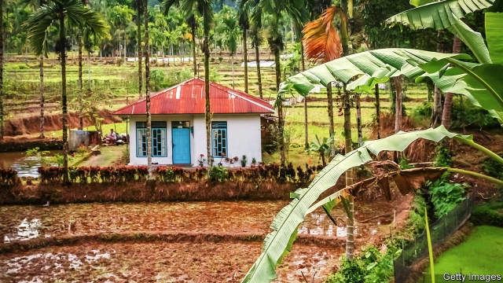

###### Island shopping

# Indonesia binges on e-commerce 

##### Local champions are battling Chinese-backed firms across the archipelago 

 

> Jan 10th 2019 

 

PITY THE Indonesian courier. Delivering a package on the archipelago can be a daunting task. The country’s 13,466 islands stretch across almost 3,000km and to reach a distant atoll might mean waiting weeks for a boat. Many people in remote areas lack a formal address; their roads are nameless and their houses often without number. Those with addresses sometimes rely on local landmarks—“the house by the big tree”, for example. Even in big cities many streets have the same name. 

Yet e-commerce startups and their investors are willing to tackle logistical headaches to become established in a promising market. Since 2015, when estimates began, the value of goods sold online has roughly doubled each year, to $8-12bn presently. Only about 15% of Indonesia’s population of 265m are believed to shop online but that should rise along with incomes and internet use. A report jointly written by Google and Temasek, Singapore’s sovereign wealth fund, has forecast that the market will be worth $53bn by 2025. 

Competition among firms is already fierce. In the absence of Amazon, which has not ventured into Indonesia, two local companies, Tokopedia and Bukalapak, are thriving, and Chinese-backed regional companies have moved in. One is Shopee, a Singapore-based firm and subsidiary of Sea, a publicly-traded technology company that counts Tencent, China’s internet giant, as a big shareholder. Another is Lazada, another Singapore-based e-commerce firm, owned by Alibaba. Both count Indonesia as their biggest market. 

Tokopedia, Shopee and Bukalapak earn most of their revenues from selling advertising space on their platforms to online vendors, and from flogging extra services, such as data analytics. Bukalapak also charges commissions to some bigger brands. Only Bukalapak discusses its profits in Indonesia (it is in the red). 

Each firm has distinct advantages. Tokopedia boasts reach. Partnerships with local logistics firms let it deliver to 93% of Indonesia’s 7,000 or so districts. It also has substantial financial resources. In December it secured $1.1bn in a funding round led by SoftBank, a Japanese internet and telecoms firm, and by Alibaba. Its value is reportedly $7bn. And Tokopedia is growing faster than the market; sales on its platform quadrupled between 2017 and 2018. 

Tokopedia and Bukalapak possess most local knowledge. The value of this, many point out, is demonstrated by the foray of Uber, a ride-hailing firm, into South-East Asia which ended last year when it sold its business to Grab, a startup based in Singapore. Local entrepreneurs have “lived the problems they are trying to solve”, notes an investor in Bukalapak. 

Useful information can be gleaned, for example, from Bukalapak’s vast network of offline intermediaries. It has 400,000 “agents” around the country. Typically they run small, pre-existing neighbourhood shops in rural or suburban areas and act as a gateway to online shopping. At agents’ stores a customer can place online orders, pay for goods and collect them, and the agent takes a cut of sales. 

Lazada is betting heavily on running its own logistics empire. Its warehouse on Jakarta’s outskirts is one of the country’s biggest. About 1,000 employees help dispatch and restock thousands of goods, from groceries to laptops. Lazada has nine other similar centres across Indonesia and plans to build more. With warehouses pre-stocked with the goods its vendors sell, it offers lower delivery costs and faster speed. Its network reaches 80% of the country, says Ashwath Ramesh, head of its logistics division. 

Indonesians who shop online are as accustomed to doing so through their smartphones as are Chinese e-commerce consumers, and Shopee is investing in mobile. Its app lets customers chat online with buyers, a feature that Taobao, a Chinese e-commerce platform, launched. Around 60% of Shopee’s sales happen after such an interaction. In addition, it allows buyers to follow their preferred sellers, tapping into the social e-commerce market, in which people sell goods on platforms such as Twitter and Facebook. 

The battle among these firms is now for market share. Shoppers outside the big cities will be increasingly important—in 2017 such buyers accounted for 30% of the value of online sales, according to McKinsey, a consultancy, but by 2022 they will account for roughly half. For many, trust is still a worry as online fraud is particularly prevalent in Indonesia. Lazada therefore uses a cash-on-delivery model. Shopee’s chat feature also helps alleviate the problem; so too do Bukalapak’s agents. Tokopedia has opened three centres in small cities where customers can learn about e-commerce and vendors can take business classes. Wooing Indonesia’s online shoppers takes many forms. 

