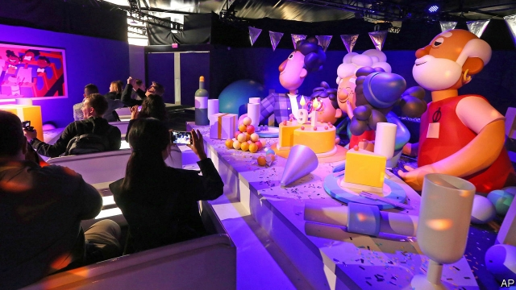

###### Keynote speaker

# Voice-enabled gadgets star at the Consumer Electronics Show 

##### Nothing measured up to the smartphone 

 

> Jan 10th 2019 

 

THE Consumer Electronics Show (CES) is a bit like Disneyland for techies. Over 150,000 people from over 100 countries are expected to descend on Las Vegas for this year’s jamboree, which opened on January 8th, to examine the very latest kit from more than 4,000 firms. This time the show even features an amusement-park ride, run by Google, in which rapt visitors are ferried around in trolley cars through rooms full of talking animatronic characters and singing macarons. 

The search giant wanted to show off the services offered by Assistant, its voice-controlled software powered by artificial intelligence (AI) that it embeds in its products. Riders followed along with Dad as he ran errands in preparation for Grandma’s birthday, encountering various obstacles along the way: bad traffic, foul weather, a baker speaking only French—each time, Assistant found clever solutions, including real-time language interpretation, a feature unveiled this week at CES. 

“Speech is invading everything,” says Jeff Loucks of Deloitte, a consultancy, surveying the thousands of devices displayed at CES that respond to “Hey, Google” or “Alexa” (the name of Amazon’s rival voice-enabled offering). Voice-enabled gadgets have improved thanks to the increasing ability of software to decipher speech. And the imminent arrival of 5G communications networks, another theme of the event, is accelerating the spread of voice-activated smart devices, ranging from home-hub systems such as Mui’s minimalist wooden slab meant to resemble furniture—which can control a home’s heating and lights, and show the weather—to health-care aids. 

Several firms unveiled voice-directed offerings for cars. One even touted technology that allows a person to modify a room’s scent through voice command (if you sound sleepy it might waft the smell of coffee). Mr Loucks reckons that helping couch potatoes control content on home entertainment systems will be a killer app for voice technology. 

The consumer-electronics giants’ bets on speech cannot hide two adverse developments, however. First, they have not come up with a breakthrough on the scale of the smartphone, sales of which are peaking. Second, in the race to create the next platform, privacy could become a casualty. Voice technologies rely on sensors that are always listening to speech, which gets hoovered up by the AI powering them in order to personalise offerings. As these devices invade the most intimate bits of people’s lives (a voice-controlled lavatory from Kohler, an American firm, created a stir this week), consumers will worry about what data are being collected. Privacy-minded Apple fuelled concerns by hoisting a banner on the side of a Las Vegas hotel with a provocation: “What happens on your iPhone, stays on your iPhone.” 

