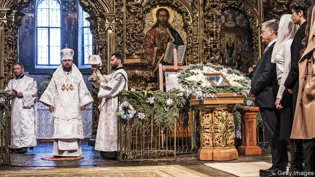

###### Putin and the patriarchs

# Russia’s conflict with Ukraine has caused the Orthodox church to split 

##### Ukrainians have lost their land, but not their souls 

 

> Jan 10th 2019 

 

WITH SNOW falling on the green domes of Kiev’s Saint Sophia cathedral, Ukraine’s president, Petro Poroshenko, strode triumphantly towards its ancient doors on January 7th to mark an Orthodox Christmas like no other. Beside him stood Metropolitan Epifaniy, the newly minted head of the Orthodox Church of Ukraine. They carried a document, called a tomos, granting the new Ukrainian church independence from the Moscow patriarchate, the result of a year of intensive negotiations between political leaders and clerics in Kiev and Istanbul, home to Patriarch Bartholomew I, the “first among equals” in the eastern Christian world. 

Until this week, the only internationally recognised Orthodox church in Ukraine had been a body whose ultimate master is Patriarch Kirill of Moscow. After Russia annexed Crimea and stoked a war in Ukraine’s east in 2014, that struck many Ukrainians as untenable. “We have cut the last chain that connected us to Moscow and its fantasies about Ukraine as the canonical territory of the Russian Orthodox Church,” said Mr Poroshenko. The bid for ecclesiastical independence, which is as much about Ukraine’s desire to break from Moscow’s political orbit as it is about theological authority, has enraged both Kirill and Russia’s earthly ruler, Vladimir Putin, who has said that the church schism could “turn into a heavy dispute, if not bloodshed”. 

The warning reflects the significance of the church split for the Russian president. Mr Putin has devoted enormous effort to re-establishing Russia’s influence, whether political, commercial or spiritual, over the lands that used to be part of the Soviet Union. This schism is a move in the opposite direction. More than 12,000 parishes still lie under the Moscow-aligned Ukrainian Orthodox Church; now the new body, the Orthodox Church of Ukraine, which already controls about 7,000 parishes, will try to woo those communities into its fold. Another point of contention is control over valuable church property and over historic sites such as the Kiev-Pechersk Lavra, a famed cave monastery. Archbishop Kliment, a cleric of the Moscow-aligned patriarchate, frets about threats against the branch’s churches. Some Moscow-aligned priests have been called in for questioning by the Ukrainian security services. 

Nonetheless, Mr Putin may be hard-pressed to find popular support for fresh intervention in Ukraine on religious grounds. The spiritual stand-off has failed to arouse much passion among ordinary Russian citizens. Some 60% say they are not bothered by the Ukrainian split; even among self-identified believers, just 43% say they are concerned. At Christmas celebrations in the medieval Russian town of Vladimir, believers refused to let church politics in Istanbul or Kiev spoil the festival. “Let those who did this worry about it,” said Eduard, a middle-aged factory worker, as he approached the Assumption Cathedral. “We’re having a holiday.” 

Mr Poroshenko hopes the move will inspire greater zeal among Ukrainian voters. With presidential elections looming in March, he has made church independence a central pillar of his campaign. Some of those who came to the service on January 7th say their views of the president have improved thanks to the autocephaly. But it has yet to shift the polls so far; the president is still trailing. 

