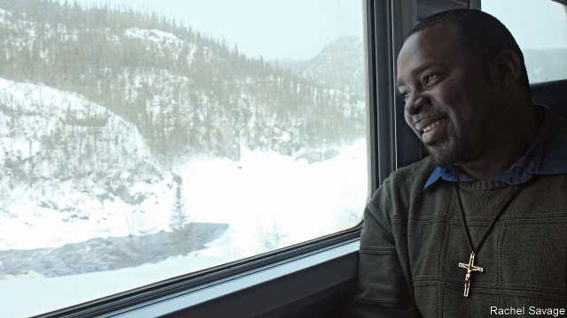
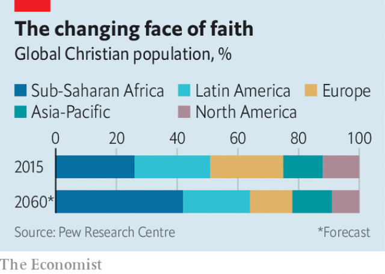
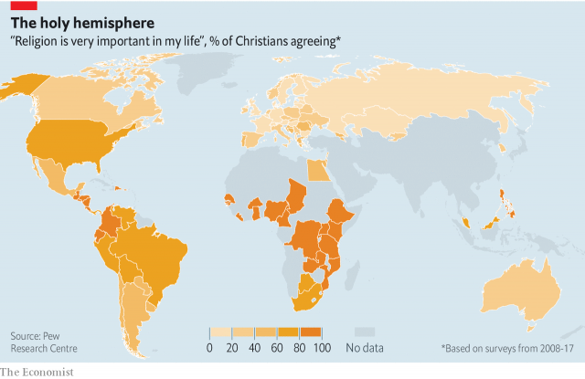

###### Camel, meet needle

# Missionaries from the global south try to save the godless West 

##### Preachers from poor countries are targeting the rich world 

 

> Jan 12th 2019 

 

EVERY TWO weeks Ali Nnaemeka, a Roman Catholic priest (pictured), travels between Sept-Îles in Quebec, Canada, and a remote mining town, Schefferville, 355 miles (570km) to the north. The trip, usually by train, takes at least a day, sometimes longer. It requires cutting through a mountainous river valley and travelling past flat lakeland, frozen for much of the year. It is a bleak, monotonous journey. But it is worth the trouble. Mr Nnaemeka, who spends most of his time as a parish priest for two indigenous First Nation communities, is on a mission from God. 

Christian missionaries have always travelled to remote spots to spread the word. In previous centuries those places tended to be in Africa and Asia; many were colonies of Western powers. The missionaries tended to be European or American. These days the flow has partly reversed. Poor countries are far more devout than rich ones. As the piety gap grows, missionaries from the global south feel called to save the rich world from perdition. Mr Nnaemeka, a Nigerian, is just one example. 

In 2015 around 400,000 missionaries were out saving souls, according to the World Christian Database, compiled at the Gordon-Conwell Theological Seminary in Massachusetts (the latest data available). Counting missionaries is an imperfect science, says Todd Johnson, who helps run the database. For example, most of those included are serving for at least two years. That ignores the many Christians (mostly American) who travel overseas for as little as ten days as “short-term missionaries”. Meanwhile the number of undercover missionaries who work in “house churches” in places where the faithful are persecuted, such as China and North Korea, can only be guessed at. 

Yet even with these patchy data it is clear that the growth in missionaries is coming from non-Western countries. The largest single exporter of soul-savers is still the United States (with 121,000 missionaries, around half of whom are Mormons). But the number of American missionaries is falling, as is the number of Europeans. By contrast, the number of missionaries from Asia, Latin America and other poorer continents is steadily increasing. In 2015 there were 27,400 African missionaries, an increase of 32% on 2010, and 30,000 Korean ones, an increase of 50% over the same period. The countries which received the most missionaries were the United States, Brazil and Russia. 

Increasingly, the most devout Christians are to be found in Africa and the Americas, so it is perhaps of little surprise that more and more proselytisers come from those places. In 1910 two-thirds of Christians worldwide were in Europe and over a quarter in the Americas. Just 1.4% were in sub-Saharan Africa. A century later 37% of Christians were in the Americas and 24% were in sub-Saharan Africa, says the Pew Research Centre, a think-tank. 

The Church of Jesus Christ of Latter-Day Saints (better known as the Mormon church) was founded in America in 1830, but now has more members abroad, largely in Brazil and Mexico, than at home. This is true of other denominations, too. And the trend is expected to continue. By 2060 the world’s largest number of Christians will be in sub-Saharan Africa, Pew predicts (see chart). 

 

Aside from his place of birth, Mr Nnaemeka is in many ways a traditional missionary. He is part of the Missionary Oblates of Mary Immaculate, a Catholic congregation founded in 1816 with the aim of converting others. He underwent ten years of training in Cameroon and Italy. As with Western missionaries of old, he has lived among the locals (in this case, the two First Nation communities) for some time: almost four years. He says he will stay “as long as I’m needed”. Many of the people he works with are descendants of those who were converted by Jesuit missionaries in the 17th century. Some have switched to Evangelical Christianity; others have lapsed altogether. Mr Nnaemeka’s job, which involves running church services, baptisms and pastoral care, is to reinvigorate their faith. 

By contrast, many of today’s missionaries will serve for no more than a few years. Some are independent proselytisers who get little or no training and have only the support of their home church and a crowd-funding website. Mr Johnson estimates that there could be 40,000 so-called independent missionaries, all of whom are uncounted in his research. 

Saving the rich is difficult, as Jesus once observed, but not impossible. Eduardo Rios, a 20-year-old Ecuadorean whose uncle is a Roman Catholic bishop, converted to Mormonism after meeting missionaries on holiday in Bolivia. He has been preaching on the cold, secular streets of Britain for 18 months. The natives look down on him, he says, because English is not his first language. Nonetheless, he claims to have converted at least a dozen people. 

Missionary duties have always been broader than just converting heathens. Mother Teresa, probably the most famous missionary of the 20th century, ran medical services for the poor, diseased and orphaned of Kolkata (in her day Calcutta). Education has also always been important. Robert Mugabe, Zimbabwe’s former dictator, was born in a Jesuit mission station, taken to Mass every day and taught by Catholic priests. (It was a Jesuit, Father Fidelis Mukonori, who arguably helped persuade Mr Mugabe to step down in 2017.) 

The new missionaries are especially likely to emphasise learning from the people they work with, rather than just pressing them to convert. Mormon missionaries in Britain—who come from dozens of countries, including Ecuador, Colombia and Madagascar—now also devote time to volunteering in soup kitchens, says David Checketts, who heads the London branch of that church. 

Many missionaries work close to home. Stephen Msele, a priest from Tanzania, trained in Ireland and Kenya but has now been based in Uganda, next door to his home country, for two decades. He says that more African missionaries are joining him in evangelising their own continent. It is a struggle. “There is still a lot of corruption, even more than Europe, in spite of the fact we say we are all Christians,” he sighs. He works on a peace-building initiative and spends his time at a centre that offers English classes to refugees from Ethiopia and Eritrea. 

Local-born missionaries may find it easier to connect. Certainly, they are less likely to make the mistakes that some Western evangelists have made in Africa. In 2016 a video of a group of American missionary women, dancing in traditional Ugandan dresses while popping deworming pills, caused uproar online. Many locals saw their antics as patronising. In the video, which has now been taken offline, they sang about “bringing missions back” to the tune of Justin Timberlake’s “SexyBack”. Last year the Ugandan police arrested an American missionary who was accused of assaulting a hotel employee; he is now on bail and pleads not guilty. 

Some preachers from Africa find the godlessness of the West an invigorating challenge. But many also become dispirited by it. This is particularly marked in Europe, the least pious continent (see map). “Missionary work is not easy,” says Andrianirira Rakotondravao, a 22-year-old Mormon missionary from Madagascar, who recently spent two years in Britain. One time he stopped a man on the street and tried to strike up a conversation about Jesus. The man yelled back at him: “What would be your response if I tried to convert you to atheism?” When Mr Msele spent time in Ireland he was depressed at how people were not very “brotherly and sisterly” in that nominally Catholic country. The experience sorely tested his faith. 

 

Faced with Western irreligiosity, some missionaries have tried to soften their notions of what makes a good Christian. Mr Nnaemeka admits that in the “traditional way of seeing things...you must be at church every day”. Most of his compatriots would agree: 89% of Nigerians go to a religious service of some sort every week, compared with about 10% of Germans, according to Pew. Mr Nnaemeka has a looser view of what makes someone devout. “I think church should be something that one should be free to go to when you feel like going,” he says. 

Often, it is tricky for missionaries from poor countries to get visas to the West. Sceptical officials sometimes suspect them of seeking a better life in this world for themselves, rather than eternal life for others. Mr Nnaemeka’s organisation is big enough to smooth his way. African priests from little-known churches find it much harder, especially since the backlash against immigration has grown stronger in Europe and the United States. Yet even as the West seems increasingly unwelcoming, the new missionaries will keep coming. The early evangelists braved stormy seas and the risk of being thrown to the lions. Their modern heirs will not be deterred by a few rude atheists or long waits for visas. 

