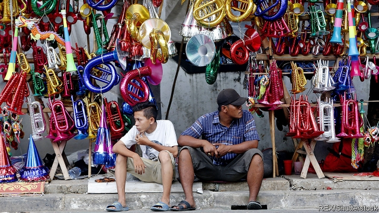
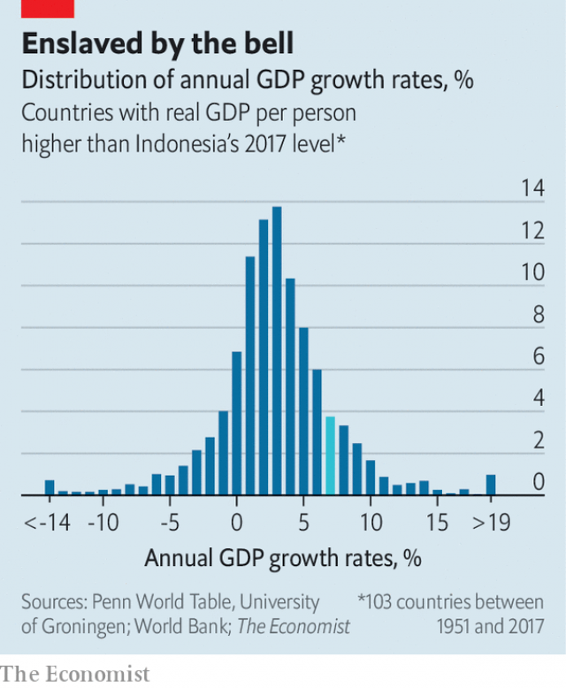

###### Awaiting the fanfare

# Indonesia’s economic growth is being held back by populism 

##### Elections in April might get reforms moving again 

 

> Jan 17th 2019 

 

AT A CONFERENCE in Singapore on January 15th, Indonesian officials were out in force. Four senior ministers, the bosses of three state-owned enterprises and a senior civil servant took to the stage to try to drum up private investment in roads and railways. The audience, mainly financiers, nodded along. Not everyone was convinced, though. “The risks don’t match the returns,” complained one. Red tape is a headache. Changes in government policy could derail an investment. “If things go badly, you get zero.” 

Such risks are particularly high in Indonesia at the moment. The country is gearing up for presidential and legislative elections in April. The incumbent, President Joko Widodo, or Jokowi, will face Prabowo Subianto, a former general, in a rematch of the previous vote, in 2014. The two were squaring off in the first of five debates as The Economist went to press. Jokowi’s biggest vulnerability is the economy, where returns have not matched his promises. 

During the 2014 campaign Jokowi pledged to deliver GDP growth of 7% a year by the end of his first term. That will not happen. Growth has instead hovered around 5% since he took office. Prospects for 2019 look no better, especially since the central bank has raised interest rates six times in the past nine months to arrest a worrying slide in the currency. 

Was Jokowi’s promise realistic? The country certainly has enormous potential. About half of its 265m people are younger than 30; and its national saving rate is typically above 30% of GDP. Its economy routinely grew faster than 7% a year before the Asian financial crisis of 1997. 

But that era offers little guidance to Indonesia today. The country’s labour force is growing less quickly than it did in the 1990s. Its oil imports have long since surpassed its exports (although it remains a net seller of commodities in general). And now that its GDP per person exceeds $10,000 (at purchasing-power parity), the scope for rapid catch-up growth has diminished. Once an economy has reached Indonesia’s present level of development, growth of 7%, even for a single year, is rare (see chart). 

 

In the years since 1997, China has also become a more decisive influence on Indonesia’s fortunes, both as a consumer of its abundant resources and a competitor to its hard-pressed factories. China’s rapid rise pumped up commodity prices from 2003 to 2011 and punctured rival manufacturers in a variety of emerging economies. Both trends have contributed to what economists call “premature deindustrialisation” in Indonesia. Manufacturing peaked as a share of GDP over 15 years ago, at a much lower level of income than in America, say, which acquired its rustbelt only after it grew rich. Rather than taking comfortable, post-industrial white-collar jobs, many factory workers moved into less productive employment, such as informal trading, explains Zulfan Tadjoeddin of Western Sydney University. 

When Jokowi took office, the World Bank calculated that Indonesia’s potential rate of growth was 5.5%. The best way to improve that number would be to revive the manufacturing sector, emulating other Asian countries by becoming part of the global supply chain. Myriad problems stand in the way, many of which the government is taking steps to fix. But too often populist and nationalist tendencies are the main cause of obstruction. 

Take Indonesia’s neglected infrastructure. Expensive electricity and slow transport put off manufacturers. Jokowi came to power with a $323bn (32% of GDP) plan to solve this, reducing fuel subsidies to pay for it. He aimed to build new airports, seaports and power plants, as well as 3,258km of railways and 3,650km of roads by 2022. To speed up progress, the government also made compulsory land acquisition easier. 

But in last year’s budget Jokowi changed course. Expenditure on vote-winning energy subsidies jumped by 69% and the growth of infrastructure spending slowed. How, then, will Jokowi pay for his building plans? So far the infrastructure boom has relied on state-owned enterprises. But the government wants 37% of funding to come from the private sector. Hence the mobs of ministers at conferences. 

To woo investors, the government has eased limits on foreign ownership, but only half-heartedly. Every time regulations are loosened nationalists howl, so restrictions remain severe, discouraging investors. Rules aimed at boosting small businesses have the same effect. The OECD, a club mostly of rich countries, looked at foreign direct investment (FDI) rules in 68 rich and middle-income countries. It found that Indonesia had the third-most restrictive regime. Small wonder its FDI as a share of GDP is one of the lowest in the region. 

High trade barriers have not come down since Jokowi became president. Over half of all imports by value are subject to restrictions. That adds to the price of imported capital goods, like heavy machinery, and thus to manufacturing costs. Exports have also been hampered. In 2014 parliament banned the export of metal ores, a clumsy attempt to boost local refineries. Though the rule was later relaxed, foreign firms fled and mines closed. 

Hobbled by economic nationalism at home, Indonesia must also contend with growing economic nationalism abroad. America’s trade war with China and rising American interest rates unnerved emerging-market investors last year, contributing to the decline in the rupiah, Indonesia’s currency. Over the longer run, however, the country hopes to provide a refuge to manufacturers who now deem China too risky or expensive a place for their next factory. On the eve of the Asian financial crisis, China’s income per person was only about 40% of Indonesia’s. Now it is about 140%. That Chinese success is also an Indonesian opportunity: it should be able to attract firms that can no longer afford higher-paid Chinese workers. 

Unfortunately, Indonesian labour is neither as well qualified nor as keenly priced as it should be. Business leaders complain about a lack of skilled workers. Education standards are low, despite a law forcing the government to spend a fifth of its budget on schooling. Over half of those who finish school are practically illiterate. 

Local labour can also be pricey. A survey of firms with ties to Japan by the Japan External Trade Organisation, a government body, shows that the wages of Indonesian manufacturing workers are 45% higher than those of their Vietnamese counterparts. That is partly due to rocketing minimum wages, which are set by local government. Politicians raise the floor to win votes. As a result, the average minimum wage as a share of the average wage grew from 60% in 2008 to around 90% in 2018, according to Ross McLeod of Australian National University. In some districts it exceeds the average salary for the country as a whole by a fifth. This discourages hiring, pushing workers into the informal sector, or drives firms to ignore the rules. To stop this trend the central government capped increases in minimum wages in 2015, but stopped short of reversing previous rises. 

If the government’s attempts to open up the economy remain feeble, 7% growth will remain out of reach. But a hefty win in April’s election could give Jokowi the mandate to make the sweeping changes Indonesia needs. If he wins a second term, he will have to take greater risks to reap the returns he has promised. 

