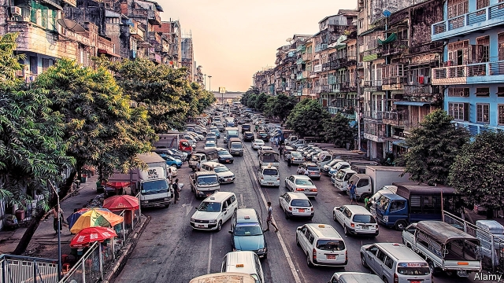

###### Four wheels better

# Motorbikes are oddly absent from Myanmar’s biggest city 

##### That makes life easier in some ways and harder in others 

 

> Jan 17th 2019 

 

LATE AT NIGHT Klo He Bin likes to don his biking jacket and take to the roads of Yangon on his Yamaha EasyRider. The other 15 members of his gang, the “Freeriders”, cruise alongside, wearing leathers embroidered with their logo. Mr Klo (not his real name) has been a motorbike enthusiast for years and says he likes the freedom that comes with it. However, in Yangon that freedom is restricted. He can roar around the city only after dark, when few policemen are on the streets. That is because in much of Yangon motorbikes are banned. 

In most other cities in South-East Asia motorbikes are ubiquitous. Rising incomes have made them attainable. Shoddy public-transport systems and woeful traffic boost their appeal. A survey by the Pew Research Centre in 2015 looked at motorcycle ownership in 44 countries. The top seven were in Asia, with over 80% of households in Indonesia, Malaysia, Thailand and Vietnam owning one. In Hanoi riders terrorise pedestrians who try to cross roads—and sometimes those who stand inattentively on pavements. Across the region, motorbikes shift everything from steel piping to families of five. 

All that has been oddly absent in Yangon since 2003. No one knows why. One rumour claims that, before military rule ended in 2016, a biker threatened a general with a finger-gun gesture and was able to escape with ease. Another says the general’s daughter died in a motorcycle accident. The ban applies only to central Yangon. Enforcement is patchy: police, who are allowed to ride motorbikes, turn a blind eye in exchange for kickbacks. 

Still, the ban changes life in the city. It is a headache for businesses. Shopowners rely on cars and vans to restock their wares, clogging up narrow side-streets. In other South-East Asian cities startups deliver everything from meals to massages by motorbike. In Yangon the fledgling industry relies on cyclists. Shady Ramadan, founder of Door2Door, a delivery firm, has a fleet of 80 pedallers. In Mandalay, Myanmar’s second city, the average delivery takes 32 minutes; in Yangon it takes 50 minutes. 

The ban forces most of the city’s 6m residents to rely on overcrowded and chaotic public transport to get around. The city’s commuter trains are a shambles. Much of the track was laid in colonial times. Trains travel at 5-10kph. About half of journeys are by bus, a higher share than in other South-East Asian cities. The government recently overhauled the network, reducing the number of operators, who used to compete on the same routes, causing buses to race dangerously between stops. It also introduced set wages for conductors, who used to be paid by commission, leading to alarming overcrowding. Yet the system remains far from adequate to serve the city. 

Buses are moving more slowly, too, as booming car ownership clogs the roads. It used to be only the army and state-controlled firms that had the right to import cars. A Toyota Land Cruiser would sell for $500,000. When the restrictions were lifted in 2011, cars flooded the market. Prices dropped and the roads began to gum up. Average travel speeds in downtown Yangon fell from 38kph in 2007 to 10kph in 2015. 

The motorbike ban has mixed effects on this traffic. On the one hand, it delays the point at which individuals can afford to buy a vehicle, meaning there are fewer vehicles on the road. In Yangon there are about 135 private vehicles for every 1,000 people, barely a quarter of the level in Mandalay. What is more, motorbikes tend to weave in and out of traffic, causing further delays, points out Sean Fox of Bristol University in Britain. On the other hand, the ban boosts the rate of car ownership, which is 40% higher in Yangon than in Mandalay. 

The net effect is to reduce congestion, albeit at great inconvenience to many. A study by Hiroki Inaba and Hironori Kato of the University of Tokyo estimates that the ban lowers traffic volume by 18%. That proportion, however, is forecast to shrink to 5% by 2035, as incomes rise and more people buy cars. The case for restricting the freedom of the Freeriders will only get weaker as Yangon grows richer. 

