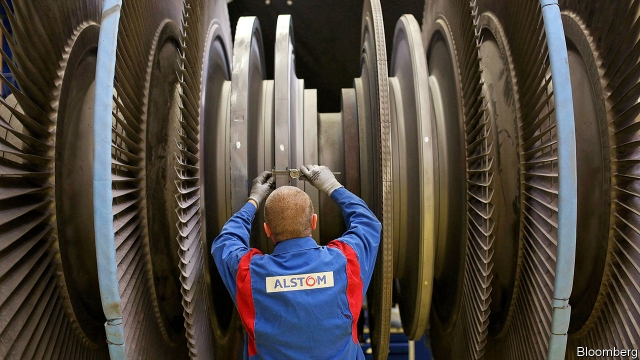
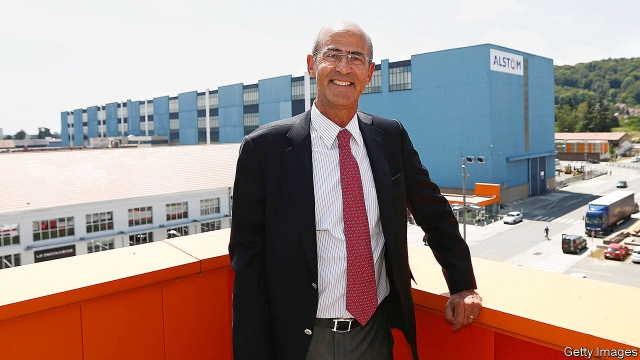
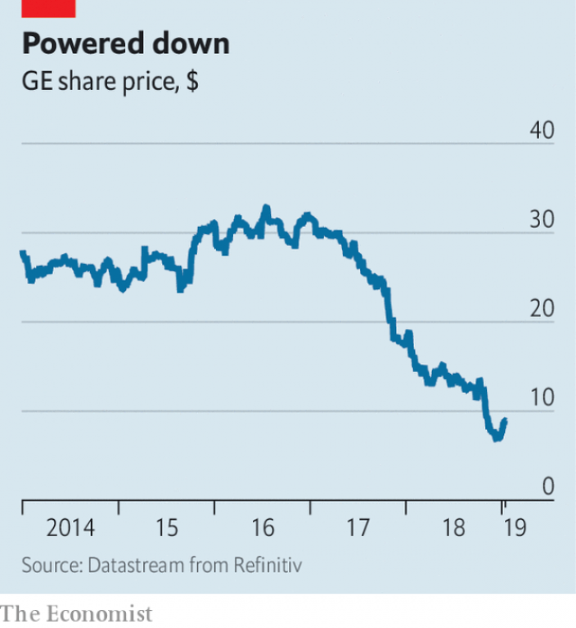

###### The French resolution

# How the American takeover of a French national champion became intertwined in a corruption investigation 

##### A Department of Justice investigation into Alstom ended in 2014 with General Electric’s $17bn takeover of the French company 

 

> Jan 17th 2019 

OVER THE past decade, American legal and regulatory authorities have subjected scores of large foreign companies to extraterritorial actions. Paying large fines, which can exceed $1bn, has often been the only way finally to settle such accusations of serious misconduct—typically, corruption or breaching sanctions—outside America. As a result, many bosses and executives are quietly paranoid about the long arm of American sheriffs. 

Such cases, however, rarely go to trial, and the firms involved are limited in what they can say about them; surprisingly little is known about how the process works. The Economist has identified an exception: Alstom, a French power and transport group that faced an American legal action in 2010-15 and which sold the bulk of its assets to General Electric (GE) in a deal that was announced in 2014 and closed in late 2015. 

The case of Alstom and GE is important for three reasons. First, the sums involved are huge: Alstom faced a $772m fine, among the largest ever in a foreign corruption case prosecuted by America. GE paid $17bn to buy the Alstom assets; their subsequent underperformance explains part of the American conglomerate’s present dire straits, including the $23bn loss it reported in October 2018. 

Second, multiple sources of information mean that a reliable account can be constructed of how a legal process and a commercial one jointly produced a particular outcome for GE. A senior former Alstom executive closely involved in the scandal, Frédéric Pierucci, has published a book this week called “Le Piège Américain” (“The American Trap”). Mr Pierucci is no angel: he is a convicted criminal who, Alstom documents show, knew bribes were being paid to win a contract for a power plant in Indonesia. But we have reviewed American court documents and material from several French parliamentary inquiries (the last of them conducted in 2018), and spoken to industry executives. 

Last, the case raises uncomfortable questions about American officials’ uncompromising techniques. It suggests that foreign companies may receive more lenient treatment if they pass into American ownership. The possibility of a link between Alstom’s legal woes and the sale of its crown jewels to GE has vexed French policymakers, not least Emmanuel Macron, France’s president. 

Mr Pierucci’s private hell began in April 2013 when he was handcuffed upon arrival at New York’s John F. Kennedy Airport. The Frenchman knew his employer, Alstom, was in the midst of a protracted tussle with American authorities over bribery allegations. Having expected to be released rapidly, perhaps on bail, he did not share his predicament with his wife for four days. This legal wrinkle was no reason to push back his expected return by the weekend, he thought. Things did not turn out as he planned: Mr Pierucci did not emerge from prison until September 2018. 

At around the same time, in 2013, Alstom was racing into commercial heavy weather. Its imperious chief executive, Patrick Kron (pictured below), who had by then presided over the company for a decade, deemed some of its units below scale to compete globally. He had good reason to be looking for a buyer for its flagship power division, which accounted for nearly three-quarters of the group’s revenues: demand was sagging for the turbines it sold to electricity-generation plants across the world, performance had been woeful for years and debt had swollen. And across the Atlantic, the chief executive of GE at the time, Jeff Immelt, was searching for a big end-of-reign deal. 

But the process of Alstom dismantling itself was being buffeted by an investigation dating from 2010 by America’s Department of Justice (DOJ) into exactly how it had managed to bring home billions of dollars in contracts outside America. The French firm had been dragging its feet in responding to the DOJ, infuriating prosecutors. They suspected Alstom of paying a total of at least $75m in bungs in Egypt, Saudi Arabia, the Bahamas, Taiwan and Indonesia, which won it $4bn in contracts. Some of the bribes, including those Mr Pierucci had been involved with in Indonesia from 2002, had been paid by an American subsidiary, and Alstom had financed itself partly in America, giving American authorities their justification to chase Alstom in France and to punish it with a fine far greater than European corruption statutes might have levied. At the time, investors fretted that this could exceed $1bn, damaging the company’s balance-sheet and forcing a fire sale of its assets. 

The prospect of this, and Mr Pierucci’s legal troubles, weighed on Mr Kron as he pondered Alstom’s future in mid-2013. The arrest shocked Alstom’s top brass: around 30 senior executives were subsequently warned against travelling to America lest they share Mr Pierucci’s fate. By spring 2014 at least three of his former associates at Alstom had been arrested by American authorities to bring pressure on the company to co-operate with the DOJ. Court documents suggest that prosecutors ended up with 49 hours of covertly-taped conversations inside Alstom, courtesy of executives-turned-informants. 

Two elements of what happened next are disturbing. First is the treatment of Mr Pierucci. Now 51, heavy-set with a tall forehead and a provincial twang, the former industrial-equipment salesman could be typecast as an accountant, not the orange-jumpsuited prisoner he became upon his arrival in America. 

After three months in a Rhode Island high-security prison packed with violent offenders, he faced a plea hearing. The choice was stark. One route was to plead innocent and face trial; a risky proposition, since prosecutors in Mr Pierucci’s case were pushing for charges which would translate into prison sentences ranging from 15 to 19 years. He was advised that preparation for the trial would take three years and would cost millions of dollars. 

That left the option of pleading guilty, co-operating with the authorities, and facing only a few more months of prison. Mr Pierucci says he admitted that he was guilty of bribing Indonesian officials—which emails cited by the DOJ suggest he was aware of, even if he did not instigate the crime—on the understanding that he would receive a sentence of no more than six months, most of which he had served. But despite this he was detained for another year, then spent over three years out on bail from June 2014 to October 2017, and then went back for another year in jail. He says he spent over 250 days at one point without seeing direct sunlight or breathing outside air. 

 

Part of Mr Pierucci’s outrage reflects America’s harsh judicial system: a legal playbook devised to bring down mobsters and racketeers has since been repurposed for the corporate world. Europe’s approach to white-collar criminals is softer, for better or worse. But Mr Pierucci’s claim that he was an “economic hostage” carries weight. DOJ officials have indeed linked his imprisonment to Alstom’s failure to co-operate with their inquiry. 

The broader worry is that the DOJ’s investigations distorted Alstom’s sale process, giving an edge to a potential American purchaser. The French parliament has returned time and again to the circumstances of the deal with GE. For a country that once blocked the takeover of a yogurt firm, Danone, on the basis of its strategic importance, the sale to a foreign rival of a firm that maintained turbines for France’s nuclear power stations and submarines remains highly sensitive. 

According to executives there at the time, Alstom first explored a deal with GE just after Mr Pierucci’s guilty plea in July 2013. Legal pressure on Alstom, and on Mr Pierucci, seemed to ease once it became possible that much of his employer would come under GE’s ownership. For one thing, the arrest of executives stopped. The fourth to be detained in the case, while in the American Virgin Islands, was seized one day before news of the deal became public on April 24th 2014. Two months later, in the same week that Alstom’s top brass signed off on the sale to GE, Mr Pierucci’s long-standing bid to be released on bail was approved, after 14 months inside. 

There is no suggestion of wrongdoing by GE itself, merely that American supremacy in imposing anti-corruption norms globally may have given American firms an advantage. GE had an edge over non-American firms vying to buy Alstom’s assets, such as Siemens of Germany and Mitsubishi of Japan, insofar as their legal departments may have been less well-versed in negotiating American legal settlements. 

That mattered. In the purchase agreement, GE agreed to pay whatever fine was meted out to Alstom Power for past wrongdoing, even though the fine the French firm faced also related to past activities of other parts of the group. Foreign rivals interested in joining the bidding would also have to gauge the size of that potential legal liability, but may have been at a disadvantage: GE, like other American firms, employs multiple former DOJ staffers, according to their LinkedIn profiles. (Later, the DOJ decreed that what remained of Alstom in France should pay the fine, not GE.) 

An American group such as GE could also help Alstom navigate judicial waters. Lawyers for GE conferred with the French firm’s lawyers ahead of its agreement with the DOJ, long before the deal formally closed. The DOJ settlement mentions how GE promised to “implement its compliance programme and internal controls” at Alstom. In American courts, such assurances may carry more weight coming from well-known local firms, not foreign ones. Unlike Siemens, which has also felt the weight of the DOJ on corruption charges, Alstom was able to avoid an intrusive American “monitor” being embedded inside the firm. Insofar as the aim of American prosecutors was to wean Alstom off its wayward behaviour, the job could in effect be outsourced to GE. 

Mr Kron has been repeatedly asked by parliamentarians if legal pressure—perhaps on him personally—influenced his decision to sell most of Alstom to GE. He forcefully denies this, dismissing links between the sale and the DOJ investigation as the work of conspiracy theorists.  But the theory has gained traction in high places. Questioned by parliament in 2015, the then economy minister, Emmanuel Macron, said it had been “his heartfelt belief” that pressure from the DOJ had weighed on Mr Kron. “Personally, I was myself convinced of the causal link between the investigation and Mr Kron’s decision [to sell to GE], but we have no proof,” he said. 

On December 19th 2014, at an extraordinary meeting of shareholders in Paris, Mr Kron got formal support for the sale. Disheartened retail shareholders in the auditorium cheered those who opposed the deal (institutional shareholders had backed it). One asked Mr Kron if Alstom’s legal troubles had forced this unexpected event. “Stop banging your head trying to find fictitious arguments to justify a good deal,” Mr Kron replied. “This kind of masochism is terrible!” Both GE and Alstom declined to comment for this article; the DOJ did not respond to calls for comment. 

The Alstom purchase has backfired dramatically for the American group. Troubles at GE’s power division explain in part why its shares have collapsed by two-thirds in the past five years (see chart). Mr Immelt’s successor, John Flannery, an architect of the Alstom deal, was fired on October 1st, after a year in the hot seat. Alstom lives on at home in France as a smaller group, and is trying to persuade European regulators to allow its last big business unit to be absorbed by Siemens. 

 

Looking back, Mr Kron, who stepped down as Alstom’s boss a few months after its main assets were sold, sees what happened at GE as vindication that his thinking was guided by commercial logic, not judicial pressure. Insofar as GE overpaid for Alstom’s assets, the deal counts as a resounding victory for the French group’s erstwhile shareholders. 

Yet the method by which America secured a legal settlement was brutal. In order to be legitimate, a legal process must be transparent and independent—and be seen to be so. In this case, the legal process and the commercial one became uncomfortably intertwined. On the very same winter day in 2014 that the sale to GE was approved by shareholders, Alstom’s lawyers signed documents admitting charges brought by the DOJ. They agreed to settle these with the $772m fine. Alstom’s legal troubles were now over, just as the company, as it once was, ceased to exist. 

