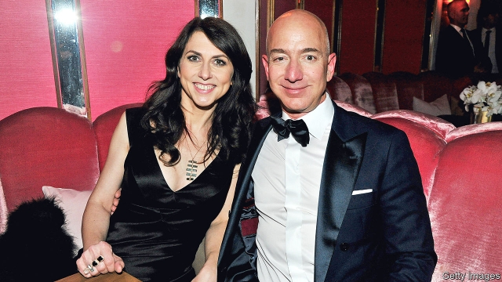

###### Bezos v Bezos

# What the break-up of the world’s richest couple means for Amazon 

##### Jeff Bezos’s stake in the e-commerce giant is much lower than that of other tech founders 

 

> Jan 17th 2019 

 

“WHEN YOU have loving and supportive people in your life, like MacKenzie…you end up being able to take risks.” So declared Jeff Bezos, boss of Amazon, the e-commerce giant, last April. This affirmation by the planet’s richest man of the contribution of his wife of 25 years to the company (she was in the founding team) takes on a new significance now that the power couple is preparing to split. 

When a founder divorces it can affect firms and shareholders in several ways. Most consequential are changes in corporate control. In the case of Wynn Resorts, a casino group, for example, its founder, Steve Wynn, was challenged for control by his former wife, Elaine, after a bitter divorce in 2010. She became the largest shareholder in the group and demanded governance reforms. 

Mr Bezos is not thought to have a prenuptial agreement. In the state of Washington, where the couple mainly live, Ms Bezos is entitled to half of her husband’s $137bn fortune (if the divorce is filed elsewhere, her share may be lower). Critically, Mr Bezos owns a smaller proportion of his firm than other tech founders: whereas Mark Zuckerberg, for example, controls 51.3% of Facebook’s voting rights through a dual-class structure, Mr Bezos controls only about 16% of Amazon and has no special voting rights. 

The divorce could weaken his hand in two ways. His stake could be cut to 8% (though Ms Bezos may accept some cash or put her shares in a trust), changing the balance of power with the largest institutional investors—Vanguard has a 6% stake, for example. And she may demand a board seat. It is conceivable that she might then oppose her ex-husband’s plans at the company. She might push for pay rises for workers, say, that hurt profits (Amazon is already under pressure in this regard). 

To reassure shareholders, reckons William Klepper of Columbia Business School, author of “The CEO’s Boss”, Amazon’s board must now hold discussions with Mr Bezos about how any share transfer will take place and communicate relevant points to shareholders. The board will need to be vigilant on other fronts, too, says David Larcker of Stanford Graduate School of Business. Executives going through a divorce often get distracted, which explains why a company spokesman insisted this week that “Jeff remains focused”. Studies have also shown that a big reduction in wealth through divorce can lead a boss to make more aggressive corporate bets in the hope of clawing back riches. Some boards have even awarded CEOs extra pay to tamp down such behaviour. 

Mr Bezos’s best defence may not be legal manoeuvring, but continuing to do his job well. Amazon has outperformed the S&P 500 index by 33% over the last year, and by over 2,000% over the past decade. A recent survey by Stanford found him (and not Tesla’s Elon Musk) to be “the most difficult CEO to replace”. For now, the love affair between Mr Bezos and investors is still going strong. 

