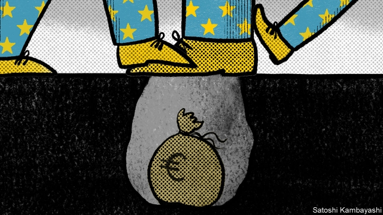

###### Sub par

# Europe’s safest funds lose a tool to cope with negative interest rates 

##### A clash between national regulators has wrong-footed money markets 

 

> Jan 17th 2019 

 

JANUARY 21ST should have been a momentous day for the European Union’s money markets. A package of reforms five years in the making, designed to make the bloc’s safest funds even safer, was due to kick in. Blue-chip firms like BlackRock and Morgan Stanley, anxious to meet the deadline, planned to switch their funds to compliant structures a week early. Yet on January 11th regulators announced a surprise delay. Money-market managers, which together oversee €1.3trn ($1trn), now have until March to put their houses in order. The delay stems from a row between national regulators over whether managers should ditch the “share-cancellation mechanism”(SCM), a tool that helps them deal with negative interest rates. 

Money-market funds invest in very short-term safe assets, like government bonds and top-notch corporate debt, to provide clients with a liquid alternative to cash. They play a key role for pension funds and large companies, which need to park their cash somewhere safe before paying pensions or wages at the end of the month. The aim is to maintain their capital at a stable value, often €1 per share. Any interest on portfolio assets is distributed to investors on the day via dividend payments, leaving the share price unchanged. 

But the system does not work when interest rates are below zero, as they have been in the euro zone since 2014. Negative yields cannot be distributed. So in Ireland and Luxembourg, home to most European money-market funds, regulators allow funds to cancel shares to get around the problem. The assets of the cancelled shares are split among the remaining ones, ensuring that their value per share remains at par. The share price does not budge. 

The European Commission dislikes SCMs. Although most experts disagree, it reckons “share destruction” can be used to mask a capital loss in the fund. After a long silence the European Securities and Markets Authority (ESMA), which co-ordinates regulation across the EU, eventually sided with the commission, confirming that SCMs would be stopped. It had initially hinted that national authorities could decide how to phase out SCMs, which led managers to expect a long transition period. But on Christmas Eve managers were told that no grace period would be allowed. 

When managers fumed at the lack of notice, regulators delayed the reform. But the two-month reprieve does not help much. Managers are scrambling to restructure funds—without an obvious solution to the negative-yield headache. Most are likely to move to accumulative structures, where share prices fluctuate along with the yield. Some worry investors could move their money to bank deposits, depleting funds. That may lower demand for the safe short-term debt issued by banks and states. 

The EU would have been better off placing the fate of SCMs in the hands of the bloc’s legislative arm, which writes other rules on money-market funds, rather than leaving national regulators to squabble over it, says Barry O’Connor of Matheson, a law firm. The outcome is also a victory for France, which bans SCMs, and perhaps regards them as giving Ireland and Luxembourg a competitive edge. Brexit was the swing factor: the British regulator would probably have sided with the two smaller countries. But its vote did not count. 

