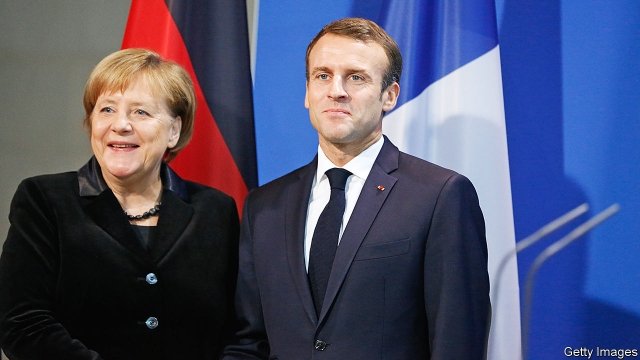

###### Engine trouble

# France and Germany plan to sign a new treaty in Aachen 

##### But the planned celebration is really a sign of weakness 

 

> Jan 17th 2019 

 

YOU CANNOT doubt the ambition. By choosing Aachen as the place where they will sign their renewed treaty of friendship and co-operation on January 22nd, Emmanuel Macron and Angela Merkel aim to send a strong signal: France and Germany are still at the heart of the European project, guiding and dominating it, even as the British prepare to depart. Aachen was the capital of Charlemagne’s ancient Frankish empire, his reincarnation of the lost Roman one. His kingdom encompassed most of the lands of the six founding members of the European Union. 

The Aachen treaty is intended to reinvigorate the Franco-German partnership at the core of the EU, and strengthen the Elysée treaty of 1963 which institutionalised it. Alas, the jamboree may do more harm than good. One reason is that, by focusing on form rather than substance, it exposes how far the two countries have drifted apart. Another is that the show of unity perpetuates the notion of a duumvirate that irritates other members of the EU. This is dispiriting. Even without Brexit, the EU needs new energy and leadership to confront its many problems. 

One difficulty with Aachen is that, despite the smiles, Franco-German relations are at a low ebb. Mr Macron came into office with ambitions to build up Europe as well as France, but his plans have come to little. The huge new euro-zone budget he proposed has been rejected by the flinty Germans, and will be tiny if it exists at all. Progress towards full banking union, including euro-zone-wide deposit insurance, is glacial. France has been disappointed by German reluctance to boost spending, which would generate extra demand across the EU. Now the German economy is flirting with recession. 

Germany is just as disenchanted. Mr Macron has done nothing to help Mrs Merkel draw up a Europe-wide scheme for sharing out refugees. He is trying to break up the party-group system at the European Parliament, which will diminish Mrs Merkel’s Christian Democrats. He is pressing his form of European defence co-operation as a rival to a German model, though at least there is a promise to increase Europe’s ability to act. His surrender to the gilets jaunes protesters will bust his budget, damaging his credibility. And the hope of French support for Germany’s diplomatic ambitions, in the shape of a shared EU permanent seat at the UN Security Council, has evaporated. 

Set against this discouraging backdrop, the Aachen meeting was a chance to forge a new consensus. But the treaty and its various side-documents contain remarkably little: a promise to co-ordinate positions on some issues (but agreement on exactly what these should be has proved elusive with, for instance, no common view on how to tax global companies); the creation of a cross-border assembly that will meet twice a year, though only to talk; and some deepening of cross-border links on health care and education. Charlemagne would not have been impressed. 

Franco-German understanding has always been partly about hiding the economic weakness of France and the strength of Germany. Their differences were fruitful—French views reflect a “southern”, broadly Keynesian approach to political economy, whereas Germany represents a “northern”, more parsimonious attitude. If the two exemplars of these outlooks could agree on a proposal, then others would probably be able to fall into line. 

But even if they can see eye to eye, their ability to impose decisions has waned as the union has expanded. Other governments increasingly resent EU business being stitched up between Paris and Berlin. At the time of the Elysée treaty, when the then EEC was just six members strong, France and Germany had a combined eight votes out of 17, with 12 votes needed to push legislation through the Council of Ministers. Today’s “double-majority” voting system requires at least 16 countries, which must also represent at least 65% of the EU’s population, to approve something. Between them France and Germany have only about 30% of the EU’s citizens. In any case, European politics no longer divides neatly into Latin and Germanic camps. On rule-of-law matters, say, Italy’s populist government is closer to the nationalist governments of eastern Europe. On migration, Italy wants others to take its migrants; the easterners refuse to do so. 

Franco-German understanding is a necessary but increasingly insufficient condition for progress. Worse, the pairing has few obvious allies. Britain is leaving. Italy is run by populists. Spain has a minority government. Poland and Hungary are run by illiberal parties. And no government wants to give institutions in Brussels more power to take the lead. Mrs Merkel and Mr Macron must realise that they cannot fill Charlemagne’s shoes. Their problem is that it is not clear anyone else can either. 

