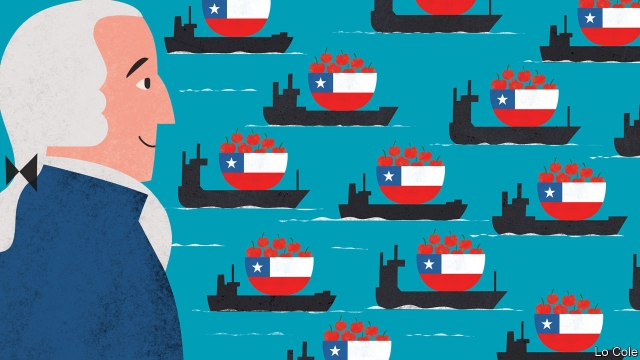

###### Bello

# A cheery tale of Chilean cherries 

##### Government help and market forces create a new industry 

 

> Jan 17th 2019 

 

“I BEGAN TO do cherries because it was difficult,” says Hernán Garcés. The small sweet fruit is easily damaged by rain, hail or rough handling. They must be harvested by hand and processed individually. But the effort has paid off. Mr Garcés, now known as the “father of Chilean cherries”, has just guided the head of China’s customs agency round his firm’s plant, an hour’s drive south of Santiago. Thanks to China’s appetite for cherries, Garces Fruit has become the world’s biggest producer of them. Its output has increased 25-fold in 15 years. And Chile has a booming new industry. The mix of market forces and government help is an example of what Chile needs to escape from the “middle-income trap”. 

It is the country’s good fortune that the southern-hemisphere cherry harvest comes just before Chinese new year. Newly rich Chinese consumers like to bestow on friends and family a gift of cherries, whose red, round form they see as symbolising prosperity. Exported in elegant 5kg (11lb) boxes, the cherries are marketed as something closer to a luxury product than a humdrum fruit. 

This means that quality is paramount. The cherries are pampered. At Greenex, a smaller firm, a $3.2m intelligent processing machine began work last month. It washes the fruit, then guides it into individual channels, where the stems are plucked out. The machine can sort by colour, form, weight and defects, explains Luis Dalidet, the young technician minding it. It discards around 15% of the fruit as inferior. That goes for sale in the local market. The machine will be used for only six weeks or so per year. 

Seizing the opportunity of the Chinese market has required innovation. There are new varieties, and better farming practices such as high-density planting. Garces Fruit uses giant fans to warm the trees in winter and, after heavy rains, draughts of air from a helicopter to dry the cherries, since damp can cause them to split. The biggest changes were in logistics. To pack his product Mr Garcés brought plastic bags from the United States that regulate the air inside them (they are now made in Chile). Ships ply the route from Chile to China in 22 days, compared with 40 in the recent past. 

Thanks mainly to Chinese demand, Chile exported $1.1bn-worth of cherries in 2018, double the value of 2017 and two-thirds that of its much better-known wine exports. Such is the potential demand in China that Mr Garcés is confident that Chile’s cherry exports can double again over the next five years. 

That is welcome. If Chile is going to become a developed country, it must reduce its reliance on copper, which accounts for around half of its exports, and develop higher-value products. That transition began in the 1990s, with rising exports of wine, salmon and grapes, but had seemed to stall recently. 

Creating new industries sometimes requires government involvement. The cherry industry would not exist but for Chile’s free-trade agreement with China and its rigorous sanitary standards, for example. Corfo, the state development agency, provides seed money for innovative ventures. It is inviting bids to build and run a centre to develop lithium batteries. The country also has potential in astrodata, according to Sebastián Sichel of Corfo. With its clear, dark skies, Chile’s desert is home to several of the world’s biggest telescopes. Astronomy is the highest-paying profession in Chile, says Mr Sichel. 

But the cherry industry, and Chile’s diversification, also owe much to market forces. Cherries require field labour, which Chileans spurn. Some 700,000 immigrants, mainly from Haiti and Venezuela, arrived between 2015 and 2017, averting a labour shortage. Farmers are tearing out vines to plant cherry orchards, which are more profitable. Farther south, apple growers are switching to hazelnuts for the same reason. 

Peru has enjoyed a similar agro-industrial revolution. It rivals Chile in exports of blueberries. Competition is leading to specialisation. Peru and Chile squabble over trademark rights to pisco (a grappa named after a Peruvian seaport). Nevertheless, Chile is now importing Peruvian pisco, a superior product. Although the cheap local version remains the favourite tipple of hard-up young people, some Chilean pisco producers have switched to making good white wine. Had he lived to see this happy evidence of the invisible hand of market forces, Adam Smith might have downed a glass and polished off a bowl of cherries to celebrate. 

