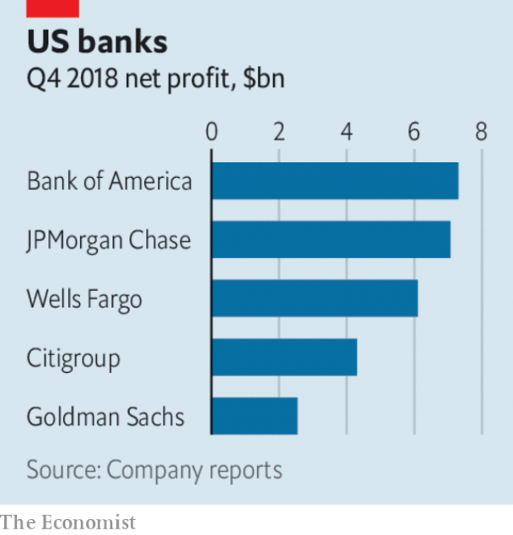

###### Britain’s crisis

# Business this week 

> Jan 17th 2019 

Worse-than-expected trade data from China accentuated concerns about the country’s economic slowdown. Exports fell by 4.4% in December compared with the same month in 2017 and imports by 7.6%. Imports of goods from America slumped by 36% amid the two countries’ trade war. Despite the imposition of tariffs, China still recorded an annual trade surplus with the United States of $323bn, up by 17% from the previous year. 

China’s central bank, meanwhile, injected 570bn yuan ($84bn) into the banking system in order “to maintain reasonably adequate liquidity”. The Chinese new year, which starts on February 5th, is normally associated with a surge in cash transactions. 

Sales of passenger cars in China fell last year for the first time since 1990, puncturing the growth forecasts of the car industry. Despite a strong start to 2018, overall sales of passenger vehicles dropped by 4.1% over the 12 months, dragged down in part by a weaker yuan and the withdrawal of a tax break in late 2017. Sales of electric cars motored ahead, however, accounting for 4% of vehicle sales. The government wants this to reach 20% by 2025. 

Carlos Ghosn’s application for bail was rejected by a court in Tokyo. Mr Ghosn has been in custody since his arrest in November over allegations of financial misconduct at Nissan, where he was subsequently sacked as chairman. Renault, which owns 43% of Nissan and stood by Mr Ghosn as he was “temporarily incapacitated”, was reportedly preparing to replace him as its chief executive and chairman. 

Ford and Volkswagen launched an alliance through which they will work together on making pickup trucks for the global market and commercial vans in Europe. The carmakers said they were also looking at ways to collaborate on electric cars, autonomous vehicles and mobility services, though they provided scant detail about how they would do that. The announcement left little impression on investors. Ford’s share price later tumbled when it warned that its fourth-quarter earnings would fall short of expectations and that it will be “prudent” when forecasting its annual profit. See article. 

The consolidation in the goldmining industry stepped up a notch as Newmont, which is based in Denver, agreed to buy Goldcorp, a Canadian rival, in a $10bn deal. The combined company will be the world’s biggest goldminer, vaulting ahead of the recently merged Barrick-Randgold. 

In a rare public interview, Ren Zhengfei, the founder and president of Huawei, denied that the Chinese maker of telecoms equipment posed a security threat to other countries, asserting that China does not require it to install “back doors” into network systems. Huawei’s apparatus has been barred from government use in America and elsewhere. One of its executives was arrested in Poland recently for spying (he has since been dismissed by the company). 

Faced with ruinous liabilities arising from the role its power lines played in sparking wildfires in California, Pacific Gas and Electric said that it intended to file for bankruptcy protection as its “only viable option”. Fire officials have found that the state’s biggest utility was responsible for 17 wildfires in 2017. It is also being investigated over last year’s devastating infernos. 

Fiserv said it would acquire First Data in a deal it valued at $22bn, one of the biggest ever mergers in the financial-services-and-payments industry. 

 

America’s big banks reported earnings for the fourth quarter. Despite a fall-off in bond and currency trading, net profit at JPMorgan Chase surged to $7.1bn. Bank of America’s quarterly profit of $7.3bn was another record for the bank. And having booked a charge of $22.6bn in the fourth quarter of 2017, Citigroup was able to please investors a year later by reporting a profit of $4.3bn. See article. 

A row over pay prompted Santander to rescind its appointment of Andrea Orcel, the former head of UBS’s investment bank, as chief executive. The Spanish lender balked at fully compensating Mr Orcel for deferred pay, much of it in shares, accrued at the Swiss bank. The sum was reportedly €50m ($57m). See article. 

Tributes were paid to Jack Bogle, the founder of Vanguard, who died at the age of 89. Mr Bogle revolutionised the investment industry in the 1970s by launching an index-tracking fund with super-low fees aimed at everyday investors. Some called him the Henry Ford of finance for bringing Wall Street to the masses. Vanguard is now the world’s second-largest investment firm with $4.9trn of assets under management. One of his best-known pieces of investment advice was: “Time is your friend; impulse is your enemy.” 

