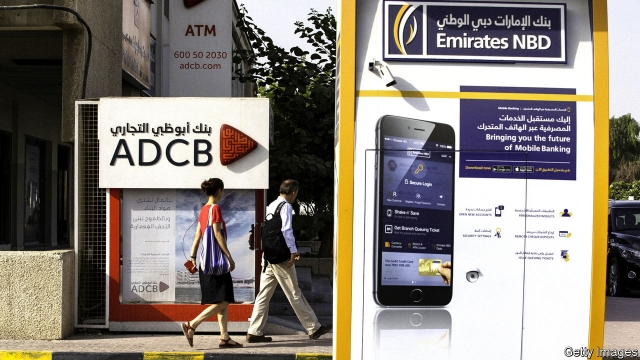

###### Three’s company

# An overbanked region sees some welcome consolidation 

##### But how far will it go? 

 

> Jan 31st 2019 

 

WHEN YOU have 60 banks in a country of just 9.5m people, there is much to be said for merging three at a time. On January 29th Abu Dhabi Commercial Bank (ADCB), the third-biggest bank by assets in the United Arab Emirates (UAE), agreed to buy eighth-ranked Union National Bank in an all-share deal. The enlarged ADCB will then swallow Al Hilal Bank, a smaller, Islamic bank. All three are controlled by Abu Dhabi’s government, which will own 60.2% of the new entity. 

The deal is the latest of several tie-ups, actual or mooted, among banks in the Gulf. On January 24th Kuwait Finance House, that country’s second-biggest bank, announced “tentative” agreement on takeover terms with Ahli United Bank, of Bahrain. Saudi British Bank and Alawwal Bank are joining forces to form Saudi Arabia’s third-largest lender. The kingdom’s number one, National Commercial Bank, is talking to Riyad Bank, the current number four. And in 2017 First Gulf Bank and National Bank of Abu Dhabi combined to create First Abu Dhabi Bank (FAB), the UAE’s market leader. 

Analysts at Moody’s, a rating agency, argue that banks are being pushed into merging by slower economic growth and muted demand for credit, the product of lower oil prices in recent years, and tighter funding conditions. Higher American interest rates have forced banks in the Gulf, where most currencies are pegged to the dollar, to offer more. ADCB’s cost of funds was 2.36% in the last quarter of 2018, up from 1.54% a year earlier, though it managed to maintain its net interest margin at just under 3%. And rising regulatory demands and the costs of digitisation—burdens for banks everywhere—are easier to bear if you are big. 

The Gulf’s banking markets are overcrowded anyway. Oman, Moody’s notes, has 20 banks for 4.6m people. Bahrain has around 30 for a mere 1.5m. In the UAE, although there are lots of tiddlers, the top three lenders account for more than half of assets: FAB boasts 26% and post-merger ADCB 15%. The big fish have lower costs, relative to income, and the gap is widening. 

However, Mohamed Damak of S&P Global Ratings, another agency, believes that ownership structures could limit mergers. Many banks are controlled by governments or rich families. Both could be reluctant partners. Abu Dhabi’s new deal has faced no such obstacle, because the government controls all three parties. The state was also on both sides in the merger that created FAB. The union of Saudi British Bank and Alawwal, says Mr Damak, is made easier by the fact that the main shareholders of both—HSBC and Royal Bank of Scotland—are big Western banks. 

In cramped markets mergers make sense. Abu Dhabi’s three-way deal combines ADCB’s relative strength in corporate banking and serving expatriates, Union National Bank’s in retail banking for locals and Al Hilal’s Islamic franchise. The trio expect to cut their combined costs by 13% in two to three years. Such arithmetic ought to convince more banks to join forces. 

-- 

 单词注释:

1.overbanked[]:[网络] 银行已经过度；总体上看是一个银行过度；过度膨胀 

2.consolidation[kәn.sɒli'deiʃәn]:n. 巩固, 团结, 合并, 加强 [医] 实变 

3.Jan[dʒæn]:n. 一月 

4.merge[mә:dʒ]:vt. 使合并, 使消失, 吞没 vi. 合并, 渐渐消失 [计] 合并 

5.abu[]:abbr. 亚洲广播联盟（Asian Broadcast Union） 

6.asset['æset]:n. 资产, 有益的东西 

7.emirate[e'miәrit]:n. 埃米尔的地位, 酋长国 

8.UAE[]:阿拉伯联合酋长国 

9.AL[]:[计] 算法语言, 字母, 汇编语言 [医] 铝(13号元素) 

10.hilal[]:n. (Hilal)人名；(阿拉伯)希拉勒 

11.Islamic[iz'læmik]:a. 伊斯兰教的, 穆斯林的 

12.entity['entiti]:n. 实体, 实存物, 存在 [计] 实体 

13.moot[mu:t]:n. 大会, 模拟案件, 辩论会 a. 未决议的, 无实际意义的 vt. 讨论, 争论 

14.Kuwait[kә'wait]:n. 科威特 

15.takeover[]:n. 接管, 接收 [经] 接收 

16.Bahrain[]:n. 巴林岛 

17.saudi['sajdi]:a. 沙乌地阿拉伯（人或语）的 

18.lender['lendә]:n. 出借人, 贷方 [经] 出借者, 贷方, 贷款人 

19.riyad[]:[网络] 利雅得；利亚德；里亚德 

20.fab[fæb]:a. 绝好的, 极妙的 [化] 快速原子轰击离子源 

21.analyst['ænәlist]:n. 分析者, 精神分析学家 [化] 分析员; 化验员 

22.peg[peg]:n. 钉, 桩, 栓, 藉口, 销子, 借口 vt. 钉木钉, 固定, 限制, 使受约束 vi. 坚持不懈地奋力于, 疾行 

23.regulatory['regjulәtәri]:a. 受控制的, 统制的, 调整的 [经] 规则的 

24.overcrowd[.әuvә'kraud]:vt. 容纳过多的人, 使过度拥挤 

25.Oman[әu'mɑ:n]:n. 阿曼 

26.tiddler['tidlә]:n. [英口]小鱼；小孩儿 

27.Mohamed[]:n. (Mohamed)人名；(阿拉伯)穆罕默德； 

28.damak[]:[网络] 南唛；道毛克；南唛区 

29.rating['reitiŋ]:n. 等级, 额定功率, 责骂 [经] 等级评定 

30.merger['mә:dʒә]:n. 合并, 归并 [经] 购并 

31.shareholder['ʃєә.hәuldә]:n. 股东 [法] 股东, 股票持有人 

32.cramp[kræmp]:n. 痉挛, 腹部绞痛, 铁夹钳 a. 狭窄的, 难认的 vt. 使抽筋, 以铁箍扣紧, 束缚 

33.corporate['kɒ:pәrit]:a. 社团的, 合伙的, 公司的 [经] 团体的, 法人的, 社团的 

34.expatriate[eks'peitrieit]:n. 移居国外者, 侨民, 被流放者, 背井离乡者 vt. 逐出国外, 脱离国籍, 放逐 vi. 移居国外 

35.franchise['fræntʃaiz]:n. 公民权, 特权, 特许经营权, 免赔额 vt. 给以特权, 给以...公民权 

36.trio['tri:әu]:n. 三重唱 

