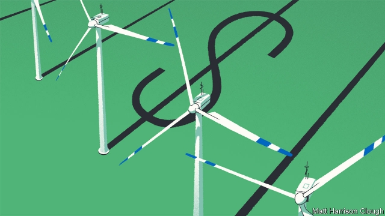

###### Free exchange

# A bold new plan to tackle climate change ignores economic orthodoxy 

 

> print-edition iconPrint edition | Finance and economics | Feb 7th 2019 

AS DEALS GO, the New one was a big one. Franklin Roosevelt’s plan to yank America out of depression permanently altered the contours of the country’s economy and politics. Proponents of a “Green New Deal” harbour similar ambitions. Though still nebulous the proposal, championed most loudly by Alexandria Ocasio-Cortez, a new congresswoman from New York, has been met with surprising enthusiasm in Washington. It is an outright rejection of the orthodox economic approach to climate change. 

In economics, climate change is a big but straightforward example of a market failure, with a correspondingly straightforward solution. People take environmentally harmful decisions because the private benefits of doing so (using a car to get to work, say) outweigh the private costs (the price of the petrol to run the car). But emission-producing activities also impose social costs—deaths from pollution and collisions, the contribution of carbon emissions to climate change—that do not influence an individual’s decision to drive rather than walk or take public transport. To solve the climate problem, then, governments need only include the social cost of carbon in the prices people pay. The simplest approach is a levy on emissions corresponding to that social cost. Carbon-intensive activities become more expensive, and people efficiently reduce their emissions by responding to prices. It is an elegant approach favoured by this newspaper. In January a distinguished and bipartisan list of economists signed a letter that ran in the Wall Street Journal arguing in favour of a version that would refund carbon-tax revenue in the form of a flat, universal dividend. 

But robust carbon taxation is politically elusive. Schemes exist that put a price on carbon, some through a carbon tax and others through a functionally similar system of tradable carbon-emission permits. Only a fifth or so of global emissions are covered, however, and only about 1% of emissions subject to such schemes face a price as high as $40 per tonne of carbon dioxide, the bottom of the $40-80 range deemed necessary to limit warming to no more than 1.5°C relative to pre-industrial temperatures. Time is short. And other policies less loved by economists, such as green subsidies and regulatory restrictions, have brought a solution to the climate problem no closer. 

Green New Dealers reckon the secret lies in making the economy both greener and more equitable. Their plan remains ill-defined, though Democrats are expected to release draft legislation that may provide more details soon. But its primary aims are clear. It proposes a move to 100% clean and renewable energy within a decade or two, and to zero net emissions by mid-century. Carbon prices might be included, but the emphasis is elsewhere. Supporters describe massive public investment to overhaul energy and transport infrastructure; extensive state support for green industries, with the goal of turning America into a leading exporter of clean technologies; and large-scale efforts to help workers through training, job-placement schemes and perhaps a federal job guarantee (essentially, a promise of public work to anyone involuntarily unemployed). Supporters are vague about costs and funding. But decarbonising the economy so quickly would certainly require vast sums, some of which would probably be raised by borrowing and some, almost certainly, by taxes on the well-off. 

Why bundle together the seemingly unrelated issues of climate change and economic inequality? To some, the appeal rests in political economy. Any plan to free an industrialised economy from fossil-fuel dependence will create losers. To succeed politically, it must mobilise groups of winners more powerful and passionate than those losers. Plans to tax carbon and pay out the revenue as a dividend may seem appealing; what voter could resist cash rebates? But the benefits, from lowering emissions to paying out dividends, are shared broadly and thinly, while the costs are concentrated on a few politically powerful industries. A carbon refund of $100 per month might be too small to mobilise a critical mass of voters, while the associated tax would prompt a no-holds-barred campaign by deep-pocketed fossil-fuel firms. A Green New Deal, in contrast, might promise sufficient goodies to sufficiently organised interest groups, such as labour unions and domestic manufacturers, to gather a winning political coalition. 

To others, the Green New Deal is something more revolutionary. Roosevelt saw the Depression as both a threat to liberal democracy and the product of an economic system that put profits ahead of the welfare of the working man. Similarly, left-wing activists view climate change as the result of unbridled capitalism. They aim to solve it by redistributing economic and political power. 

From either perspective, there is plenty in the Green New Deal to make economists nervous. Yes, many approve of government funding for public goods such as infrastructure and education. Some see the sense of embracing second-best solutions to serious problems when the ideal approach is politically untenable. But the Green New Deal largely dispenses with analysis of the costs and benefits of climate policy. It would create large opportunities for rent-seeking and protectionism, with no guarantee that the promised climate benefits will follow. It might chuck growth-throttling tax rises and dangerously high deficits into the bargain as well. 

Of course, much the same could be said for the New Deal, or indeed the effort to win the second world war. In fact, the criticism of the economic approach to climate change implicit in the Green New Deal is not that it is flawed or politically unrealistic, but that it is a category error, like trying to defeat Hitler with a fascism tax. Climate change is not a market glitch to be fixed through pricing, in this view, but part of a dire social crisis. It is hard to judge such arguments without decades of hindsight. But they seem to be winning, raising the possibility that, for the moment, economists have lost the chance to lead the fight against climate change. 

