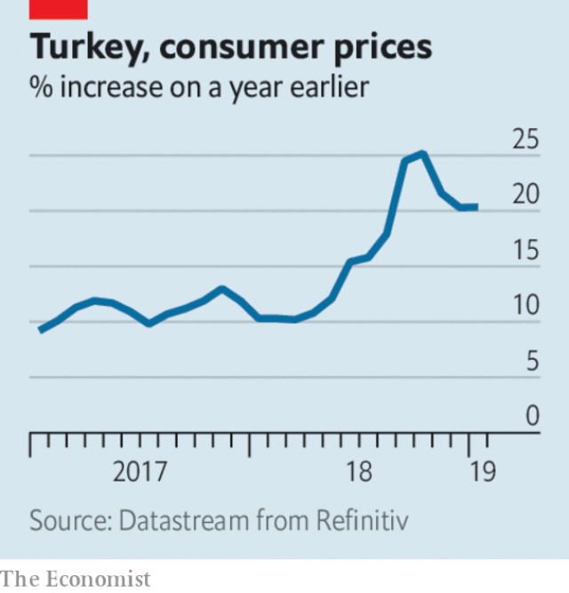

###### American politics

# Business this week 

> Feb 7th 2019 

Donald Trump nominated David Malpass to become the World Bank’s next president, a job that is by tradition filled by the American government. Mr Malpass currently heads international affairs at the Treasury. A controversial choice, he has voiced concerns about the spreading power of multilateral and global institutions and of Chinese influence. He was part of the negotiating team that agreed to a capital increase in the World Bank in return for restraint on staff wages and benefits. See article. 

Europe’s competition commissioner blocked the merger of Alstom with the rail operations of Siemens, reasoning that the combination of the French and German companies would lead to higher prices in the markets for signalling systems and high-speed trains. Supporters of the deal, such as Bruno Le Maire, the French finance minister, said it was a mistake because such mega-mergers are vital to take on the might of Chinese companies. However, in some markets a combined Alstom-Siemens would have been three times bigger than its largest rival. 

Nissan’s reversal of a promise to build the X-Trail SUV at its factory in Sunderland, a city in the north of England, was blamed by Remainers on Britain’s commitment to leave the European Union. The carmaker said that Brexit was a concern. But its decision was also driven by the collapse in demand for diesel and the lower costs of making the vehicle in Japan. See article. 

Ryanair reported its first quarterly loss since 2014. Europe’s biggest low-cost airline said that although passenger numbers had grown, the average fare it was able to charge had fallen to less than €30 ($34) because of excess short-haul capacity in Europe. In a nod to shareholder discontent, the airline is replacing its chairman, who has been in the job for over 20 years. It is also moving to set up a group structure which will be overseen by Michael O’Leary, Ryanair’s ebullient chief executive. 

Underlining the turbulence in Europe’s discount-flight market, Germania became the latest in a long list of low-cost carriers to declare bankruptcy. The Berlin-based airline flew 4m passengers last year. 

 

Turkey’s inflation rate crept up to 20.4% in January. Floods in Antalya province, the centre of Turkey’s greenhouse production of vegetables and fruits, helped push food inflation up to 31%, the highest reading since 2004 and up from 25% in December. Although it is under political pressure to reduce interest rates, the central bank recently committed itself to maintain its tight monetary stance until price pressures weaken. Happily, it also forecast that inflation will fall by the end of the year. 

India’s central bank cut its key interest rate by a quarter of a percentage point, to 6.25%. It was the first big policy decision taken under the new governor, Shaktikanta Das. Mr Das was given the job after Urjit Patel quit amid a quarrel with the government, which has been nagging the bank to do more to boost the economy ahead of this year’s election. 

American employers created 304,000 jobs in January, far more than economists had forecast and the 100th consecutive month of job growth. Average hourly wages increased by 3.2% during the 12-months ending in January. 

Following bumper annual earnings from Chevron, ExxonMobil and Shell,  bp more than doubled its headline profit in 2018, to $12.7bn, the most since the downturn in oil prices that began in 2014. 

Despite a widely panned redesign of its app, Snap, the parent company of Snapchat, increased revenues by 36% in the last three months of 2018 compared with the same quarter a year earlier. Having never reported a profit since going public in 2017, investors took comfort in the halving of its loss for the quarter, to $192m. 

Sony’s share price tumbled after it reported a big drop in quarterly profit for its gaming division. Rumours that the Japanese electronics giant might release PlayStation 5 next year, its first update to the gaming console in six years, did little to lift its stock. 

Internet companies are removing 72% of content flagged as racist or xenophobic in Europe within 24 hours. That is up from 28% in 2016, when Facebook, Microsoft, Twitter and YouTube presented a voluntary code of conduct on hate speech, which in effect stopped the EU from imposing its own restrictions. 

Bill Gross announced his retirement from the investment industry. One of the founders of Pimco, Mr Gross was once known as the Bond King for managing the world’s largest bond fund, which had almost $300bn in assets at its peak. He left Pimco in 2014 after falling out with the firm and has struggled to repeat his success. His current fund manages only $1bn in assets. Summing up the industry in 2010, Mr Gross said “My clients don’t pay me to feel sorry, they pay me to bring them money.” See article. 

