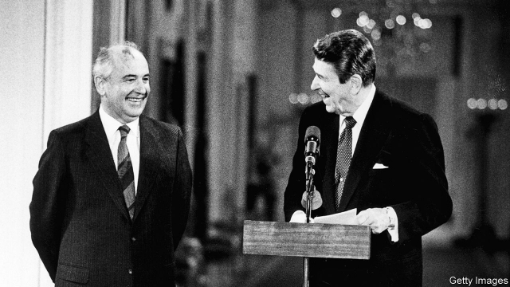

###### Missiles and mistrust

# Russia, America and the INF 

 

> print-edition iconPrint edition | United States | Feb 9th 2019 

THE WHITE HOUSE was draped with a red flag, with hammer and sickle. Inside, the Soviet delegation led by Mikhail Gorbachev sang “Moscow Nights” and celebrated a landmark agreement to eliminate an entire class of nuclear weapons that had threatened Europe for years. It was December 8th 1987. The next day America’s great and good, a group which included a pushy entrepreneur called Donald Trump, flocked to lunch at the State Department to hear Mr Gorbachev speak. “Two world wars, an exhausting cold war, plus small wars—all destroying millions of lives. Isn’t this a high enough price to pay for adventurism, arrogance, contempt for the interests and rights of others?” the Soviet leader said. “How far we had come from the days of tension,” George Shultz, Reagan’s secretary of state mused to himself. 

Neither Russian nor American military and security-service bosses shared the festive mood. Russia’s top brass, who had spent their entire lives fighting America, felt betrayed. America’s cold warriors feared that Mr Gorbachev was trying to smother them with kindness and lure them into a trap. Thirty years later, the revanchists’ view has finally prevailed. While the INF treaty has, in effect, been eroding for years, its scrapping is symbolic of the distrust that now permeates relations between America and Russia. 

“The problem is that you [America] have been playing the winner for too long,” says Evgeny Buzhinsky, a former senior general and member of the Russian general staff. “Putin is not Gorbachev,” he adds. Whereas the White House sees the end of the INF treaty as a recognition of reality and the treaty’s failure to restrain Russia and China, along with several other countries, from developing the banned missiles, the Kremlin sees it as the manifestation of American triumphalism and a vindication of Mr Putin’s inbred distrust of America. 

“The Soviet Union is not a weak, poor country that can be pushed around,” Vladimir Kriuchkov, the head of Soviet intelligence, told his American counterparts in 1987. Mr Putin, a student of Mr Kriuchkov, has made that his policy. Before she joined the National Security Council Fiona Hill, an expert on Russia, wrote that for Mr Putin, the “paradigm has not changed so much. Yes, communism is gone and the Soviet Union has crumbled but, from his vantage point, Russia did not go anywhere. Military might still makes right.” 

Mr Putin saw treaties such as the INF agreement not as evidence of goodwill between the two countries but as a sign of Russia’s relative weakness, which he has tried to correct. As a former KGB operative, Ms Hill argued, he is obsessed with security or bezopasnost, literally the “absence of threats”, and constantly fights dangers which, in his mind, come almost exclusively from America. So what America sees as Russia’s aggression, whether in Ukraine and Syria or in presidential elections, Mr Putin sees as a way of deterring America and preserving Russia’s freedom to act without restraint in its sphere of influence. 

The problem, Ms Hill argued, is that American politicians find it hard to comprehend that Russia still sees the United States as a threat after the end of cold-war competition. This leads to a spiral, which has dragged down the INF treaty. Russia has long cheated on its obligations, but cried foul when America decided to suspend the treaty, and is now presenting that decision as proof of America’s disregard for the post-cold-war security architecture. 

Few Western policymakers have much hope of improving relations with Mr Putin. As a former KGB operative, he prefers clandestine actions and feints to direct confrontation. These include engaging in covert operations, such as spreading disinformation, encouraging cyber-crime or using mercenaries, all masked as non-state actors. In the words of one senior American official, the task is not to win over Mr Putin, but to manage the conflict and “professionalise” the relationship. The administration may hope that dismantling the treaty will lead to a more sincere conversation about security. So far, however, there is little indication that Mr Putin will go along. Instead, the Kremlin is using America’s move for propaganda purposes. 

Russian military strategists say Russia should assume that America will place new missiles in Europe and get ready to respond. Should America proceed, “we’ll have to think not only about missiles in Kaliningrad, but also those in Chukotka that can at least reach Seattle”, Mr Buzhinsky says. The presence of nuclear-armed missiles in eastern Europe, he adds, would trigger a replay of the Cuban missile crisis. “Then, as our officers say, it’s time to think not about a retaliatory strike, but about a pre-emptive one.” Russia and America have indeed come a long way from the days of Gorbachev and Reagan. 

