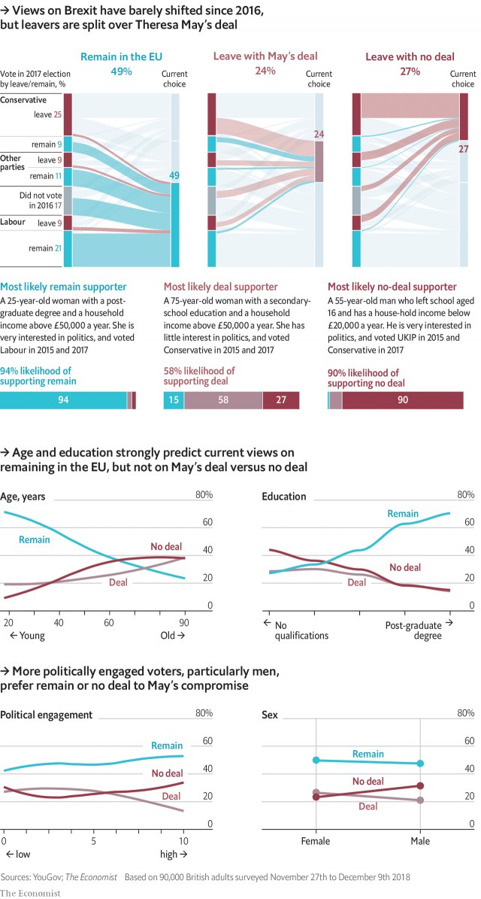

###### The centre cannot hold

# British voters are unimpressed by Theresa May’s Brexit deal 

##### The people most likely to support it are also the least interested in politics 

 

> Feb 23rd 2019 

AFTER 52% OF Britons voted to leave the EU in 2016, stunned observers wondered when and how Brexit would occur. The picture is scarcely clearer today. In January Parliament rejected the withdrawal pact agreed on with the EU by Theresa May, the prime minister. Yet a majority of MPs oppose leaving without a deal. And neither Mrs May nor Jeremy Corbyn, the opposition leader, backs a second referendum, which could undo Brexit altogether. 

Eventually the public will have its say on the handling of Brexit, be it in a referendum or a general election. Voters are outraged. In a recent poll, 75% of respondents said that “politicians are not up to the job”. 

Yet voters are as split as Parliament is. Late last year YouGov, a pollster, asked 90,000 Britons if they preferred Mrs May’s accord, leaving without a deal or staying in the EU. Just as in 2016, a narrow majority of those expressing an opinion wanted to depart. Few have changed their minds: 90% of leave voters and 84% of remainers would vote the same way today. However, leavers have split over Mrs May’s plan, with 24% of respondents supporting it and 27% choosing no deal. Among leavers from her own party, 55% prefer no deal to her plan. 

Using YouGov’s data, The Economist has built a model of the odds of each respondent backing each Brexit option. The referendum divided Britons by age, income, schooling and party: old, poor Tories with little education chose to leave, while rich young Labourites with degrees wanted to remain. Based on these variables, the model reliably identifies both no-dealers and remainers. People with the most remain-friendly profiles were 94% likely to pick remain, and those with the most anti-EU traits were 90% likely to want no deal. 

In contrast, fans of Mrs May’s deal have less in common with each other. The highest chance the model gives to a respondent backing it is just 58%. That will make them harder to target in get-out-the-vote efforts. 

Moreover, rather than sitting between no-dealers and remainers on age, income, schooling and party, deal supporters look like no-dealers, with two exceptions: interest in politics and Y chromosomes. Men who follow politics closely prefer the ideological end-points of leaving with no deal or remaining. Women, especially those who mostly ignore politics, are more open to the deal. Sadly for Mrs May, people bored by politics are also unlikely to vote. 

Mrs May hoped her deal would be seen as a fair compromise between EU membership and a hard Brexit. In fact, the issue is so divisive that her plan is the least popular choice. The prime minister says she opposes a new referendum out of respect for the voters’ verdict in 2016. Another possibility is that she fears what would happen if the people did vote on her plan. 

