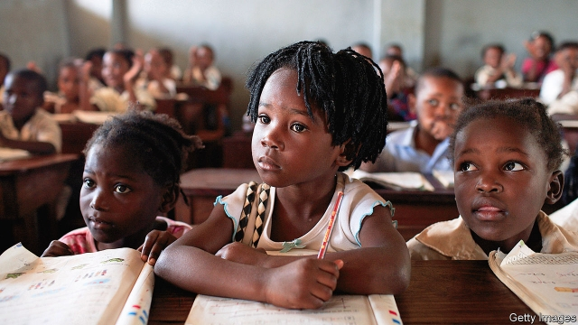
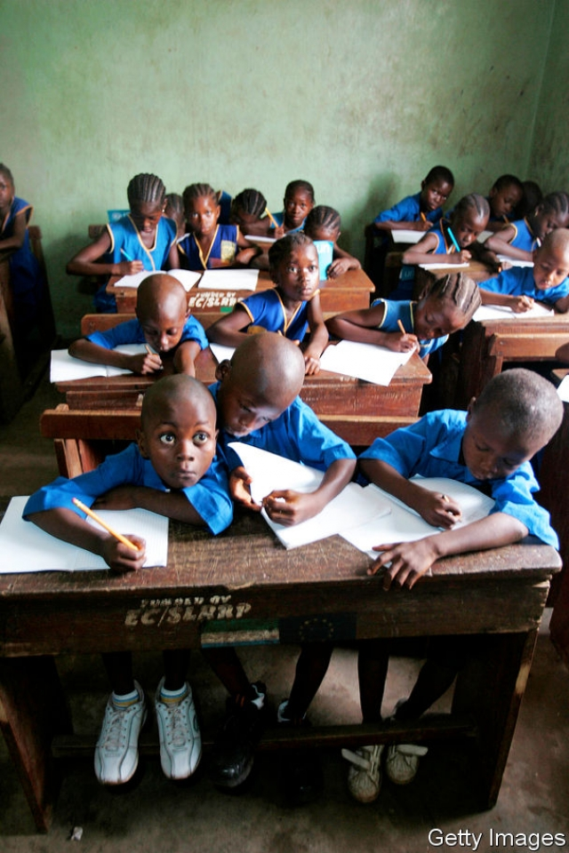

###### Language without instruction

# More children around the world are being taught in English, often badly 

##### If children or teachers do not understand the language of instruction, they cannot learn or teach properly 

 

> Feb 21st 2019 

“ROLY POLY right, right, right. Roly poly left, left, left,” sings a class of five-year-olds at a government primary school on the outskirts of Lucknow, a city in India’s Hindi-speaking heartland. This English-medium school, one of seven that opened last year among the 215 government schools in the Sarojini Nagar administrative block, is part of an effort by the government of Uttar Pradesh, India’s most populous state, to counter the rise of private schools. Private schools have been mushrooming in India—private-sector enrolment rose from around a quarter of pupils in 2010-11 to over a third in 2016-17—and in Sarojini Nagar there are 200 registered private schools and many more unregistered ones. One of their main attractions is that the great majority of them use (or claim to use) English as the language of instruction. 

As a recruitment drive, the policy seems to be working. A school nearby saw its enrolment rise over 50% in six months when it switched the medium of instruction from Hindi to English last April. As an education policy, however, it is not ideal. 

The language in which children are taught can be hugely contentious. Colonial history determines its political salience. Where colonial powers wiped out the indigenous population, such as in America and Australia, it is hardly an issue: the colonial language has crushed indigenous ones, though a few of these are making a comeback (see article). In places that were colonised unsuccessfully or not at all—such as Europe, Japan and China—indigenous languages rule. But controversy erupts in countries with a century or two of effective government by a colonial power—in South Asia and Africa, for instance—where the colonial language retains considerable sway. 

In sub-Saharan Africa, only Tanzania, Ethiopia and Eritrea do not use a colonial language at all during primary education. Others use either English or French. That is partly because of inertia. Developing curricula and printing books in local languages is expensive, and doing so in scientific subjects in which the terminology is in English is difficult. Keeping English or French is also, in some places, politically convenient. Where tribes compete for power, the colonial language can be less controversial than the local ones. And then there is the self-interest of the elites, usually the only people who can speak the colonial language properly. “They have a huge return to their linguistic capital” when it is the official language, says Rajesh Ramachandran, of the Alfred Weber Institute for Economics in Heidelberg, Germany. The bias in favour of English is sometimes ferociously enforced: Rose Goodhart, a teacher in Ghana, has seen children beaten for speaking in their mother tongue. 

It is not just inertia and coercion that work in favour of English. It is also, these days, popular demand. English is the language of technology. In Africa and South Asia, most higher education is in English, so those who aspire to a college education must master the language. “In higher studies, like medicine and engineering, English is a must,” says Atul Kumar Srivastava, president of the Association of Private Schools of Uttar Pradesh, and headmaster of St Basil’s School, Lucknow. 

English-medium education is no longer the preserve of the elite. Sameena Asif, whose husband is a street hawker, sends her three children to private school in Lahore, Pakistan. “They won’t get a degree or a job if they can’t speak English. I have a BA in Urdu, but it’s useless. I’m embarrassed that I was educated in Urdu.” 

Many state governments in India, like that in Uttar Pradesh, are establishing or expanding English-medium education. All primary schools are English-medium in Jammu & Kashmir; Andhra Pradesh announced last year that its elementary schools would convert to English; others are experimenting on a smaller scale. In Pakistan, the Punjab provincial government announced in 2009 that it would go English-medium, and Khyber Pakhtunkhwa announced the same in 2013. 

Yet there are problems associated with much English-medium schooling. Visitors soon discover that, except in elite establishments, interviews in most “English-medium” schools have to be conducted through an interpreter, in the local language, because neither teachers nor pupils speak much English. At the Lucknow primary school, the head teacher and two out of four teachers speak reasonably good English, but the other two little. Since most of the pupils’ parents are illiterate, they are unlikely to be aware of that. 

Such difficulties are reflected in the findings of much research into the educational outcomes of English-medium schooling. The most-often cited study into private versus government-school outcomes in India, carried out in Andhra Pradesh in 2013, found that on average pupils in private schools performed a bit better than those in government schools. But pupils in Telugu-speaking private schools did considerably better in maths than those in English-medium schools. 

History provides some intriguing examples of the effect of being educated in the mother tongue or some other language. A policy change in South Africa introduced in 1955 by the apartheid government used the medium of education to sharpen the divide between whites and blacks, increasing the years of schooling that children got in their mother tongue. Two extra years of mother-tongue schooling, instead of schooling in Afrikaans or English, raised both literacy and wages, according to a recent study of historical data. 

A similar effect was seen in Ethiopia after the downfall of the Derg, a communist military dictatorship, in 1987. The Derg had mandated that education be in Amharic, a Semitic language with its own script, very different from Oromigno, a Cushitic language spoken by the Oromo people and written in the Latin script. A study from 2017 looking at Oromo children educated just before and just after the change showed an 18-percentage-point increase in literacy. Newspaper readership was also 25% higher among the mother-tongue-educated people, which very likely meant greater political participation. 

Of course, parents may be more concerned that their offspring speak English, rather than that they learn history or arithmetic. They may think it worth sacrificing some of the knowledge and understanding that can be gained from being educated in the mother tongue for better prospects in the labour market. But there seems not to be a trade-off. A forthcoming study looked at 12 schools in Cameroon which taught children in Kom rather than, as is standard practice, English, during the first three years of school. Not only did Kom-medium children perform better in all subjects than English-medium ones in third-year tests; in the fifth year they even outperformed English-medium children in English. 

“Parents are right that speaking English works for a child,” says Zia Abbas of The Citizens’ Foundation (TCF), a charity that runs 1,500 schools in Pakistan at which children are taught in Urdu. “But they don’t understand the difference between English as a subject and English as a medium of instruction. The children end up not learning English, and not learning anything.” 

Some governments have taken this on board. In Pakistani Punjab the new Pakistan Tehreek-e-Insaf government, which took power in the province last year, is to reverse the previous government’s move from Urdu to English. “We don’t have enough qualified teachers,” says Murad Raas, Punjab’s education minister, “and children in the rural areas can’t learn in English. They must be taught in a language they understand.” Punjab is developing a new Urdu-medium curriculum. 

Uganda has implemented mother-tongue instruction for the first four years in 12 different languages, and seen big improvements in learning in some languages, though not all. Kenya, too, is moving in the mother-tongue direction. Last month the government introduced a new curriculum which includes a half-hour lesson in “literacy”—in the mother tongue—every day. 

The infinite variety of language means that even the choice of mother tongue is not an easy one. Urdu is the mother tongue of only a minority of Pakistani children. In Punjab most families speak Punjabi at home. So why does TCF not teach Punjabi children in Punjabi? Because, says Riaz Kamlani of the charity, “there are a dozen languages in Pakistan, and we don’t have the resources to use them all as a medium.” Urdu is a compromise. 

 

These complexities mean that mother-tongue teaching requires careful planning. Ben Piper, who leads a USAID-funded literacy programme in government schools in Kenya, found, to his surprise, that children taught in their mother tongue learnt less maths than those taught in English or Swahili (the mother tongue of only a minority of Kenyans). The problem, he realised, was that teachers are assigned jobs by a central agency, without regard to their mother tongue, so they often do not understand the local language in which they are supposed to teach. In Ghana Elorm Apatey was teaching in an English-medium junior high school in the Volta region. To help his pupils, he also spoke to them in Ewe, his and their mother tongue. But because there are so many dialects of Ewe he had to employ linguistically talented pupils to translate for those who did not understand his Ewe. 

The complexity of the linguistic landscape in many countries argues not for abandoning mother-tongue teaching, but for developing layered curriculums that ease children into learning other languages. TCF is doing that for the inhabitants of the Thar desert, in a remote part of Sindh province. Their mother tongue is Dhatki. Sindhi, the provincial language, is quite close to that. Urdu, the lingua franca of Pakistan, is necessary but less familiar. English is hardest of all, but as desirable to the Thari people as to anybody else. So the curriculum will start children off in Dhatki and gradually introduce them to the other languages they will need as citizens of Pakistan, and of the 21st century. English will be a subject, not a medium. 

Such linguistically sensitive schooling demands more resources than most governments can afford. Instead, more pupils are likely to be taught in English, despite the drawbacks that entails. Their parents will make sacrifices to buy what they believe to be an advantage for their children. “If our children don’t speak English, they can’t excel in today’s world,” says Rukayat Tanvir, whose husband is a shopkeeper in Lahore, and who sends five children to an English-medium private school. “It gives me pleasure to hear my daughters speaking English even though I can’t understand what they are saying.” 

