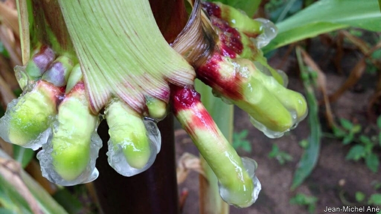

###### Nitrogen fertilisation

# Rice, maize and sorghum may be able to fix nitrogen from the air 

##### That would help agricultural productivity a lot 

 

> Feb 21st 2019 

PLANTS NEED nitrogen to make proteins and DNA. But though this element is abundant in the air, they have failed to evolve the biochemical apparatus needed to break up nitrogen molecules and combine the resulting atoms with other elements (a process called “fixing”) in order to feed it into their biochemical pathways. Some bacteria have, however, managed this trick. And some plants, notably legumes, have worked out how to play host to these nitrogen-fixing bacteria by encouraging them to invade the cells of their roots, and by growing special root nodules to encourage such cohabitation. 

At the moment, farmers overcome the inability of most crops to fix nitrogen either by crop rotation (planting fields with legumes every few years to refresh the soil with nitrogenous compounds) or by applying artificial fertiliser. But fertiliser, on which about half of the world’s food production now relies, costs money and (a more modern worry) is manufactured using a lot of fossil fuel in the form of natural gas. It has therefore long been a dream of agricultural scientists to fit out cereal crops with their own bacteria-hosting nodules, or similar organs, so as to permit them to fix their own nitrogen. 

Jean-Michel Ané of the University of Wisconsin-Madison is one of those working on this problem. He told the AAAS meeting of two approaches that he and his colleagues are following. One involves an evolutionary analysis of the way legumes became bacteria-friendly in the first place. The other is the identification of a type of symbiotic nitrogen-fixing that does not rely on root nodules. 

The crucial insight behind the first of these approaches was the realisation that the association between legumes and bacteria is similar to a more widespread one between land plants and fungi. Most plants have fungal hyphae growing in their roots. Occasionally this is a parasitic relationship, but usually it is mutualistic. The plant feeds sugars and amino acids to the fungus. The fungus supplies the plant with water and minerals. Analysis of the genes involved in the plant side of this deal suggests that plant-fungal symbiosis goes back to the first land plants. The genes in question permit intimate association between fungal hyphae and plant cells, and the molecular pathways involved are similar to those that let nitrogen-fixing bacteria sit inside legume root cells. 

Dr Ané and his colleagues have also worked out the evolutionary origin of nodule formation. This is a result of mutations in genes that control the formation of lateral roots in legumes. What seems to have happened is that, about 60m years ago, relevant changes in the symbiosis genes and the root-formation genes came together in the ancestor of modern legumes. The team’s mission is to recapitulate this fortuitous coincidence in other crops, by genetic tweaking. At the moment they are studying the effects of promising-looking tweaks on root cultures of poplar. They picked poplar as a model for their experiments because it has a well-understood genome and is fairly closely related to the legume family. Their ultimate target is rice—the third most widely grown crop in the world. 

The most widely grown crop of all, though, is maize, and this cereal is the subject of the second approach Dr Ané and his colleagues are taking. Some years ago the properties of a strange form of maize, which is grown by farmers in the Sierra Mixe of Oaxaca state, in Mexico, were brought to the world’s attention by Howard-Yana Shapiro, chief agricultural officer at Mars, an American confectionery company, and an adjunct professor of agriculture at the University of California, Davis. 

Sierra Mixe maize is a giant crop, standing five or six metres tall when fully grown. What intrigued Dr Shapiro, however, was that it needs neither fertiliser nor crop rotation to flourish. It also, he noticed, has a strange anatomy. It puts out aerial roots (see picture). These are a feature that plants such as mangroves (which live in saline coastal areas) and epiphytic orchids (which cling onto trees and have no contact with the soil) use to collect water from the air. Such roots were, though, previously unknown on maize. Moreover, far from absorbing water when conditions are damp they actually ooze gel when it rains, and this gel drips off them onto the soil. 

Analysis of the gel showed that it was fixing nitrogen. The aerial roots, in other words, are hosting nitrogen-fixing bacteria and using them to fertilise the surrounding soil. Hence the lack of need for fertiliser or crop rotation. 

Six-metre-tall maize plants, even ones with the ability to fix nitrogen, are unlikely to find favour with the intensive farmers of the rich world. But maize is maize, and Dr Ané, Dr Shapiro and their colleagues have managed to cross-breed aerial roots into more manageable plants, which are being tested experimentally. They have also, by searching old literature, found that gel-dripping aerial roots were reported on a strain of sorghum at a conference in India in 1984, though the matter was never followed up. 

Dr Ané is now doing so. Though sorghum is not as dominant or as widely traded as maize or rice, it is still important. If any of these crops could be encouraged to fix nitrogen routinely, that would simplify and improve farmers’ lives enormously. 

