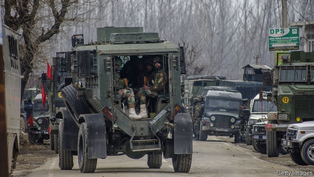
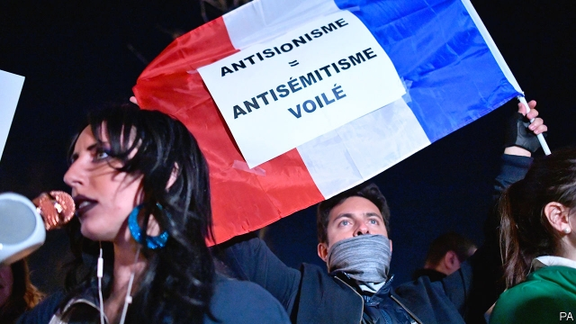

###### Economic reform

# Politics this week 

 

> Feb 21st 2019 

Pakistan’s prime minister, Imran Khan, warned India not to attack his country in retaliation for a suicide-bombing in Kashmir that killed 40 Indian security personnel, the worst attack on security forces in the region in 30 years of conflict. A militant group based in Pakistan said it was responsible. As tensions mounted between the two arch-rivals, a gun battle between police and suspected militants killed nine people in a village in Kashmir. See article. 

Amid the hostilities Saudi Arabia’s crown prince and de facto leader, Muhammad bin Salman, visited Pakistan and India, where he promised large investment deals. The Saudi foreign minister offered to help ease tensions between the two neighbours, underscoring the Saudis’ new-found confidence on the world stage. See article. 

A fire broke out in the Chawkbazar district of Dhaka, Bangladesh’s capital, killing scores of people. Poor safety regulations have led to hundreds of people being killed in building fires in recent years. 

Fang Fenghui, a former chief of the joint staff in China’s army, was found guilty of corruption and sentenced to life in prison. Mr Fang had been allied with Zhang Yang, who served on China’s military commission before his arrest for corruption and subsequent suicide in 2017. President Xi Jinping has undertaken an unprecedented crackdown on graft, which some believe to be a cover for a purge of his opponents. 

Nigeria delayed its presidential election by a week after officials said they had not managed to distribute ballot papers and other voting materials in time for the scheduled date of February 16th. The delay is expected to reduce voter turnout, as many people had to travel to their home districts in order to cast their ballots. See article. 

South Africa’s government pledged 69bn rand ($4.9bn) to prop up Eskom, a state-owned power utility that is close to bankruptcy. Power cuts caused by poor maintenance have slowed economic growth. See article. 

Hundreds of civilians were evacuated from the last enclave held by Islamic State in eastern Syria. Kurdish-led forces backed by America have pushed the jihadists to the brink of defeat. A Kurdish commander urged Donald Trump to halt his plans to pull American soldiers out of Syria and called for up to 1,500 international troops to remain. 

Poland withdrew from a central European summit in Jerusalem after a dispute with Israel over how to characterise Poland’s treatment of its Jewish community during the second world war. Israel’s acting foreign minister said Poles “suckle anti-Semitism with their mother’s milk”. 

In Britain, eight Labour MPs quit the party over Jeremy Corbyn’s poor leadership, which has led to dithering over Brexit and failed to clamp down on a surge in anti-Semitism among party activists. The eight back a second referendum on Britain leaving the EU. Rather than form a new party they will for now sit in the House of Commons as the Independent Group. They called on centrist MPs from any party to join them. Three Conservative MPs duly did so. See article. 

 

Demonstrations were held across France to protest against the rise in attacks against Jewish people and symbols, which were up by 74% last year. This week 80 Jewish graves were daubed with swastikas, and Alain Finkielkraut, a prominent philosopher, was heckled with anti-Semitic abuse by gilets jaunes (yellow vest) protesters. See article. 

Pedro Sánchez, the prime minister of Spain, called a snap general election for April 28th. Mr Sánchez’s socialist-led coalition had suffered a heavy defeat in parliament when parties from Catalonia that normally support the government joined conservatives in voting down the budget. The Catalans had tried to force Mr Sánchez into discussing independence for their region. 

Donald Trump urged Venezuela’s armed forces to back a political transition and said they should accept the offer of amnesty by Juan Guaidó, who has been recognised as the country’s interim president by Venezuela’s legislature and by some 50 countries. Mr Trump held open the possibility of military intervention to topple the repressive regime of Nicolás Maduro. 

Jair Bolsonaro, Brazil’s president, presented an ambitious plan to reform the country’s publicly funded pension schemes. His proposal, which requires amendments to the constitution, would establish a minimum retirement age of 65 for men and 62 for women and would limit the scope for pensioners to collect more than one benefit. See article. 

Gerald Butts, the principal private secretary of Canada’s prime minister, Justin Trudeau, resigned. He denied allegations that he or anyone else in the prime minister’s office had put pressure on Jody Wilson-Raybould, then justice minister, to settle a criminal case against an engineering company based in Montreal. Mr Trudeau has also denied that he put pressure on Ms Wilson-Raybould to intervene. See article. 

Ecuador reached an agreement with the IMF to borrow $4.2bn to help it cope with a large external debt and budget deficit. It will also borrow $6bn from other multilateral lenders, including the World Bank. The government will reduce fuel subsidies and employment at state-owned enterprises. 

The first lawsuits were launched against Donald Trump’s declaration of a national emergency on the Mexican border, which allows him to sequester funding for his border wall. Sixteen states, including California, filed a court motion arguing that Mr Trump’s edict would divert money from law enforcement. See article. 

Bernie Sanders announced that he is to run again for president as a Democrat in 2020. The 77-year-old senator from Vermont was describing himself as a socialist years before today’s crop of young pretenders in the party was even born. He raised nearly $6m in the 24 hours following his campaign launch, outstripping his rivals. See article. 

