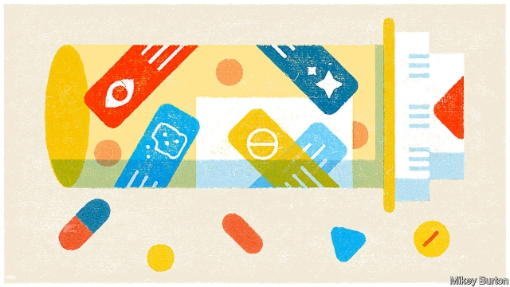

###### Old drugs in new bottles

# Deploying drugs for new purposes holds great promise 

##### Pharma firms and governments should both make it easier 

 

> Feb 28th 2019 

BIG PHARMA is under fire. This week the bosses of seven large drug firms were hauled before the United States Congress to answer pointed questions about the cost of their medicines. The hearings come amid rising bipartisan anger about high drug prices. New laws are threatened (see article). Concerns about the affordability of medicines are not peculiar to America; they are global. In Britain the price of a new drug for cystic fibrosis has provoked fury, as has the government’s refusal to pay it. Italy is calling for the World Health Organisation to bring greater transparency to the cost of making drugs and the prices charged for them. 

Too rarely raised in this discussion is one promising area where pillmakers and governments alike could do more to fight disease while also saving money. Drugs can be “repurposed” (see International section). That is, existing drugs can sometimes be used to treat diseases other than the ones for which they were first designed. This can be a cheaper way to develop new treatments. It could also help answer another criticism often thrown at drug firms: that they do not invest enough in areas where medical need is great but financial returns are unattractive, such as rare cancers, new antibiotics and medicines for children or poor countries. For 7,000 rare genetic conditions, only around 400 drugs have been licensed. Last year saw a record number of new drugs approved. The 59 new arrivals are welcome, but barely scratch the surface of unmet needs. 

Drugmakers have a point when they say that the cost of developing new drugs for non-lucrative ailments is prohibitive. (They say it costs more than $2bn to bring a new molecule from laboratory to pharmacy shelf.) Drug repurposing is cheaper because the drugs in question have already been tested for safety, which is itself hugely expensive. Repurposed drugs must be tested principally for effectiveness against the new disease. Some compounds are being tested to find new treatments for brain cancer, the Zika virus, tuberculosis and motor neurone disease. Others have already yielded new treatments for sleeping sickness, leukaemia and blood cancers. 

Given the untapped potential in the 9,000 generic drugs (ie, those which no longer have patent protection) found in America alone, this could be just the beginning. One charity says it has found evidence of anti-cancer activity in almost 260 drugs that treat other conditions. An academic reckons that one in five existing cancer drugs might be effective against other cancers. Big data makes it easier to identify promising leads. 

For all its promise, however, repurposing is underfunded. Once a drug has lost its patent protection, it is difficult for a drug firm to recoup the investment needed to test and relabel it for a new purpose. The leads already identified need to be tested with randomised trials, and then approved by regulators for their new uses. A doctor can prescribe a pill for “off label” uses without such trials. But patients may not trust a drug that is not approved for their condition; doctors may worry about being sued; and health services and insurers may be reluctant to pay for it. 

Governments support drug development through grants, tax incentives or other schemes. However, they focus on molecules that have intellectual property attached. This is misguided. They should support generic molecules, too. Some regulations are also unwise. For example, only firms with permission to market a generic drug can get it relabelled. This means that repurposing charities are not able to work with regulators to speed up the arrival of new cures. They should be. They also deserve more of the public funding used to develop drugs. One interesting proposal is a social-impact bond—where investors would be repaid by a public health system if their financing helped produce a drug that cut the costs of treating a disease. Perhaps firms that relabel drugs could be allowed a temporary price rise to recoup their investment. 

Politicians tend to blame drug firms for the cost of drugs, sometimes fairly. But governments themselves have failed to take advantage of the cornucopia of generic medicines. This may include treatments that patients with rare diseases have been waiting for, that could extend the lives of cancer patients and that might transform the lives of ill people in poor countries. The next wonder-drug may already have been discovered and bottled; it just needs repurposing. 

-- 

 单词注释:

1.deploy[di'plɒi]:v. 展开, 配置 

2.pharma[]:n. 制药公司 

3.pharma[]:n. 制药公司 

4.haul[hɒ:l]:n. 用力拖拉, 拖运, 强拉, 捕获量, 拖运距离 vi. 拖, 拉, 改变方向, 改变主意 vt. 拖拉, 拖运 

5.amid[ә'mid]:prep. 在其间, 在其中 [经] 在...中 

6.bipartisan[bai,pɑ:ti'zæn]:a. 两党连立的 

7.affordability[əˌfɔdɚ'bɪlətɪ]:n. 支付能力；负担能力；可购性 

8.cystic['sistik]:a. 胞囊的, 膀胱的, 胆囊的 [医] 囊的; 胆囊的; 膀胱的 

9.fibrosis[fai'brәusis]:n. 纤维变性, 纤维化 [医] 纤维变性, 纤维化 

10.provoke[prә'vәuk]:vt. 激怒, 惹起, 诱导 [法] 刺激, 煽动, 激怒 

11.fury['fjuri]:n. 愤怒, 狂暴, 狂怒的人 [医] 狂乱, 狂暴, 狂怒 

12.organisation[,ɔ: ^әnaizeiʃən; - ni'z-]:n. 组织, 团体, 体制, 编制 

13.transparency[træns'pærәnsi]:n. 透明, 透明度, 透过性, 透明物, 清晰 [计] 透明性; 透明 

14.repurposed[]:[网络] 再利用材料 

15.unattractive[.ʌnә'træktiv]:a. 无吸引力的, 无魅力的, 乏味的, 不美的 

16.antibiotic[.æntibai'ɒtik]:n. 抗生素 a. 抗生的 

17.unmet[ʌn'met]:a. 未满足的,未相遇的,未应付的 

18.drugmaker['drʌ^,meikә(r)]:制药者 

19.ailment['eilmәnt]:n. 病痛, 疾病 [医] 疾病 

20.prohibitive[prә'hibitiv]:a. 禁止的, 禁止性的 [经] 禁止性的, 抑制的 

21.pharmacy['fɑ:mәsi]:n. 药房, 配药学, 制药业 [医] 药学, 药剂学, 调剂学, 药房 

22.repurposing[rɪpɜ:'pəsɪŋ]:n. 再利用 v. 为…改变用途（repurpose的ing形式） 

23.hugely['hju:dʒli]:adv. 巨大地, 非常地 

24.repurposed[]:[网络] 再利用材料 

25.principally['prinsәpәli]:adv. 主要地, 大部分 

26.effectiveness[i'fektivnis]:n. 效力 [经] 有效性, 能行性 

27.zika[]:[网络] 齐卡；齐卡兔；齐卡肉兔配套系 

28.tuberculosis[tju,bә:kju'lәusis]:n. 肺结核 [医] 顿挫性结核 

29.neurone['njuәrɔn]:[医] 神经元; 轴索; 脑脊髓轴(罕用) 

30.leukaemia[lu:'ki:miә]:n. 白血病 

31.untap[]:abbr. United Nations Technical Assistance Programme 联合国技术援助计划 

32.generic[dʒi'nerik]:a. 属类的, 一般的 [计] 一般的 

33.IE['i:ei]:[计] 中断启动 

34.reckon['rekәn]:vt. 计算, 总计, 估计, 认为, 猜想 vi. 数, 计算, 估计, 依赖, 料想 

35.datum['deitәm]:n. 论据, 材料, 资料, 已知数 [医] 材料, 资料, 论据 

36.underfunded[ˌʌndəˈfʌndɪd]:a. 资金不足的 

37.recoup[ri'ku:p]:vt. 偿还, 赔偿, 补偿, 扣除 vi. 补偿损失 

38.relabel[.ri:'leibәl]:vt. 重新贴标签于；重新用标签标明 

39.randomise['rændəmaiz]:vt. [主英国英语]＝randomize 

40.regulator['regjuleitә]:n. 调整者, 校准者, 校准器, 调整器, 标准钟 [化] 调节剂; 调节器 

41.sue[su:]:vt. 控告, 起诉, 请求 vi. 提出诉讼, 提出请求 

42.insurer[in'ʃuәrә]:n. 保险公司 [法] 保险人, 承保人, 保险公司 

43.incentive[in'sentiv]:n. 动机 a. 激励的 

44.misguide[mis'gaid]:vt. 误导 

45.unwise['ʌn'waiz]:a. 愚蠢的, 欠考虑的, 不明智的, 轻率的 

46.investor[in'vestә]:n. 投资者 [经] 投资者 

47.repay[ri'pei]:v. 偿还, 报答, 报复 

48.cornucopia[.kɒ:nju'kәupiә]:n. 丰盛 [医] 外侧隐窝(第四脑室) 

