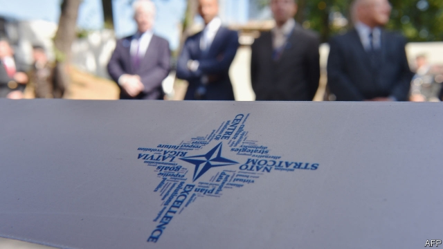

###### Social media

# Preparing for conflicts by cyber-means 

##### Social media are being weaponised 

 

> Mar 14th 2019 

WHEN LATVIA conducted its biggest-ever national military exercise last August, which mobilised more than 10,000 people, a group of researchers discovered that using only open-source information they could identify about 10% of the individuals involved—and use that knowledge to track the exercise in real time. They also found they could make a soldier leave his post, against orders. Janis Sarts, director of NATO’s Strategic Communications Centre of Excellence, which ran the experiment, said it was very simple. 

The StratCom unit was set up in 2014. It now has about 40 people and is already outgrowing its home in a white building in Riga. Its expansion reflects the rising importance of information warfare in the age of social media. 

Part of its job is to do something for which surprisingly few governments have the capacity: monitor the information environment. It tracks the “weaponisation” of social media, including the use of bots and a growing trend towards “hybrid” activity involving both humans and machines. It studies what Russia and terrorist groups are up to. Iran is also increasingly active, says Mr Sarts, and China is quickly becoming the most capable country, though it is less willing than Russia to take risks in Europe. 

The other part of the job is to put this knowledge to use. The unit helps with training, introduces information warfare into NATO exercises and gets involved in operational support beyond the military sphere, such as election resilience. Tracking Russian propaganda efforts to undermine NATO’s new multinational battlegroups in the Baltics allowed StratCom to push back quickly and effectively. 

As data get ever richer, Mr Sarts expects information to be increasingly used to influence behaviour; he talks of “cognitive warfare”. Deep fakes will make it hard to know whether a video or voice recording is genuine or not, undermining trust and making more people move to closed groups with embedded beliefs, he predicts. Some of the tech giants, including Instagram (owned by Facebook) and YouTube (owned by Google), deserve more scrutiny, he says. He does not think that self-regulation will work, and sees a need for a proper regulatory framework. 

StratCom collaborates on some projects with a well-regarded centre in neighbouring Estonia that specialises in cyber-defence. Lithuania has an outfit for energy security. They are among 25 NATO-accredited “centres of excellence” with a range of expertise—one way in which small countries can make an outsized contribution to the alliance. 

  

-- 

 单词注释:

1.weaponised['wepənaiz]:vt. 把…改装成武器；使…武器化 

2.Latvia['lætviә]:n. 拉脱维亚 

3.mobilise['mәjbilɑiz]:vi.vt. 动员, 松动, 使活动, 调动, 发动 

4.Janis[]:n. 口器颚颌 n. (Janis)人名；(英)贾妮斯；(俄、拉脱)亚尼斯；(法)雅尼 

5.sarts[]:[网络] 搜救应答器；雷达应答器；搜救雷达应答器 

6.excellence['ekslәns]:n. 优秀, 卓越, 优点 

7.outgrow[.aut'grәu]:vt. 过大而不适于, 长得比...高(或大、快), 成长得不再具有... 

8.riga['ri:^ә]:n. 里加（拉脱维亚共和国首都） 

9.warfare['wɒ:fєә]:n. 战争, 战斗, 交战, 斗争, 竞争 [法] 战事, 作战, 交战 

10.weaponisation[]:[网络] 武器化 

11.BOT[bɔt]:[计] 磁带开始标志, 计算机角色 [医] 肤蝇[类]幼虫 

12.hybrid['haibrid]:n. 混血儿, 杂种, 混合物 a. 混合的, 杂种的, 混合语的 [计] NetWare的主机实用程序, 双重用户建立程序 

13.terrorist['terәrist]:n. 恐怖分子 [法] 恐怖份子, 恐怖主义 

14.Iran[i'rɑ:n]:n. 伊朗 

15.quickly['kwikli]:adv. 很快地 

16.les[lei]:abbr. 发射脱离系统（Launch Escape System） 

17.NATO['neitәj]:北大西洋公约组织, 北约组织 [经] 北大西洋公约组织 

18.resilience[ri'ziliәns]:n. 弹回, 有弹力, 恢复力 [化] 回弹; 弹性; 弹回性; 回能; 弹能 

19.propaganda[.prɒpә'gændә]:n. 宣传, 宣传活动 [医] 宣传 

20.undermine[.ʌndә'main]:vt. 在...下面挖, 渐渐破坏, 暗地里破坏 [法] 暗中破坏, 以阴谋中伤伤害 

21.multinational[.mʌlti'næʃәnl]:a. 多国的, 跨国公司的 n. 跨国公司 

22.battlegroup[]:na. 战斗群 [网络] 战场；战斗大队；战斗部队 

23.Baltic['bɒ:ltik]:a. 波罗的海的 

24.effectively[i'fektivli]:adv. 有效地, 有力地, 实际上 

25.datum['deitәm]:n. 论据, 材料, 资料, 已知数 [医] 材料, 资料, 论据 

26.cognitive['kɒgnitiv]:a. 认知的, 认识的 

27.fake[feik]:n. 假货, 欺骗, 诡计 a. 假的 vt. 假造, 仿造 vi. 伪装 

28.embed[im'bed]:vt. 使插入, 使嵌入, 使深留脑中 [计] 嵌入 

29.tech[tek]:n. 技术学院或学校 

30.Instagram[]:一款图片分享应用 

31.facebook[]:n. 脸谱网 

32.youtube[]:n. 视频网站（可以让用户免费上传、观赏、分享视频短片的热门视频共享网站） 

33.google[]:谷歌；搜索引擎技术；谷歌公司 

34.scrutiny['skru:tini]:n. 细看, 仔细检查, 监视, 选票检查 [经] 复查, 评核, 仔细检查 

35.regulatory['regjulәtәri]:a. 受控制的, 统制的, 调整的 [经] 规则的 

36.Estonia[es'tәuniә]:n. 爱沙尼亚 

37.specialise['speʃә,laiz]:vt. 特加指明, 列举, 使专门化, 限定...的范围 vt.vi. (使)特化, (使)专化 vi. 成为专家, 专务, 专攻, 专门研究, 逐条详述 

38.lithuania[,liθju(:)'einjә, -niә]:n. 立陶宛 

39.outfit['autfit]:n. 用具, 配备, 机构 vt. 配备, 供应 vi. 得到装备 

40.excellence['ekslәns]:n. 优秀, 卓越, 优点 

41.outsize['autsaiz]:a. 特大的 n. 特大号 

42.alliance[ә'laiәns]:n. 联盟, 联合 [法] 同盟, 联盟, 联姻 

