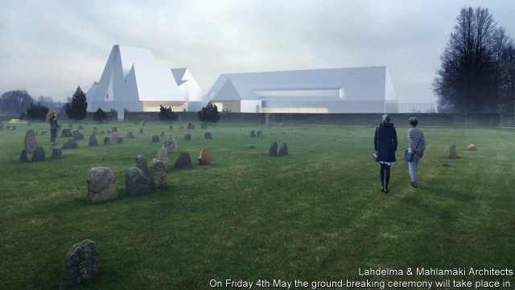

###### To life

# Lithuania starts to pay respect to its murdered Jews 

##### A new museum and well-kept memorials 

 

> Mar 21st 2019 

ALL THE Jews of Seduva are dead. The lucky ones who died ordinary peacetime deaths lie beneath simple gravestones in a windswept cemetery outside this unremarkable village. The unlucky ones were dragged out of town, forced into a ghetto in the next village, and then, in August 1941, marched into the woods and shot to death in their hundreds by their Lithuanian neighbours, overseen by the invading Germans. Their corpses were dumped in pits. 

Most traces of centuries of Jewish presence were also obliterated, as they were in hundreds of other shtetls (small Jewish towns or villages) throughout Lithuania. The town’s synagogues are gone. The old shtetl’s square, where Jewish artisans traded and debated, is desolate. Until recently, the ancient cemetery was an overgrown mess of weeds and rubbish; the more ornate gravestones were plundered. With no Jews left to tend to the graveyard, the rough-hewn tombstones were worn blank by wind and weather. 

Yet today the cemetery is well-kept and dignified. The gravestones have been put upright and restored, and the names remaining upon them carefully recorded. At the three mass-murder sites in the surrounding forests, there are solemn new memorials to the dead. And opposite the cemetery, construction has begun for a museum of Jewish village life, the Lost Shtetl Museum, set to open in 2020. 

It comes as a surprise to find signs of renewal in this remote town. The country is itself a cemetery for Jews: out of some 250,000 Jews living in Lithuania before the second world war, some 90% were killed—one of the worst rates in Europe, due to the thoroughness of the Germans and the widespread collaboration of Lithuanians, who rounded up and murdered Jews. 

Anti-Semitism remains common: in a Pew poll in 2015, half of Lithuanians said they would not accept Jews in their family. Almost a quarter said they would reject them as neighbours or citizens. Nationalists love talking about Lithuania’s struggles against Russians or Poles, but are reluctant to discuss their compatriots who collaborated with the Nazis. In downtown Vilnius, a showy Museum of Genocide Victims is not about the Holocaust, which is strenuously downplayed, but about the post-war Soviet occupation of Lithuania, during which tens of thousands of people died in labour or prison camps over the decades. 

The memorials in Seduva are not the work of the government (although the prime minister and other officials attended a groundbreaking ceremony for the museum in May), but of a small private foundation, the Seduva Jewish Memorial Fund, which seeks to remember Jewish life in one typical shtetl. “All you can find is fragments,” says Sergey Kanovich, a Lithuanian-born writer who emigrated to Israel and is a founder of the organisation. 

For some six centuries before 1941, Lithuania was a centre of Jewish civilisation and learning. Vilnius, Lithuania’s capital, was renowned as “the Jerusalem of the North”, most famous for the 18th-century teachings of Rabbi Elijah son of Solomon, who was celebrated as “the Vilna Gaon”—the genius of Vilnius. In the countryside, the shtetls nurtured scholarship, crafts and sports teams. 

In Seduva, the hope is to recall some of what was lost forever when Lithuania’s shtetls were annihilated. The town itself still has some of the humble wooden houses visible in 19th-century images, not much changed: walking some of its streets, it is hard to know exactly what century it is. While the museum cannot avoid discussing the Holocaust, it means to go deeper: understanding how the Jews there lived, and not just how they were murdered. 

-- 

 单词注释:

1.lithuania[,liθju(:)'einjә, -niә]:n. 立陶宛 

2.Jew[dʒu:]:n. 犹太人, 守财奴, 犹太教信徒 vt. 欺骗, 杀价 

3.peacetime['pi:staim]:n. 平时时期, 和平 

4.gravestone['greivstәun]:n. 墓石, 墓碑 

5.windswept['windswept]:a. 风刮的, 被风吹扫的, 暴露在风中的 

6.cemetery['semitәri]:n. 墓地, 公墓 [法] 公墓, 墓地 

7.unremarkable['ʌnri'mɑ:kәbl]:a. 不显著的, 平凡的, 不值得注意的 

8.ghetto['getәu]:n. 犹太人区 

9.Lithuanian[.liθju:'einiәn]:n. 立陶宛人 a. 立陶宛的, 立陶宛人的, 立陶宛语的 

10.oversee[.әuvә'si:]:vt. 向下看, 了望, 监督, 偷看到 [法] 监察, 监督, 俯瞰 

11.corpse[kɒ:ps]:n. 尸体 [医] 尸体 

12.obliterate[ә'blitәreit]:vt. 擦去, 冲刷(掉), 消灭, 忘掉, 盖销(邮票等) [法] 灭迹, 消灭, 涂抹 

13.shtetl['ʃtetl]:<意第绪> n.(尤指第二次世界大战前东欧的)犹太人小村(或小镇) 

14.synagogue['sinәgɒg]:n. 犹太人集会, 犹太教会堂, 犹太教 

15.artisan[.ɑ:ti'zæn]:n. 工匠, 技工 [经] 熟练技术工, 匠人 

16.desolate['desәlәt]:a. 荒凉的 

17.overgrow[.әuvә'grәu]:vt. 在...上长满, 长得太大使...不适用 vi. 长满, 长得过大 

18.ornate[ɒ:'neit]:a. 装饰的, 华丽的 

19.plunder['plʌndә]:n. 抢夺, 掠夺品, 战利品 v. 掠夺, 抢劫, 抢夺 

20.graveyard['greivjɑ:d]:n. 墓地 

21.tombstone['tu:mstәun]:n. 墓石, 墓碑 [经] 墓碑, 墓志铭 

22.dignify['dignifai]:vt. 增威严, 使高贵, 故作显贵 

23.carefully['kєәfuli]:adv. 小心地, 谨慎地 

24.shtetl['ʃtetl]:<意第绪> n.(尤指第二次世界大战前东欧的)犹太人小村(或小镇) 

25.renewal[ri'nju:әl]:n. 更新, 革新, 复兴, 恢复, 修补, 补充, 继续, 重订, 重申, 续借 [经] 更新, 换新, 重申 

26.thoroughness['θʌrәnis. 'θә:rәu-]:n. 十分, 完全；彻底 

27.collaboration[kә.læbә'ræʃәn]:n. 合作, 勾结 [法] 通敌卖国者, 奸细 

28.Lithuanian[.liθju:'einiәn]:n. 立陶宛人 a. 立陶宛的, 立陶宛人的, 立陶宛语的 

29.pew[pju:]:n. 教堂长椅, 会众, 座位 vt. 为(教堂)安装座位, 把...围在一起 

30.nationalist['næʃәnәlist]:n. 国家主义者, 民族主义者 

31.compatriot[kәm'pætriәt]:n. 同国人 a. 同国的, 同胞的 

32.Nazi['nɑ:tsi]:n. 纳粹党人 a. 纳粹党的 

33.Vilnius['vilnijs, -әs]:维尔纽斯[立陶宛共和国首都] 

34.showy['ʃәui]:a. 艳丽的, 炫耀的 

35.genocide['dʒenәu,said]:n. 种族灭绝, 灭绝整个种族的大屠杀 [医] 种族灭绝(侵略军队加害居民的罪行) 

36.holocaust['hɔlәkɔ:st]:n. 大屠杀, 大火灾, 毁灭, 大规模烧杀 

37.strenuously[]:adv. 勤奋地；费力地 

38.downplay['daunplei]:vt. 不予重视 

39.tens[]:十位 

40.groundbreaking[ˈgraʊndbreɪkɪŋ]:a. 开创性的, 突破性的 

41.sergey[]:n. 谢尔盖（男子名） 

42.emigrate['emigreit]:v. (使)移居, (使)移民 

43.Israel['izreil]:n. 以色列, 以色列后裔, 犹太人 

44.founder['faundә]:n. 创立者, 建立者 vt. 使沉没, 使摔倒, 弄跛, 浸水, 破坏 vi. 沉没, 摔到, 变跛, 倒塌, 失败 

45.organisation[,ɔ: ^әnaizeiʃən; - ni'z-]:n. 组织, 团体, 体制, 编制 

46.civilisation[,sivilai'zeiʃən;-li'z-]:n. 文明, 文明世界, 文化, 开化, 教化 

47.renowned[ri'naund]:a. 有名的, 有声誉的 

48.Jerusalem[dʒә'ru:sәlәm]:n. 耶路撒冷 

49.rabbi['ræbai]:n. 拉比(犹太教圣职人员), 大师(对犹太学者的尊称) [法] 犹太教的法学博士, 老师, 犹太教教士 

50.elijah[i'laidʒә]:n. 以利亚（希伯来先知） 

51.Solomon['sɒlәmәn]:n. 所罗门(古以色列国王), 聪明人, 贤人 [计] 所罗门阵列处理机 

52.vilna[]: [地名] [加拿大] 维尔纳 

53.nurture['nә:tʃә]:n. 养育, 营养物, 培育 vt. 养育, 供给营养物, 教养 

54.annihilate[ә'naiәleit]:vt. 消灭, 废止 

55.cannot['kænɒt]:aux. 无法, 不能 

