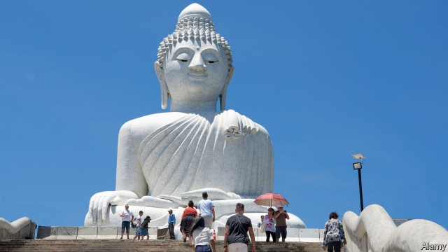

###### Big people, big gods

# What came first: all-seeing gods or large societies? 

##### A search for the origin of religions 

 

> Mar 21st 2019 

HORUS, AN ANCIENT Egyptian sky god, was often depicted as a sharp-eyed falcon. Lord Buddha’s eyes are supposed to be able to look in four directions at once. The god of Abraham sees everything, always. A “Big God” of this sort—a supernatural “eye in the sky” who cares whether people do right by others—is a feature of most of the world’s top religions. But it was not always so. Anthropological research suggests that the gods who watch over small societies tend to demand only that people show deference to them. Big Gods come later. 

One theory holds that this is because small societies do not need a supernatural policeman. If everyone knows everyone else, antisocial elements are easily managed. But as societies grow, and especially as they absorb ethnically and culturally diverse groups through conquest, a different policing mechanism is needed. What could be better than an all-seeing eye that enforces co-operation between friends and strangers alike? 

If this theory is correct, it raises another question: which comes first, a Big God that permits a big society, or a big society that requires a Big God? That question is addressed by a paper published in this week’s Nature by Harvey Whitehouse of Oxford University and his colleagues. 

Over the past eight years the team has built a historical database, dubbed Seshat after a goddess of knowledge who was Horus’s contemporary. With the help of a small army of historians and archaeologists, they have accumulated data on more than 400 societies that have existed in the past 10,000 years. 

In previous research, the group identified 51 highly correlated variables that gauge a society’s complexity, such as population size, the presence of bureaucrats or paper money. They have now asked how this composite indicator of social complexity relates to the presence, or absence, of moralising gods. 

Seshat divides the globe arbitrarily into 30 regions. Twelve housed societies that offered data on their complexity before and after the emergence of Big Gods. In ten of these 12 regions, Big Gods appeared about 100 years after a society took a leap forward in complexity, with populations in the region of 1m. 

That suggests Big Gods are a consequence of big societies, not a cause of them. But interrogation of Seshat revealed another religious phenomenon that played a role in driving societies towards greater complexity: frequent, collective rituals such as daily food offerings to gods. These rituals predate Big Gods in nine of the 12 regions by long periods of time, around 1,100 years on average. 

Dr Whitehouse’s hypothesis is that, because they were easy to learn and were performed often, such rituals may have allowed beliefs and practices to spread to much larger populations than had previously been possible, helping to unify those populations around a common identity. Only subsequently do Big Gods emerge. Both innovations seem to have consolidated or stabilised societies that had recently expanded. If true, this would fit with findings the same group published last year. 

On that occasion they tested a theory that has been popular for several decades: that societies became recognisably “modern” in the mid-first millennium BC, during the so-called “Axial Age”, the period in which figures such as Plato, Buddha and Zoroaster appeared on the scene, promulgating moralising ideologies. 

Instead, the latest study showed that the various components of that age, including legal codes and moralising gods, emerged gradually over a much longer period, starting in the third millennium BC and ending after the appearance of the first complex societies. If Dr Whitehouse and his colleagues are correct, today’s religions did not create modernity but, in the past at least, they held it together. 

-- 

 单词注释:

1.horus['hɔ:rәs]:n. 何露斯（古代埃及的太阳神） 

2.depict[di'pikt]:vt. 描述, 描写 

3.falcon['fɒ:lkәn]:n. 隼, 猎鹰 

4.abraham['eibrәhæm, -hәm]:n. 亚伯拉罕（男子名） 

5.alway['ɔ:lwei]:adv. 永远；总是（等于always） 

6.supernatural[.sju:pә'nætʃәrәl]:a. 超自然的, 神奇的 [医] 超自然的 

7.anthropological[.ænθrәpә'lɒdʒikl]:a. 人类学的, 人类学上的 

8.deference['defәrәns]:n. 顺从, 尊重 

9.antisocial[.ænti'sәuʃәl]:不爱社交的, 反社会的, 有害于公众利益的 [医] 不喜社交的 

10.ethnically['eθnikli]:adv. 人种上, 民族上 

11.culturally[]:adv. 从文化角度, 文化意义上；在人文学方面 

12.mechanism['mekәnizm]:n. 机械, 机构, 结构, 机理, 技巧 [化] 机理; 历程; 机构 

13.harvey['hɑ:vi]:n. 哈维（男子名） 

14.Whitehouse[]:n. 怀特豪斯（人名） 怀特豪斯（地名） 

15.Oxford['ɒksfәd]:n. 牛津, 牛津大学 

16.dub[dʌb]:vt. 配音, 轻点, 授予称号, 击 n. 一下击鼓声, 笨蛋 

17.Seshat[]:[网络] 塞莎特；塞丝哈特；塞絲哈特 

18.goddess['gɒdis]:n. 女神, 美女, 受崇拜的女性 

19.historian[hi'stɒ:riәn]:n. 历史学家, 记事者 

20.archaeologist[.ɑ:ki'ɒlәdʒist]:n. 考古学家 

21.datum['deitәm]:n. 论据, 材料, 资料, 已知数 [医] 材料, 资料, 论据 

22.correlate['kɒrәleit]:n. 有相互关系的东西, 相关物 vt. 使有相互关系 vi. 相关 

23.complexity[kәm'pleksiti]:n. 复杂, 复杂性, 复杂的事物 

24.bureaucrat['bjuәrәukræt]:n. 官僚作风的人, 官僚, 官僚主义者 [法] 官僚, 官僚作风的人 

25.composite[kәm'pɒzit]:a. 合成的, 混合成的, 菊科的 n. 合成物, 复合材料, 菊科 

26.indicator['indikeitә]:n. 指示器, 指示剂, 指标 [计] 指示器 

27.moralise['mɔrәlaiz; 'mɔ: -]:vi. 说教, 从道德上解释 vt. 指出...的寓意, 提高...的德性 

28.arbitrarily['ɑ:bitrәrili]:adv. 任意地, 武断地, 专横地, 反复无常地 

29.emergence[i'mә:dʒәns]:n. 出现, 浮现, 发生 

30.interrogation[in.terәu'geiʃәn]:n. 审问, 疑问句, 问号 [电] 询问 

31.ritual['ritʃuәl]:n. 仪式, 典礼, 宗教仪式 a. 仪式的, 依仪式进行的 

32.offering['ɒfәriŋ]:n. 提供, 奉献物, 牲礼, 上市的股票(或证券等) [经] 出售物 

33.predate['pri:'deit]:vt. 倒填...的日期, 把...的日期填早, 在日期上早于, 在日期上先于 [经] 提前日期 

34.hypothesis[hai'pɒθәsis]:n. 假设 [化] 假设 

35.unify['ju:nifai]:v. 统一, 使成一体 

36.subsequently['sʌbsikwәntli]:adv. 后来, 随后 

37.innovation[.inәu'veiʃәn]:n. 改革, 创新 [法] 创新, 改革, 刷新 

38.consolidate[kәn'sɒlideit]:vt. 巩固, 使联合, 统一 vi. 巩固 [计] 合并计算 

39.stabilise['steibilaiz]:vt.vi. (使)稳定, (使)安定, (使)坚固 vt. 装稳定器 

40.recognisably[]:[网络] 可以肯定的 

41.millennium[mi'leniәm]:n. 千禧年, 一千年 

42.BC[]:公元前 

43.axial['æksiәl]:a. 轴的, 成轴的, 轴向的 [医] 轴的, 中轴的 

44.Plato['pleitәu]:n. 柏拉图 

45.Buddha['budә]:n. 佛陀 

46.zoroaster[zɔrәu'æstә]:n. 琐罗亚斯德, 古代波斯国国教拜火教之祖 

47.promulgate[prә'mʌlgeit]:vt. 发布, 公布, 发表, 传播 [法] 颁布, 公告, 散播 

48.ideology[.aidi'ɒlәdʒi]:n. 思想体系, 意识形态, 观念学, 空论 [医] 观念学, 观念形态 

49.modernity[mɒ'dә:nәti]:n. 现代性, 现代状态, 现代东西 

