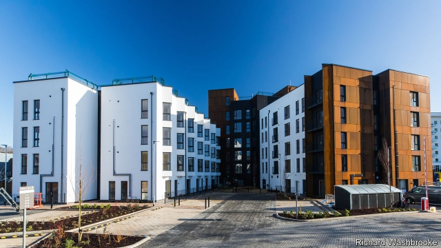

###### Blooming

# Council housing is making a comeback in Britain 

##### Last year councils put up 4,000 homes, the most since 1992 

 

> Apr 11th 2019 

IN THE 1920s Stepney library, in working-class east London, was at the centre of a police investigation. A reader had asked the library to obtain a copy of James Joyce’s “Ulysses”, a modernist masterpiece that governments across the world were trying to ban. As Kevin Birmingham shows in his history of the novel, a covert inquiry was launched to determine the identity of the Joyce fanatic. The police concluded that he was a “red-hot Socialist”. 

Stepney library is again part of a socialist experiment, which if not red-hot is at least warming up. Tower Hamlets, the local authority, recently revealed plans to replace the library, which closed over a decade ago, with five council-built homes, as part of a drive to put up 2,000 by 2022. It is quite a change for a council which until recently built almost none. What is happening in Tower Hamlets is happening across Britain. Last year councils put up 4,000 homes, the most since 1992. 

Britain is still a long way from the golden era of council homes. In the 1950s councils put up 150,000 dwellings a year. About a tenth of all public spending went towards state-provided housing. All that changed in the 1970s. Believing that they had eliminated housing shortages, councils turned to other matters. Margaret Thatcher’s governments cut support for new construction. There began a long decline in council-house building. In 2004-05 local authorities put up just 130 new homes. 

A few factors explain the recent renaissance. In the late 2000s the government boosted grant funding to councils for new building, says John Perry of the Chartered Institute of Housing, a professional body. An accounting change in 2012, which linked the amount that councils could spend on housing to the rents they charged, made financial planning easier. At the time the government put a cap on the amount councils could borrow to build new homes, but in October it was removed. 

Council housing is popular, as the long waiting lists to move into it attest. For those with little money, it is often a better bet than renting on the open market. Council homes tend to have rents below market rates. And they are half as likely as privately let dwellings to be classed as “non-decent”, meaning they fail to meet basic standards for things like heating. “I’m so happy,” beams Jane, who lives in a council block which opened in January in Hemel Hempstead, Hertfordshire. She got her tenancy after escaping a violent partner (we have changed her name). The block is hardly posh: the stairwell walls are bare concrete, to limit the cost of upkeep. But it is well maintained, and Jane reports that someone comes quickly if there are problems. 

Some policymakers argue that building more council houses is the best way to reduce Britain’s sky-high housing costs. Economists reckon the country needs to put up 300,000 houses a year to keep prices in check. It currently manages about half that. The last time private firms got anywhere near building such a total was in the mid-1930s. The Labour Party has promised a big rise in council-house building. 

That would incur a large upfront cost. Politicians might hope that extra building would push down average housing costs, reducing in turn the bill for housing benefit, which in the past 40 years has risen sixfold in real terms. Yet because the planning system so limits the supply of land for development, extra council building risks crowding out the private-sector sort, lessening the impact on the overall number of homes. Official estimates suggest that for every two new council houses, one private home is not built. 

A more effective policy might be to relax planning laws, making life easier for private and public developers alike. That could involve more development on the “green belt” land that encircles cities. Any politician who proposed such a plan would risk the wrath of nimbys, many of whom live in swing seats. But only a government with a radicalism worthy of Joyce has any hope of fixing Britain’s housing mess. 

-- 

 单词注释:

1.comeback['kʌmbæk]:n. 复原, 复辟, 复位, 尖刻的对答, 抱怨的原因 [计] 复原的 

2.APR[]:[计] 替换通路再试器 

3.stepney['stepni]:n. 充气备用轮胎 

4.jame[]: 灰岩井 

5.ulysses[ju(:)'lisi:z]:n. 尤里西斯（希腊神话中男子名, 也是爱尔兰意识流文学作家詹姆斯·乔伊斯小说名） 

6.modernist['mɒdәnist]:n. 现代主义者, 现代人, 现代主义作家 

7.kevin['kenin]:n. 凯文（男子名） 

8.Birmingham['bә:miŋәm]:n. 伯明翰 

9.covert['kʌvәt. 'kәuvәt]:a. 隐蔽的, 偷偷摸摸的, 隐密的 n. 树丛, 隐藏处 

10.joyce[dʒɔis]:n. 乔伊斯（女名） 

11.fanatic[fә'nætik]:n. 狂热者, 盲信 a. 狂热的, 盲信的 

12.hamlet['hæmlit]:n. 小村, 部落 

13.margaret['mɑ:^әrit]:n. 玛格利特（女子名） 

14.renaissance[ri'neisәns]:n. 复活, 复兴, 文艺复兴 a. 文艺复兴的 

15.john[dʒɔn]:n. 盥洗室, 厕所, 嫖客 

16.perry['peri]:n. 梨子酒 

17.charter['tʃɑ:tә]:n. 特许状, 执照, 宪章 vt. 特许, 发给特许执照 

18.attest[ә'test]:vi. 证明, 表明, 作证 vt. 为...作证 

19.privately[]:adv. 秘密地；私下地 

20.jane[dʒein]:n. 简（女子名） 

21.Hemel[]:n. (Hemel)人名；(英)赫梅尔 

22.Hempstead['hempsted]:n. 亨普斯特德（美国地名） 

23.Hertfordshire['hɑ:(t)fәdʃә(r)]:n. 赫特福德郡(位于英国英格兰东南部) 

24.tenancy['tenәnsi]:n. 租用, 租赁 [经] 租赁, 租回 

25.stairwell[]:n. 楼梯井 

26.upkeep['ʌpki:p]:n. 维持, 维修费 [经] 维修费, 养护费, 保养 

27.quickly['kwikli]:adv. 很快地 

28.policymaker['pɔlisi.meikә]:n. 政策制定者；决策人 

29.economist[i:'kɒnәmist]:n. 经济学者, 经济家 [经] 经济学家 

30.reckon['rekәn]:vt. 计算, 总计, 估计, 认为, 猜想 vi. 数, 计算, 估计, 依赖, 料想 

31.currently['kʌrәntli]:adv. 现在, 当前, 一般, 普通 [计] 当前 

32.incur[in'kә:]:vt. 招致, 蒙受, 遭遇 [经] 招致, 蒙受, 担负 

33.upfront[ˌʌpˈfrʌnt]:a. 正直的, 坦率的; 最前面的, 首要的; 在前面的; 预先的 adv. 在最前面; 提前支付（工资） 

34.sixfold['siksfәuld]:a. 六倍的, 六重的 

35.developer[di'velәpә]:n. 开发者 [计] 显影器 

36.encircle[in'sә:kl]:vt. 环绕, 围绕, 包围 

37.wrath[rɒ:θ]:n. 愤怒, 激怒, 愤怒的举动, (自然现象等)严酷 

38.nimby[ˈnɪmbi]:n. <美口>宁比 

39.radicalism['rædikәlizm]:n. 激进主义 

