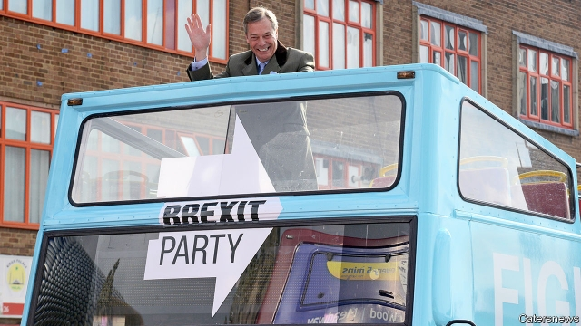

###### Divided they fall

# The EU’s voting system will help small parties less than they think 

##### Despite proportional representation, the Remain vote could be fatally split 

 

> Apr 17th 2019 

BRITAIN IS SET to elect members of the European Parliament on May 23rd, something Theresa May had hoped to avoid. The prime minister is embarrassed to be holding an EU election two months after the country was supposed to have left the club. What’s more, she knows her Conservative Party is in for a drubbing. 

The Tories and Labour face competition from a crowd of little parties, some established, others brand new, motivated by Europhobia or -philia. Nigel Farage has launched the Brexit Party to “start the fightback” against the Remainer establishment. Eleven fed-up Labour and Tory MPs have formed an anti-Brexit party called Change UK. The Liberal Democrats and Greens are pushing a strong Remain message. 

The tiddlers’ hopes are high, for two reasons. One is that Britons use European elections to cast protest votes for outsiders. At the last one, in 2014, the UK Independence Party (UKIP) came top with 27.5% of the vote, twice what it has ever managed in a general election. The other reason for their optimism is that the elections use proportional representation (PR). First-past-the-post blocks small parties from Parliament. EU elections, in which Britain’s 73 seats are divvied up more equitably, allowed the Greens to pick up three MEPs last time and helped the far-right British National Party to elect two in 2009. 

Yet Britain’s version of PR is harder on small parties than many seem to realise. Northern Ireland, like the Republic, uses a single transferable vote, meaning that ballots cast for no-hopers are reallocated to the voter’s second choice. But the rest of Britain uses the d’Hondt system, which doles out seats starting with the biggest parties and does not give a second chance to voters whose first-choice party loses. 

And whereas most countries operate as a single national constituency, Britain is one of five that divide into regions. Its 12 constituencies elect between three and ten MEPs each. In small constituencies the threshold to election is therefore very high. In 2014 the Tories won 17.7% of the vote in the North East, which was not enough to win one of the three seats up for grabs there. The Lib Dems polled 6.9% nationwide, but won only one seat (in the South East, where 8% of the vote was just enough to pick up one of ten MEPs). Meanwhile the Scottish National Party, whose support was piled up in a single constituency, won two seats with just 2.5% of the nationwide vote. 

The upshot is that, despite PR, the small parties will damage each other’s chances. UKIP and the Brexit Party, both polling in the mid-teens, are likely to do well, but will win fewer seats than they would as a single Eurosceptic party. The Remainers’ split is worse. The Lib Dems, Greens and Change UK are on track to get a little over 20% between them. That would be enough for a big haul of seats, if they joined forces. But with 7% or so each, they could all end up with next to nothing. 

There is no sign of an alliance. Change UK has made an electoral pact with Renew, an even tinier pro-Remain party. But efforts by the Lib Dems to form a common front were rebuffed by both Change UK and the Greens. The “superior system” used in EU elections means splitting the vote “does not arise”, claims a Change UK MP. PR “means every vote counts and every vote can make a difference,” insists a Green spokesman. Alas, it doesn’t. 

