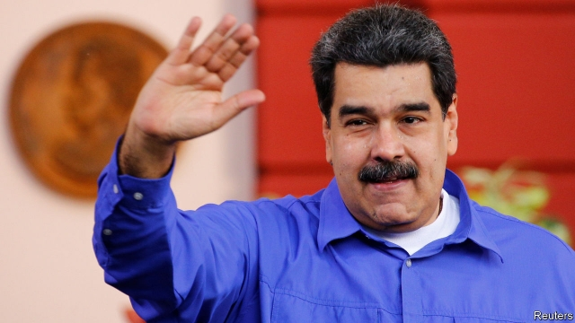
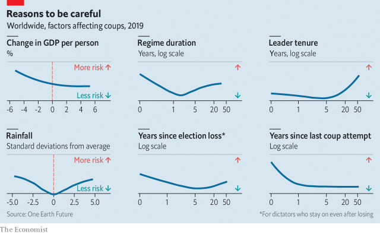

###### Coup data

# How to predict when a despot will fall 

##### The economy matters, but so do history and the weather 

 

> Apr 17th 2019 

THE REMOVALS in the same month of two presidents—Abdelaziz Bouteflika of Algeria and Omar al-Bashir of Sudan—look like an unforeseeable coincidence. But they are also two more data points for analysts trying to turn the art of predicting political upheaval into something approaching a science. Some believe they have the tools to make an attempt. 

Coups and revolutions present unique challenges for forecasters. They are both extremely rare and, notes Andreas Beger of Predictive Heuristics, a consultancy, by definition conspiratorial—they do not advertise themselves in advance. Perhaps the most rigorous quantitative forecast of political upheaval comes from One Earth Future (OEF), an NGO based in Colorado that publishes a predictive model, CoupCast. It reckons that the factors correlating most strongly with the risk of a coup include: the rate of economic growth; how long a regime has been in power; how long since a country’s most recent coup; and whether it has been hit by extreme weather, such as a flood or a drought (see chart). 

 

Economic woes certainly played a part in the defenestrations of Mr Bouteflika and Mr Bashir. Real annual GDP growth has averaged just 2.8% over the past five years in Algeria, compared with 3.3% for Africa as a whole. Sudan’s GDP grew at just 1.8% a year over the same period, and last year actually contracted by 2.1%. Inflation reached 63%. The IMF expects Sudan’s economy to shrink by a further 2.3% in 2019. 

The relationship between prosperity and political stability is complex. In 2015 a report from the World Bank noted that economic indicators alone could not have predicted the advent of the Arab spring in 2011. Economies in the Middle East and north Africa were growing steadily. Extreme poverty and income inequality were falling. 

However, despite the rosy headline numbers, surveys conducted in the 2000s found that Arabs were growing increasingly worried about their financial prospects. The World Bank observes that, though the bottom 40% of earners in the region were becoming richer, the living standards of the middle 40%, who receive less in government transfers, had stagnated. In Tunisia, where the Arab spring began, 23% of graduates were unemployed in 2010, compared with only 13% for the population as a whole. This suggests that a lack of opportunities mattered more than poverty. 

Political history matters, too. CoupCast finds that both new and very old autocratic regimes are at risk of being overthrown. Emerging tyrants need time to consolidate power. Longer-standing regimes like those of Mr Bouteflika and Mr Bashir tend to fade as their leaders age. CoupCast’s data find that for dictators, the “sweet spot” in terms of political stability comes very early in their despotism—after just 18 months. 

Clayton Besaw of the OEF says that one way dictators have adapted to modern politics is by choosing to hold elections. This is a risky strategy. Winning elections can help legitimise their regimes, but trying to stay on after losing tends to create further instability. Congo’s former president, for example, rigged a vote count to keep out a rival, then swore in a successor but refused to move out of the presidential villa himself. No one would be shocked if Congo had a coup some day. 

Perhaps the most likely place for the next putsch, however, is Venezuela. Nicolás Maduro, Venezuela’s dictator, has presided over one of the worst economic catastrophes in modern history. The IMF estimates that unemployment is 44%, and expects inflation to top 10,000,000% this year. Mr Maduro won an unfair election in 2013 and a blatantly rigged one in 2018. The legislature says he is illegitimate, and that Juan Guaidó, the head of the legislature, should take over, as the constitution requires, pending proper elections. More than 50 foreign countries recognise Mr Guaidó as interim president. 

Yet Mr Maduro may cling grimly on. Despite deep discontent among the lower ranks, the army’s top brass still supports him. Jonathan Powell of the University of Central Florida notes that dictators can make coups less likely by lavishing cash on their armies and tampering with command structures to make it difficult for them to co-ordinate rebellions. A study by Mr Powell published in 2012 found that such “coup-proofing” efforts were actually more useful to tyrants than improving their countries’ economies. Shrewdly, Mr Maduro has been showering his army with goodies, giving senior officers lucrative opportunities to embezzle, and has imported Cuban spooks to keep them in line. 

Which country then, has the highest chance of seeing a sudden regime change? CoupCast’s latest forecast points to Algeria. One of the strongest predictors of future political instability is past instability. Algeria already sat at the top of CoupCast’s rankings prior to Mr Bouteflika’s resignation. His sudden departure has not made the country any less volatile. 

