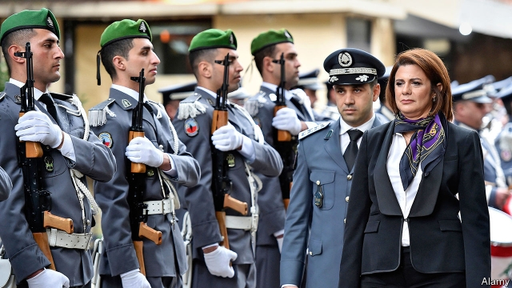

###### First woman

# Raya al-Hassan takes on Lebanon’s warlords—and the patriarchy 

##### The Arab world’s first female interior minister is shaking things up 

 

> Apr 20th 2019 

IN A COUNTRY of crusty old warlords, Raya al-Hassan is challenging stereotypes. A decade ago she was appointed Lebanon’s finance minister, the first woman in the Arab world to hold such a post. In January she broke new ground, becoming the first female interior minister in the region. As such, she commands a force of over 40,000 police officers, including the elite counterterrorism brigade known as the Panthers. The ministry’s website features a photo of her leading a pack of female cadets. 

Ms Hassan seems intent on weakening the men who fought Lebanon’s civil war of 1975-90 and who have remained in power ever since. She has called on them to remove the roadblocks around their enclaves. She plans to visit Dahiya, Beirut’s Shia-dominated southern suburb, to ensure that Hizbullah, the main Shia party-cum-militia, complies. If Ms Hassan, a Sunni Muslim by upbringing, is concerned about her safety, she doesn’t show it. She has removed many of the walls around her ministry, jettisoned her predecessor’s big motorcade and cut his large security retinue. 

Women hail Ms Hassan as a role model for taking on the patriarchy. Parliament has only six female members (out of 128). In the previous government even the women’s affairs minister was a man. The interior ministry only began admitting women into its forces in 2012. But three of the eight directors-general in the ministry are now women and Ms Hassan plans to promote more. The religious leaders who control family affairs are also in her sights. Within days of becoming minister she made headlines by calling on clerics to let Muslims and Christians marry each other. 

The men under her command seem to like her. One compares her to Aisha, the Prophet Muhammad’s favourite wife, who led Muslims into battle. In a country of backbiters, she has made remarkably few enemies. Her no-nonsense manner reminds some of Rafik Hariri, the post-war prime minister who rebuilt Beirut. Hariri, alas, was killed by a car-bomb in 2005 after calling on Lebanon’s militias to disarm. Ms Hassan is more cautious. The state should have a monopoly on the use of force, but Hizbullah’s weapons are a separate issue, she says. 

Ms Hassan is not immune to the grubbiness and sectarianism of Lebanese politics. She is a member of the Future Movement, the Sunni party led by Saad Hariri, the prime minister (and son of Rafik). Her critics claim she turned a blind eye to graft when finance minister. The economic zone she launched in her home town of Tripoli is empty despite the millions of dollars earmarked for it. For all her talk of removing roadblocks, she has kept silent on those surrounding the enclave where Mr Hariri lives (when he is not in Paris). Cynics even say that Ahmad Hariri, the Future Movement’s general secretary and the prime minister’s cousin, can overrule the ministry. Not so, says Ms Hassan: “I am in charge.” 

