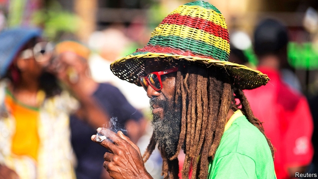

###### Head down to the herb house

# Jamaica’s cannabis gamble 

##### How to sell dope without provoking America 

 

> Apr 17th 2019 

WHEN JAMAICAN children catch a cold, mothers rub cannabis oil on their chests. Rastafarians smoke cannabis as a religious custom. Some believe that it grew on King Solomon’s tomb. Encouraged by the tropical climate, cannabis grows in many household gardens. 

Until now, Jamaica’s connection to cannabis has mainly been a problem for the Caribbean country. It is the region’s biggest supplier of illegal weed to the United States, which coaxes the government to destroy illicit fields. Before 2015, a conviction for possession could result in a sentence of up to five years in jail. Thousands of young men were locked up. 

Now Jamaica is starting to think of cannabis as an opportunity. Uruguay, Canada and ten American states have legalised it for recreational use. Ganja, as Jamaicans call it, is a “growth-oriented industry”, says Audley Shaw, the agriculture minister. In 2015 Jamaica decriminalised the possession of small amounts and allowed its cultivation for medical use. But Jamaica’s welcome is wary. It is trying to cash in on cannabis without provoking the United States. The risk of miscalculation is high. 

Worldwide sales of medical marijuana will grow from $11bn in 2017 to $37bn in 2023, predicts Research and Markets, a research firm. A share of this could help Jamaica replace income from diminished sales of sugar, once its biggest cash crop. The government plans to issue regulations on cannabis exports by the end of April. 

The island has become a magnet for marijuana merchants. In September Aphria, one of three “golden boys” of Canadian weed, bought a 49% stake in a grower in Jamaica with 22 employees as part of a C$300m ($226m) deal that included properties in Argentina and Colombia. In the same month, Jamaica-based Timeless Herbal Care exported the island’s first shipment of cannabis oil, to Canada. In February Jacana, a grower, said it had completed the first export of ganja flower, the most potent part of the plant (also to Canada). Its 40-hectare farm produces enough weed to roll 300m therapeutic joints a year. 

Jamaica Medicann, based in Toronto, will provide Jamaica-grown cannabis for clinical trials of a drug to treat a rare form of leukaemia. The US Food and Drug Administration has given the drug “orphan status”, which allows firms to get tax credits and other incentives to test it. Diane Scott, the firm’s boss, claims that the island has rare strains of weed with curative properties. 

The government says it will allow the sale of weed for medical and sacramental purposes, not recreational ones. The Cannabis Licensing Authority, founded in 2015 to regulate cultivation, processing and sale of legal weed, has granted only about 130 licences. It conducts background checks, requires that growers put up fencing and security cameras and regulates the distance between their fields and schools. The application process is “very thorough”, says one investor. 

Exports—the big prize, says Mr Shaw— face extra hurdles. Health officials in Jamaica and the importing country have to approve each supply agreement. So far, just a few countries have issued permits. The United States government still prohibits imports of all but one cannabis-derived medicine (Epidiolex, which treats epilepsy with no euphoric effect). 

Jamaica’s regulation is looser than it looks, however. The main sales channels for legal weed are “herb houses”, which have popped up across the island. Doctors on the premises write “prescriptions”. The best customers are drawn from the 4.3m tourists who visit each year. Today’s regulations amount to “a controlled-access tourist programme”, admits a foreign investor. That is better than letting tourists “stroll around on a Thursday night after a couple of rums looking for cannabis in God knows what corner of the city”. 

Balram Vaswani, an Indian entrepreneur, opened the first of seven planned pot cafés last year in Ocho Rios, a resort on the northern coast. Canada’s Canopy Growth, the world’s largest cannabis company, plans to open two pot shops in Jamaica by June. Its chief executive, Bruce Linton, hopes to encourage connoisseurship by labelling the weed with the name of the parish (territory) where it is grown and by conducting day trips to farms. “The government is very, very business-friendly,” says Jakob Ripshtein of Aphria. 

But it dare not appear too friendly. Jamaican banks that do business with cannabis companies risk having their accounts at American banks shut down. If that happened on a large scale, Jamaica could be cut off from access to American dollars, which would devastate the economy. Jamaica received $2.3bn in remittances in 2017, more than its income from exports of goods. Jamaican officials also risk losing their access to American visas if the country is found to be flouting the United States’ drug laws, says Charles Nesson of Harvard Law School. 

Herb houses do business mostly in cash, but banks will be harder to avoid as trade becomes more sophisticated. Cannabis can bring relief to a poor country like Jamaica, but only if it does not overdose. 

