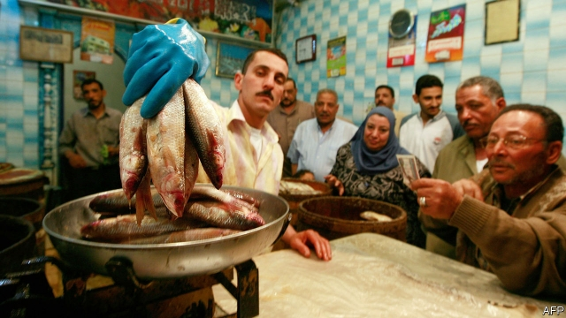

###### Fish in a barrel

# Feesekh, an Egyptian delicacy that is sometimes deadly 

##### A festive smelly fish that occasionally causes botulism 

 

> Apr 27th 2019 

IN A CONCRETE jungle of 23m people, the signs of spring are subtle. A strong breeze lofts off the Nile; policemen doff their black winter uniforms for summer white. And in Abdeen, a historic bit of downtown Cairo, the sour scent of fermented fish draws crowds of shoppers. The Shaheen family has spent more than a century selling feseekh, grey mullet dried in the sun and submerged in salt water for 45 days. It is a unique holiday delicacy that crosses borders, amiably divides families—and kills people. 

Most of Egypt’s festivals come from its main religions, Islam and Christianity, or the rituals of the modern republic founded in 1952. The exception is Sham an-Nessim, an indigenous celebration that long predates the rest. Ancient Egyptians made offerings to the gods before the Nile flooded in springtime. After Christianity took root, the church embraced the tradition. Two millennia later it is still celebrated on the day after Easter (this year, April 29th) by Christians and Muslims alike. It is a chance to savour Egypt’s fleeting spring. 

Feseekh’s appeal is more of a mystery. The taste is pungent, but traditional side dishes—lemons, spring onions, pockets of baladi bread—soften the blow. Harder to mask is the sour smell, which crosses rooms and seeps out of plastic wrappers. It is variously compared to rotten eggs, mouldy cheese and garbage. Many restaurants do not serve it lest the odour linger like an unwanted houseguest. 

No one knows quite why smelly fish became a symbol of spring. The Nile was once an abundant source of seafood. One theory holds that grey mullet simply washed up on the banks as water levels rose. Today the Nile is too polluted and overfished to yield a big catch, so feseekh are farmed or caught in the Mediterranean and Red Sea. The process of making it has not changed, though. “The salt is the key,” says Shady Shaheen. Not enough and the fish rot in the barrel; too much and the taste is ruined. The result looks ordinary until you slice it open with a fork, revealing a gooey mess. A kilo fetches up to 200 pounds ($12), a day’s wage for an average worker. 

Egypt has cycled through five rulers in the past decade, but all have agreed on one thing: their citizens should not eat feseekh, which can cause botulism if not prepared properly. The health ministry publishes annual statistics on fishy fatalities. The worst year was 1991, when feseekh felled 18 people. Two died in both 2009 and 2010. Dozens fall ill each year. 

No wonder some Egyptians hate the stuff. For many, though, spring would not be spring without feseekh. In countries with lots of Egyptian migrants, restaurants serve it to nostalgic expats. Chefs dream up ways to make it more palatable. One supermarket turns it into a salad. Like big cities everywhere, Cairo has gone through a cake craze. A few bakers have concocted special desserts for Sham an-Nessim—among them a cheesecake that mixes cream, crudités and salted fish. That innovation may be too much, even for feseekh fanatics. 

-- 

 单词注释:

1.delicacy['delikәsi]:n. 细软, 精致, 精美的食品, 娇气, 微妙, 棘手, 娇弱, 灵敏, 灵巧 

2.festive['festiv]:a. 庆祝的, 喜庆的, 欢乐的 

3.botulism['bɒtjulizm]:n. 肉毒中毒 [医] 肉毒中毒 

4.APR[]:[计] 替换通路再试器 

5.subtle['sʌtl]:a. 敏锐的, 精细的, 狡猾的, 稀薄的, 灵巧的, 微妙的 [医] 锐敏的; 精细的 

6.loft[lɒft]:n. 阁楼, 鸽房, 楼上 vt. 储存于阁楼上 vi. 将球高击 

7.Nile[nail]:n. 尼罗河 

8.doff[dɒf]:vt. 脱, 丢弃, 摆脱 

9.abdeen[]:n. (Abdeen)人名；(阿拉伯)阿卜丁 

10.historic[hi'stɒrik]:a. 历史上著名的, 有历史性的 

11.Cairo['kaiәrәu]:n. 开罗 

12.ferment['fә:ment]:n. 酵素, 发酵, 动乱 v. (使)发酵, (使)动乱 

13.shopper['ʃɒpә]:n. 购物者 [经] 顾客, 购物的人 

14.shaheen[]: [人名] 沙欣 

15.mullet['mʌlit]:n. 胭脂鱼 

16.amiably['eimjәbli]:adv. 和蔼可亲地, 亲切地 

17.Islam['izlɑ:m]:n. 伊斯兰教 

18.Christianity[.kristʃi'æniti]:n. 基督教, 基督教精神 

19.ritual['ritʃuәl]:n. 仪式, 典礼, 宗教仪式 a. 仪式的, 依仪式进行的 

20.sham[ʃæm]:n. 假, 赝品, 骗子, 哄骗 a. 假的, 伪造的 vt. 假装, 冒充 vi. 装假 

21.indigenous[in'didʒinәs]:a. 本土的, 国产的, 固有的 [医] 原产的, 本土的 

22.predate['pri:'deit]:vt. 倒填...的日期, 把...的日期填早, 在日期上早于, 在日期上先于 [经] 提前日期 

23.offering['ɒfәriŋ]:n. 提供, 奉献物, 牲礼, 上市的股票(或证券等) [经] 出售物 

24.millennia[mi'leniә]:一千年, 千年周年纪念日, 千年庆典, 千年期, (喻)太平盛世, 想象中的黄金时代 

25.Muslim['mjzlim; (?@) 'mʌzlem]:n. 伊斯兰教, 伊斯兰教教徒 

26.savour['seivә]:n. 滋味, 气味, 食欲 vi. 有...的滋味 vt. 品味, 加调味品于, 使有风味, 尝到 

27.pungent['pʌndʒәnt]:a. 刺激性的, 尖刻的, 苦痛的 [医] 冲味的, 刺激味的 

28.baladi[]:[网络] 巴勒蒂；金磨坊教练系统班高级舞码；巴乐迪 

29.seep[si:p]:vi. 渗出, 渗流, 漏 n. 小泉, 水陆两用吉普车 

30.wrapper['ræpә]:n. 包装者, 包裹者, 包装物, 覆盖物, 外包烟叶, 包纸, 书的封皮, 妇女晨衣 [医] 包裹料 

31.variously['veәriәsli]:adv. 各种各样, 种种, 不同, 多方面, 多才多艺, 许多, 各个, 个别, 杂色, 彩色 

32.mouldy['mәuldi]:a. 发霉的, 陈腐的, 乏味的 

33.linger['liŋgә]:vi. 逗留, 消磨, 徘徊 vt. 消磨 

34.unwanted[.ʌn'wɒntid]:a. 没人要的, 不需要的, 多余的 

35.houseguest['hɑjs^est]:n. 在家过夜或暂住的来客 

36.seafood['si:fu:d]:n. 海味, 海鲜, 鱼类 

37.overfish['әuvәfiʃ]:vt. 对(鱼)进行过度捕捞 

38.ruine['ru:ɪn]: [医]路因碱 

39.gooey['gu:i]:a. 胶粘的, 自作多情的 n. 胶粘物, 性格软弱的人 

40.Egypt['i:dʒipt]:n. 埃及 

41.statistic[stә'tistik]:n. 统计量 a. 统计的, 统计学的 

42.fishy['fiʃi]:a. 鱼似的, 多鱼的, 腥臭的, 呆滞的 

43.fatality[fә'tæliti]:n. 不幸, 厄运, 致命性, 死亡者, 厄运, 天命 

44.fell[fel]:vt. 击倒 n. 一季所伐的木材, 折缝 a. 凶猛的, 可怕的 fall的过去式 

45.migrant['maigrәnt]:n. 候鸟, 移居者 [法] 移居者 

46.nostalgic[nɒs'tældʒik]:a. 乡愁的, 怀旧的 [医] 怀乡病的 

47.expat[ˈeksˈpeɪt]:v. 逐出国外; 脱离国籍; 放逐; 移居国外 n. 亡命国外者 

48.palatable['pælәtәbl]:a. 美味的, 好吃的, 可口的 [医] 适口的, 味美的 

49.craze[kreiz]:n. 狂热, 大流行 v. (使)发狂, (使)开裂 

50.baker['beikә]:n. 面包师 [医] 烤箱(骨科用) 

51.concoct[kәn'kɒkt]:vt. 调合, 捏造, 编造 [建] 调制, 混合 

52.cheesecake['tʃi:zkeik]:n. 干酪饼, 半裸体的女人照片 

53.innovation[.inәu'veiʃәn]:n. 改革, 创新 [法] 创新, 改革, 刷新 

54.fanatic[fә'nætik]:n. 狂热者, 盲信 a. 狂热的, 盲信的 

