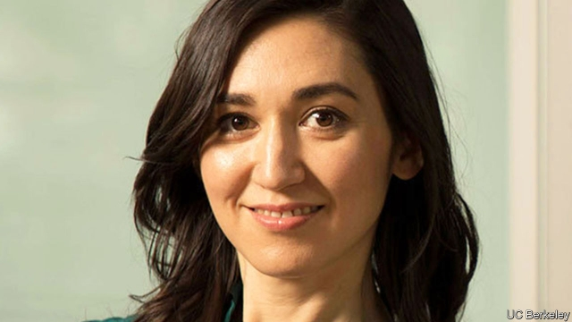

###### America’s best young economist

# Emi Nakamura wins the John Bates Clark medal 

##### Putting the macroeconomy under the microscope 

 

> May 2nd 2019 

THE YEAR 2007, when Emi Nakamura earned her PhD, was a strange one for her chosen discipline of macroeconomics. It marked a turning point between complacent consensus and humiliating division. Pre-crisis macroeconomics had such strong faith in the stabilising power of monetary policy that it neglected the dangers of financial shocks and the merits of fiscal stimulus. Like joining the cavalry in 1914, it was presumably a bad time to be entering the profession. 

Not a bit of it. “I think it was a good time,” says Ms Nakamura, who now works at the University of California, Berkeley, and this week won the John Bates Clark medal for the best economist aged under 40 in America. “Macroeconomics”, she points out, “is a countercyclical field.” 

Yes, financial shocks of the sort that caused the Great Recession were understudied, but the consequences were Keynesian, she says. And the need for a response turned theoretical curiosities (such as the liquidity trap that can stymie monetary policy) into major policy dilemmas. 

For students of economic ups and downs, the crisis also met a crying need: for a new data point, a new down-and-up to examine. The lack of data had made macroeconomics unfashionable. Its practitioners crunched the same quarterly, national numbers, which failed to illuminate ever more refined theories of how the economy worked. Microeconomists were having all the fun, plundering new sources of evidence and reinventing old techniques for divining cause and consequence. They were also snaffling most of the medals. Of the 17 Clark winners between 1995 and 2018, only two or three showed much interest in booms and busts. 

Inspired by microeconomists, Ms Nakamura and Jon Steinsson, her frequent co-author, set about enlarging the macro data repertoire. They extended some series and unpacked others. To study price inertia, for example, they dismantled the consumer-price index into its constituent parts: thousands of prices, stretching back to the Great Inflation of the 1970s. (They used a retrofitted scanner to glean older prices from microfilms that were not allowed to leave the Bureau of Labour Statistics building.) They confirmed that, outside of sales, prices were indeed slow to change, contrary to blackboard theories. They discovered, surprisingly, that periods of high inflation did not scramble price signals by driving prices too far out of synch with one another. 

To study fiscal stimulus, they divided America (one unit of analysis) into its constituent states (50). That enabled them to measure the impact of extra Pentagon spending (a source of fiscal stimulus unrelated to economic misfortune) on states with a large defence industry, relative to those without. And to illuminate monetary policy, they turned from the usual yearly or quarterly data to finer slices of time, examining the impact of unexpected Federal Reserve actions and utterances in the minutes after they reach the markets. 

Lately, Ms Nakamura has looked at “jobless” recoveries. She argues that jobs have grown more slowly in recent upswings because women’s participation in the labour force is no longer converging quickly with men’s. In earlier decades, firms took advantage of the recovery to snap up women. Hiring was swift, as employment caught up with women’s accelerating desire to enter the workforce. In more recent upturns, hiring was more tepid, as employment caught up with a stagnant trend. 

Not all professions are the same, of course. In economics, if not in the American economy, the scope for female convergence remains vast. Forty-one people have won the Clark medal. Just four, including Ms Nakamura, have been women. 

-- 

 单词注释:

1.economist[i:'kɒnәmist]:n. 经济学者, 经济家 [经] 经济学家 

2.EMI[]:[计] 电磁干扰, 消息结束指示字符 

3.nakamura[]:n. (Nakamura)人名；(意)纳卡穆拉 

4.john[dʒɔn]:n. 盥洗室, 厕所, 嫖客 

5.bate[beit]:vt. 减弱, 减少, 降低, 缓和 n. 鹰的躁动, 大怒 

6.clark[]:n. 克拉克（男子名） 

7.macroeconomy[]:[经] 宏观经济 

8.phd[]:abbr. 哲学博士学位（Doctor of Philosophy） 

9.macroeconomic[-mik]:n. 整体经济 

10.complacent[kәm'pleisnt]:a. 满足的, 自满的, 得意的 

11.humiliate[hju:'milieit]:vt. 使丢脸, 使蒙羞, 屈辱 

12.stabilise['steibilaiz]:vt.vi. (使)稳定, (使)安定, (使)坚固 vt. 装稳定器 

13.monetary['mʌnitәri]:a. 货币的, 金钱的 [经] 货币的, 金融的 

14.fiscal['fiskәl]:a. 财政的, 国库的 [经] 财政上的, 会计的, 国库的 

15.stimulus['stimjulәs]:n. 刺激, 激励, 刺激品 [医] 刺激特, 刺激 

16.cavalry['kævәlri]:n. 骑兵 

17.California[.kæli'fɒ:njә]:n. 加利福尼亚 

18.berkeley['bɑ:kli, 'bә:kli]:n. 伯克利（姓氏）；贝克莱（爱尔兰主教及哲学家）；伯克利（美国港市） 

19.countercyclical[,kajntә'saiklikәl]:a. [经]反周期的( 指与商业周期既定阶段发展方向相反的,如在商业周期高涨阶段采取通货紧缩政策,以防止通货膨胀等问题出现) 

20.recession[ri'seʃәn]:n. 后退, 凹处, 衰退, 归还 [医] 退缩 

21.understudy['ʌndәstʌdi]:n. 预备演员, 替角 vt. 通过观察掌握某工作, 通过实习掌握某工作 vt.vi. 练习当替角 

22.Keynesian['keinziәn]:a. 凯因斯主义的 n. 凯因斯主义的追随者, 凯因斯主义的鼓吹者 

23.liquidity[li'kwiditi]:n. 流动性, 流畅 [经] 流动性 

24.stymie['staimi]:n. (喻)困难的境地 vt. 使(球)处于困难的位置, 使为难, 使处困境, 妨碍, 阻挠, 阻碍 

25.datum['deitәm]:n. 论据, 材料, 资料, 已知数 [医] 材料, 资料, 论据 

26.unfashionable[.ʌn'fæʃәnәbl]:a. 不流行的, 不时髦的, 过时的 

27.practitioner[præk'tiʃәnә]:n. 从业者, 开业者 [医] 行医者, 医师 

28.crunch[krʌntʃ]:v. 嘎吱嘎吱的咬嚼, 压碎, 嘎吱嘎吱地踏过 n. 咬碎, 咬碎声 

29.illuminate[i'lju:mineit]:vt. 照明, 用灯装饰, 阐明, 说明, 使灿烂 vi. 照亮, 用灯装饰 

30.microeconomist[]:n. 微观经济学家 (microeconomics的变形) 

31.plunder['plʌndә]:n. 抢夺, 掠夺品, 战利品 v. 掠夺, 抢劫, 抢夺 

32.reinvent[.ri:in'vent]:vt. 重新使用；彻底改造；重复发明（在不知他人已发明的情况下） 

33.divine[di'vain]:a. 神的, 神圣的, 非凡的 n. 神学家 

34.snaffle['snæfl]:n. 马嚼子 vt. 装以马嚼子, 轻勒, 偷窃 

35.bust[bʌst]:n. 半身像, 胸部, 失败, 殴打 vt. 使爆裂, 使破产 vi. 爆裂, 破产 [计] 操作错 

36.jon[dʒɔn]:n. 乔恩（男子名） 

37.Steinsson[]:[网络] 斯泰因森；斯藤森 

38.macro['mækrәu]:pref. 宏 a. 巨大的, 大量的 [计] 宏 

39.repertoire['repәtwɑ:]:n. 全部剧目, 全部技能, 全部节目, 全部作品 

40.sery[]:n. (Sery)人名；(俄)谢雷；(科特)塞里 

41.unpack[.ʌn'pæk]:vt. 从包裹中取出, 卸下, 打开 vi. 打开包裹 [计] 拆开 

42.inertia[i'nә:ʃә]:n. 惯性, 惰性, 迟钝 [化] 惯性 

43.dismantle[dis'mæntl]:vt. 拆除...的设备, 分解, 去除覆盖物 

44.constituent[kәn'stitjuәnt]:n. 成分, 选民, 构成物 a. 构成的, 组织的, 选举的 

45.inflation[in'fleiʃәn]:n. 胀大, 夸张, 通货膨胀 [化] 充气吹胀; 膨胀 

46.retrofit['retrә,fit]:n. 式样翻新 vt.vi. 式样翻新 [计] 更新; 改进 

47.scanner['skænә]:n. 扫描仪, 扫描盘, 审视者 [计] 扫描器; 词法分析程序; 扫描程序; 扫视程序 

48.glean[gli:n]:v. 拾落穗, 收集 

49.microfilm['maikrәufilm]:n. 缩影胶卷 v. 缩微拍摄 [计] 缩微胶片; 缩微胶卷 

50.statistic[stә'tistik]:n. 统计量 a. 统计的, 统计学的 

51.inflation[in'fleiʃәn]:n. 胀大, 夸张, 通货膨胀 [化] 充气吹胀; 膨胀 

52.scramble['skræmbl]:n. 攀缘, 爬行, 抢夺, 混乱, 紧急起飞 vi. 攀缘, 杂乱蔓延, 争夺, 拼凑, 匆忙 vt. 攀登, 扰乱, 使混杂 

53.synch[siŋk]:[计] 同步信号 

54.pentagon['pentәgәn]:n. 五角形, 五边形 [经] 五角平台 

55.unrelated[]:[法] 无关的 

56.misfortune[mis'fɒ:tʃәn]:n. 不幸, 灾祸, 坏运气 [法] 不幸事故, 不幸, 灾祸 

57.unexpect[]:[网络] 意想不到；使意外 

58.utterance['ʌtәrәns]:n. 发声, 言辞, 表达, 说话的方式, 死 [医] 发言, 言语, 语调 

59.jobless['dʒɔblis]:a. 失职的, 无职业的 [经] 失业的 

60.upswing['ʌpswiŋ]:n. 回升时期, 上升, 向上摆动, 跃进 [经] 上升, 向上摆动 

61.participation[.pɑ:tisi'peiʃәn]:n. 参与, 分享 [经] 参与, 参股 

62.converge[kәn'vә:dʒ]:vi. 聚合, 集中于一点 vt. 使集合 

63.quickly['kwikli]:adv. 很快地 

64.upturn[ʌp'tә:n]:n. 情况好转, 向上趋势 v. (使)向上, 转朝上, 翻转 

65.tepid['tepid]:a. 微温的, 温热的, 不太热烈的 [医] 微温的 

66.stagnant['stægnәnt]:a. 不流动的, 停滞的, 不景气的, 萧条的, 污浊的, 迟钝的 [经] 萧条的 

67.convergence[kәn'vә:dʒәns]:n. 集中, 收敛 [计] 收敛, 会聚 

