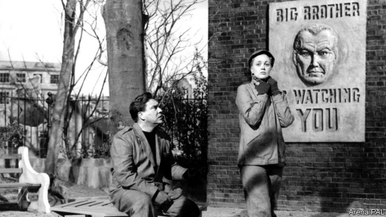

###### The clock strikes 13

# Big Brother’s long afterlife 

##### “1984” might have become irrelevant when the Soviet Union fell. But it didn’t 

 

> May 23rd 2019 

The Ministry of Truth: The Biography of George Orwell’s “1984” By Dorian Lynskey. Doubleday; 368 pages; $28.95. Picador; £16.99 

HOW GEORGE ORWELL would have relished these times. Alternative facts, troll farms, meme warfare—he would be spoiled for material. “The Ministry of Truth”, Dorian Lynskey’s biography of “1984”, joins the dots between the age of fake news and Orwell’s work. 

Mr Lynskey begins with the genesis of “1984” and its reception in 1949, and then explains how it reverberated through the cold war. The Spanish civil war and Orwell’s career in the BBC may seem familiar, but the novel’s literary background is arresting. Utopian and dystopian stories had become increasingly popular since H.G. Wells published his series of late-Victorian hits such as “The War of the Worlds”. Orwell was heavily influenced by Wells; Mr Lynskey gives a poignant account of the ageing man of letters dining with the rising star in Orwell’s tiny flat in London in 1941. The result was a bust-up, the aggrieved Wells skulking off into the darkness. 

As Mr Lynskey says, Orwell wrote “1984” not as a prophecy but as a warning, to galvanise action so that the future he described never came to pass. He succeeded; the book became a weapon in the Western fightback against totalitarianism in the 1940s and beyond. Yet, as Mr Lynskey relates, by the 1970s it had become so proverbial as to be colonised by gormless television shows and indifferent pop-music albums. Its wholesale appropriation by pop culture blunted its political force. 

When the Soviet Union fell, Orwell’s oeuvre might have become a historical curiosity. After all, mid-century writing that was meant to expose the despotism of both the communist left and fascist right should have become irrelevant; history was deemed to have ended. That is not how it turned out, for history or Orwell. 

Disappointingly, the section on his modern resonance is the weakest part of Mr Lynskey’s book. He devotes only a brief passage to the Orwellian echoes in Donald Trump’s presidency: the lies that warp reality, the obsolescence of facts, the divergent information universes of Fox News and CNN. The obvious implication—that the totalitarian methods chronicled by Orwell 70 years ago are now being recycled by supposed democrats—should concern everyone. But it awaits a more rigorous analysis than the one offered here. 
<<<<<<< HEAD

-- 

 单词注释:

1.afterlife['ɑ:ftәlaif]:n. 来世, 下半生 

2.irrelevant[i'relәvәnt]:a. 不恰当的, 无关系的, 不相干的 [法] 无关的, 不相干的, 离题的 

3.george[dʒɔ:dʒ]:n. 乔治（男子名）；自动操纵装置；英国最高勋爵勋章上的圣乔治诛龙图 

4.Dorian['dɔriәn]:a. (古希腊中南部)多里斯(Doris) 的,多里安人的 n. 多里安人 

5.picador['pikәdɒ:]:n. 骑马斗牛士, 能言善辩者, 机灵的人 

6.george[dʒɔ:dʒ]:n. 乔治（男子名）；自动操纵装置；英国最高勋爵勋章上的圣乔治诛龙图 

7.orwell['ɔ:wәl]:n. 奥威尔（姓氏） 

8.relish['reliʃ]:n. 滋味, 风味, 美味, 爱好, 食欲, 调味品 vt. 调味, 喜欢, 玩味 vi. 有味道 

9.troll[trɒl]:vi. 滚动, 参加轮唱, 曳绳钓鱼 vt. 使转动, 轮唱, 高唱, 用曳绳钓(鱼) n. 转动, 轮唱, 钓绳 

10.meme[mi:m]:n. 大脑模仿病毒；文化基因；弥母 

11.fake[feik]:n. 假货, 欺骗, 诡计 a. 假的 vt. 假造, 仿造 vi. 伪装 

12.lynskey[]: [人名] 林斯基 

13.genesis['dʒenisis]:n. 发生, 起源, 创世记 [医] 生殖, 发生 

14.reverberate[ri'vә:bәreit]:vi. 回响, 反响, 被反射 vt. 使反响, 使回响, 反射 a. 回响的, 反射的 

15.BBC[]:英国广播公司 

16.Utopian[ju:'tәupiәn]:a. 乌托邦的, 空想社会主义的 n. 理想社会主义者 

17.dystopian[dis'tәjpiәn]:a. 反面乌托邦的,反面假想国的  n. 反面乌托邦的鼓吹者(或描写者) 

18.hg[]:abbr. 标准德语（High German）；手摇发电机（Hand Generator） 

19.sery[]:n. (Sery)人名；(俄)谢雷；(科特)塞里 

20.orwell['ɔ:wәl]:n. 奥威尔（姓氏） 

21.poignant['pɒinәnt]:a. 辛酸的, 尖锐的, 剧烈的 

22.dining['dainiŋ]:n. 正餐, 宴会 

23.aggrieve[ә'gri:v]:vt. 使委屈, 使悲痛, 侵害 [法] 侵害, 使悲痛, 使委屈 

24.skulk['skʌlk]:vi. 偷偷隐躲, 偷懒 

25.prophecy['prɒfәsi]:n. 预言, 预言能力 

26.galvanise['^ælvәnaiz]:vt. 通电流于, 给...镀锌, 电镀, 刺激, 使兴奋, 激动, 激励, 惊起 

27.fightback['faitbæk]:n. <英>回击, 反攻 

28.totalitarianism[,tәjtæli'teәriәnizəm]:n. 极权主义 [法] 极权主义 

29.proverbial[prә'vә:biәl]:a. 谚语的, 谚语式的, 闻名的 

30.colonise['kɔlәnaiz]:vi. 开拓殖民地；移民于殖民地 

31.gormless['gɒ:mlis]:a. 笨头笨脑的 

32.wholesale['hәulseil]:n. 批发 a. 批发的, 大规模的 adv. 大规模, 照批发方式 vi. 经营批发业, 批发 vt. 批发 

33.appropriation[әprәupri'eiʃәn]:n. 拨用, 挪用, 拨款 [经] 拨款, 挪用 

34.blunt[blʌnt]:a. 钝的, 坦率的, 麻痹的 

35.oeuvre['ә:vr]:n. 全部作品 

36.despotism['despәtizәm]:n. 独裁, 专制, 专制政治 [法] 专制政体, 专制政治 

37.fascist['fæʃist]:n. 法西斯主义者, 法西斯党员 

38.deem[di:m]:v. 认为, 相信 

39.disappointingly[,disə'pɔintiŋli]:adv. 令人失望地 

40.resonance['rezәnәns]:n. 共鸣, 回声, 反响, 谐振, 共振 [化] 共振; 共鸣 

41.Orwellian[ɔ:'weliәn]:George Orwell的笔调或用字的, 受严格统治而失去人性的社会, 赞成上述社会的人 

42.warp[wɒ:p]:n. 变形, 弯曲, 歪曲, 乖僻, 偏差, 偏见 vt. 使变形, 弄歪, 使翘曲, 使不正常, 歪曲, 使有偏见 vi. 变弯, 变歪 

43.obsolescence[.ɒbsә'lesәns]:n. 荒废, 淘汰, 过时, 退化 [医] 废弃 

44.divergent[dai'vә:dʒәnt]:a. 有分歧的 [医] 散开的, 偏斜的 

45.cnn[]:abbr. 美国有线电视新闻网络（Cable News Network） 

46.totalitarian[.tәutæli'tєәriәn]:a. 极权主义的 n. 极权主义者 

47.chronicle['krɒnikl]:n. 年代记, 记录, 编年史 vt. 把...载入编年史 

48.rigorous['rigәrәs]:a. 严厉的, 严酷的, 严格的, 苛刻的, 严密的, 精确的 
=======
>>>>>>> 50f1fbac684ef65c788c2c3b1cb359dd2a904378

