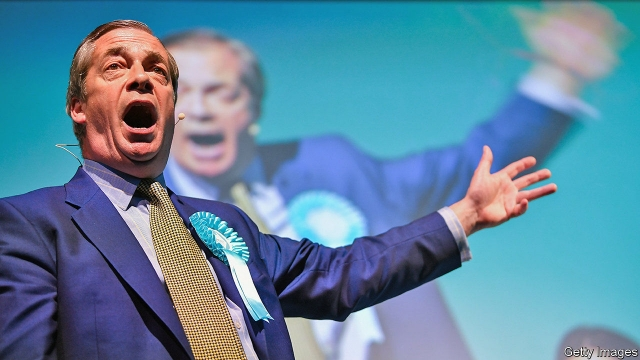

###### Social climbers

# The Brexit Party wins the battle for Facebook clicks 

##### Despite spending no more than rival parties on ads, it has got more likes, shares and comments than the rest combined 

 

> May 25th 2019 

“THEY LIED to you,” goads a video on Facebook, as news footage shows Remainers first vowing to respect the Brexit referendum’s results, then calling for a second vote. The clip, set to a pulsing soundtrack, has been watched 250,000 times. “Teach the establishment a lesson this Thursday,” it concludes: “Vote for the Brexit Party.” Polls suggested that more than 30% of voters would do so in Britain’s election to the European Parliament on May 23rd (results will be announced on May 27th). That would put Nigel Farage’s new outfit in first place, winning perhaps 30 of Britain’s 73 seats in Strasbourg. 

However the Brexit Party fares at the ballot box, it has won the battle for clicks. It has spent no more than most of its rivals on Facebook ads in the past month. But it has got dramatically better results (see charts). The party’s Facebook pages have attracted 2.2m likes, shares and comments, more than all the other parties combined, and some 30 times more than Change UK, a pro-Remain upstart which outspent it. 

 

Its focus on digital strategy is a legacy of the Vote Leave campaign, which spent 98% of its marketing budget online. Some £2.7m ($3.4m) of Vote Leave’s £7m allowance was paid to AggregateIQ, a data-mining firm linked to the now-defunct Cambridge Analytica. The Brexit Party has canny youngsters, such as Steven Edginton, its 19-year-old digital strategist, running its social-media feeds. Facebook’s algorithm rewards videos, especially those streamed live from events. The Brexit Party has posted more than any other page, including broadcasts of rallies in Wolverhampton, Durham and Newport. Its punchier clips are also popular on Twitter. 

It benefits from having a clear message, something both Labour and the Tories lack. Just as Vote Leave identified immigration and health as vote-winning subjects, the Brexit Party has alighted on the theme of democracy and its supposed betrayal. “This isn’t about left or right. It’s about right and wrong,” reads one post. “Democracy comes before party politics,” declares another. 

Who is paying for all these ads? After the referendum, the Electoral Commission found that Vote Leave broke the £7m cap by giving £675,000 to BeLeave, a youth group. Questions now hang over the Brexit Party’s finances. The commission is looking into whether any of its income has come via (prohibited) foreign donations of more than £500, which the party denies. Meanwhile the European Parliament is pursuing a complaint that Mr Farage, an MEP, failed to declare a personal gift of £450,000 from Arron Banks, a businessman whom the National Crime Agency is investigating for soliciting foreign money for Leave.EU, another pro-Brexit group (Mr Banks denies it). These are worrying allegations—which Leave-supporters who get their news from Facebook may never read about. 
<<<<<<< HEAD

-- 

 单词注释:

1.climber['klaimә]:n. 登山者 [电] 登杆器 

2.Brexit[]:[网络] 英国退出欧盟 

3.facebook[]:n. 脸谱网 

4.goad[gәud]:n. 赶牛棒, 激励, 刺激 vt. 用刺棒驱赶, 激励, 刺激, 唆使, 煽动 

5.footage['futidʒ]:n. 英尺长度, 英板尺, (影片的)连续镜头 

6.remainers[]:[网络] 剩余物 

7.vow[vau]:n. 誓约, 誓言, 许愿 vi. 起誓, 发誓, 郑重宣言 vt. 立誓, 起誓要, 郑重地宣布 

8.clip[klip]:n. 修剪, 夹子, 回形针, 剪下来的东西 vt. 修剪, 痛打, 夹牢, 剪报 vi. 剪报 

9.soundtrack[]:n. 声迹, 声槽, 声带 

10.voter['vәutә]:n. 选民, 投票人 [法] 选民, 选举人, 投票人 

11.nigel['naidʒәl]:n. 奈杰尔（男子名） 

12.outfit['autfit]:n. 用具, 配备, 机构 vt. 配备, 供应 vi. 得到装备 

13.strasbourg['stræsb\\:^, strɑ:z'bu:r]:n. 斯特拉斯堡（法国东北部城市） 

14.ballot['bælәt]:n. 投票, 投票用纸, 抽签 vi. 投票, 抽签 vt. 投票选出, 拉选票 

15.dramatically[drә'mætikli]:adv. 戏剧地, 引人注目地, 突然地 

16.UK[ju: 'kei]:n. 联合王国 

17.upstart['ʌpstɑ:t]:n. 新贵, 暴发户, 自命不凡者 a. 暴富的 

18.outspent[aut'spent]:outspend的过去式和过去分词 

19.legacy['legәsi]:n. 祖先传下来之物, 遗赠物 [经] 遗产, 遗赠物 

20.marketing['mɑ:kitiŋ]:n. 行销, 买卖 [经] 推销, 在市场买卖, 销售 

21.online[]:[计] 联机 

22.Cambridge['keimbridʒ]:n. 剑桥 

23.analytica[]:[网络] 生化及实验室技术展；生化技术博览会；慕尼黑生技医疗仪器展 

24.canny['kæni]:a. 精明的, 谨慎的, 节约的 

25.steven['sti:vn]:n. 史蒂文（男子名） 

26.edginton[]: [人名] 埃金顿 

27.strategist['strætidʒist]:n. 战略家 

28.algorithm['ælgәriðm]:n. 算法 [计] 算法 

29.rally['ræli]:n. 重振旗鼓, 集合, 群众集会, 跌停回升 v. 重整旗鼓, 集合, 恢复精神, 团结, 挖苦, 嘲笑 

30.Wolverhampton['wjlvә,hæmptәn]:伍尔弗汉普顿[英国英格兰中西部城市] 

31.Durham['dә:rәm]:n. 达勒姆郡(英格兰郡名), 短角肉牛 

32.newport[]:n. 新港；纽波特（美国罗得岛之避暑胜地） 

33.punchy[]:a. 有力的, 生气勃勃的 

34.twitter['twitә]:n. 啁啾, 唧唧喳喳声 vi. 啭, 啁啾, 颤抖 vt. 嘁嘁喳喳地讲, 抖动 

35.Tory['tɒ:ri]:n. 托利党党员, 保守党员, 亲英分子 a. 保守分子的 

36.alight[ә'lait]:vi. 落下, 偶然发现 a. 点着的 

37.betrayal[bi'treiәl]:n. 背叛, 辜负 [法] 背叛, 通敌, 背信 

38.politic['pɒlitik]:a. 精明的, 明智的, 策略的 

39.referendum[.refә'rendәm]:n. （就重大政治或社会问题进行的）全民公决，全民投票 

40.electoral[i'lektәrәl]:a. 选举人的, 选举的, (有关)选举的 [法] 选举的, 选举人的, 由选举人组成的 

41.beleave[]:[网络] 离开 

42.donation[dәu'neiʃәn]:n. 捐赠物, 捐款, 捐赠 [经] 赠品, 捐款, 捐赠 

43.farage[]:[网络] 人B淋巴瘤细胞系；法拉格 

44.MEP[]:[化] 最低能量途径 

45.arron[]:n. 炎亚纶（飞轮海成员之一）；亚纶（郭富城的英文名） 

46.solicit[sә'lisit]:v. 请求, 乞求, 招揽, 征求 
=======
>>>>>>> 50f1fbac684ef65c788c2c3b1cb359dd2a904378

