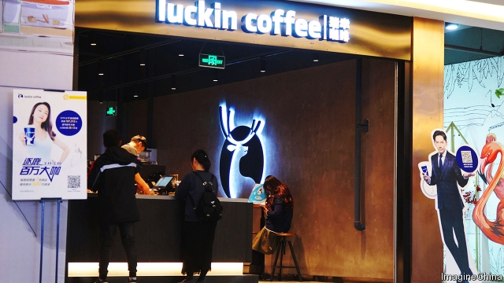

###### Full of beans

# China is a nation of tea-drinkers, but coffee is taking off 

##### It’s not just the drink that appeals, it’s the chance to share pictures of it 

 

> May 23rd 2019 

ON A SPRING morning in Chengdu, the capital of the south-western province of Sichuan, Zhang Xiaoyu stands in her classroom, teaching the art of coffee-making. On the wall a dozen plaques from the Specialty Coffee Association of Europe certify her proficiency in skills ranging from roasting beans to serving the drink. Seven students, all women in their 20s and 30s hoping to open coffee shops, take sips from tiny cups and make notes on the flavours. 

Until the 1990s coffee was rarely served in China except at luxury hotels aimed at foreigners. When Starbucks opened its first outlet there in 1999 it was far from clear that the country’s avid tea-drinkers would take to such a different—and usually more costly—source of caffeine. Starbucks tried to entice customers unused to coffee’s bitter taste by promoting milk- and sugar-heavy concoctions such as Frappuccinos. 

The average Chinese still only drinks five cups per year, says the International Coffee Organisation, a London-based group. That is just 1.3% of the amount consumed by the average Japanese or American. But coffee has become fashionable among the middle class. Starbucks now has about 3,800 outlets in China—more than in any other country outside America. Statista, a business-intelligence portal, says the roast coffee market in China is growing by more than 10% a year. Starbucks and its rivals see big scope for expanding there. 

So too, however, do home-grown competitors. A major new presence is Luckin Coffee, a Beijing-based chain. Since its founding less than two years ago it has opened more than 2,300 outlets. On May 17th Luckin’s initial public offering on the Nasdaq stockmarket raised more than $570m, giving it a value of about $4bn. 

Luckin’s remarkable growth is a sign of change. No longer do Chinese consumers see coffee as such a luxury. Most of Luckin’s outlets are merely kiosks where busy white-collar workers pick up their drinks, having ordered them online. Super-fast delivery can also be arranged through the company’s app. But, as demand for Ms Zhang’s classes suggests, the posh end of the market is flourishing too. Independent coffee shops are springing up, at which preparation of the drink is taken to artisanal extremes. No longer are whipped cream and sweet sauces essential. 

Whale Coffee, a shop in Chengdu’s trendy Yulin neighbourhood, is run by Pang Wenlong, who three years ago was among Ms Zhang’s first students. On most days Mr Pang can be seen behind the counter perusing manuals on coffee roasting, or examining his beans and separating out defective ones by hand. On a recent visit your correspondent ordered a Square Coffee (so-called because Whale looks out on a square), which combines two roasts of one’s choice. Mr Pang said he would favour the Colombia roast, rather than the requested Ethiopia, as a fit with the Kenya. 

There may be about 200 small coffee shops like Mr Pang’s in Chengdu, Ms Zhang estimates. Their growth is striking given the city’s renown for its tea-drinking culture. Many residents like to relax in open-air shops, sipping tea served gracefully by waiters from brass pots with long spouts. Xue Meiling, a Whale regular who owns a bakery, says she is as likely to invite a friend to coffee at Mr Pang’s as to tea. 

But the two markets are different. The teahouses tend to cater to older people who like to spend long hours in them, playing mahjong and gossiping. At the coffee shops it is rare to see anyone over 40. Young people use them for socialising, but much of their interaction is online—sharing photos of their drinks, of the coffee-making equipment and of themselves in chic interiors. An option on the Chinese rating app Dianping allows users to search for wanghong (“internet viral”) coffee houses: ones with particularly photogenic decor. Where better to sip and WeChat? 

-- 

 单词注释:

1.chengdu['tʃʌŋ'du:]:n. 成都市（中国四川省省会） 

2.Sichuan['si:tʃ'wɑ:n]:四川(位于中国西南部、长江上游) 

3.zhang[]:n. 张, 章（中国姓氏） 

4.xiaoyu[]:[网络] 凌晓雨；萧洛；心雨 

5.plaque[plɑ:k]:n. 匾, 饰板, 名牌, 勋章, 胸襟饰物, 血小板 

6.specialty['speʃәlti]:n. 专业, 专长, 特产, 特制品, 特性, 特点 a. 专门的, 独立的 

7.certify['sә:tifai]:v. 证明, 保证 

8.proficiency[prә'fiʃәns]:n. 精通, 熟练, 精练 

9.sip[sip]:n. 啜饮, 小口喝, 抿 vi. 啜饮 vt. 啜 [计] 单列直插式组件 

10.starbuck['sta:bʌk]:n. 星巴克（咖啡公司） 

11.avid['ævid]:a. 渴望的, 急切的, 劲头十足的 

12.caffeine['kæfi:n]:n. 咖啡因, 咖啡碱 [化] 咖啡因; 咖啡碱 

13.entice[in'tais]:vt. 诱骗, 引诱, 怂恿 

14.unused[.ʌn'ju:zd]:a. 不用的, 不在使用的, 从未用过的 

15.concoction[kәn'kɒkʃәn]:n. 调制, 调合, 调合物 [医] 加热合剂(药物); 消化 

16.frappuccinos[]:[网络] 星巴克星冰乐；法布其诺；法布奇诺咖啡 

17.organisation[,ɔ: ^әnaizeiʃən; - ni'z-]:n. 组织, 团体, 体制, 编制 

18.portal['pɒ:tl]:n. 入口, 大门 a. 肝门的 

19.les[lei]:abbr. 发射脱离系统（Launch Escape System） 

20.nasdaq['næz,dæk]:abbr. 全国证券交易商自动报价系统协会（National Association of Securities Dealers Automated Quotation） 

21.stockmarket[s'tɒkmɑ:kɪt]: 证券市场; 证券交易所; 证券行情 

22.kiosk[ki'ɒsk]:n. 亭, 凉亭, 报摊 

23.online[]:[计] 联机 

24.APP[]:[计] 应用, 应用程序; 相联并行处理器 

25.posh[pɒʃ]:a. 豪华的, 漂亮的, 优雅的, 极好的 interj. 呸 

26.artisanal[]:手工艺性的 

27.trendy['trendi]:a. 随潮流的, 时髦的, 赶潮流的 

28.yulin[]:[网络] 榆林；玉林；王丙林 

29.pang[pæŋ]:n. 剧痛, 悲痛, 苦闷 vt. 使剧痛, 折磨 

30.peruse[pә'ru:z]:vt. 熟读, 精读, 阅读, 仔细研究 

31.defective[di'fektiv]:a. 有缺陷的, 欠缺的 n. 有缺陷的人, 不完全变化词 

32.Colombia[kә'læmbiә]:n. 哥伦比亚 

33.Ethiopia[.i:θi'әupiә]:n. 埃塞俄比亚 

34.Kenya['kenjә]:n. 肯尼亚 

35.renown[ri'naun]:n. 名声, 声望 vt. 使有声望 

36.gracefully[]:adv. 优雅地；温文地 

37.spout[spaut]:n. 喷口, 从喷口流出的水, 水落管, 水龙卷 vt. 喷出, 喷射, 滔滔不绝说出, 典押 vi. 喷射, 高谈阔论 

38.xue[]:雪（汉语拼音） 

39.Meiling[]:[网络] 美菱故障代码表；台北诺贝尔医美；北京 

40.teahouse['ti:haus]:n. 茶室 

41.mahjong[ma:'dʒɔŋ]:n. 麻将 

42.gossip['gɒsip]:n. 闲聊, 随笔, 流言, 爱讲闲话的人 vi. 说闲话, 闲聊 

43.socialise['sәjʃәlaiz]:vt. 使社会化, 使社会主义化, 使适合社会需要 vi. (美)(非正式)参加社交活动, 发生社交往来 

44.chic[ʃi:k]:n. 漂亮, 别致的款式 a. 漂亮的, 别致的 

45.Dianping[]:[网络] 大众点评；促销；故事 

46.viral['vairәl]:a. 病毒的, 病毒引起的 [医] 病毒的 

47.photogenic[,fәutәu'dʒenik]:a. 发光的, 由于光而产生的, 适宜于拍照的, 拍照效果好的, 特别上镜的, 上照的 [医] 光所致的, 光原性的, 发光的 

48.decor['deikɔ:(r); (?@) dei'kɔ:r]:n. 装饰, 布置 

