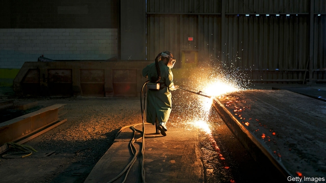

###### Shining brighter

# American importers of metals from Canada and Mexico gain relief from tariffs 

##### But the overall direction is still towards protectionism 

 

> May 23rd 2019 

TIMES HAVE been tough for Riverdale Mills Corporation, a company based in Northbridge, Massachusetts. In June last year the Trump administration imposed tariffs of 25% on steel imported from Canada, which accounted for half the firm’s supply. As its business involves transforming steel rods to supply 85% of North America’s lobster traps, and 31 miles (50km) of security fencing along America’s border, its costs soared. “We were very, very disappointed,” said James Knott, its chief executive. 

Disappointment has given way to delight. On May 19th President Donald Trump declared that steel and aluminium from Mexico and Canada no longer posed a threat to America’s national security, and the next day the tariffs were no more. “This is just pure good news for Canadians,” said Justin Trudeau, Canada’s prime minister. 

It was also excellent news for American consumers of steel. Faced with a lack of steel of similar quality from American suppliers nearby, and the expense of shipping from those farther away, Mr Knott had stuck with his Canadian suppliers, which hit profits and forced him to trim his workforce. Although he kept prices steady for his core products, some customers decamped anyway, worried that price rises were coming. 

The tariff cuts will relieve strain for metal importers immediately. But the effect on the overall market may be muted, says Michael Widmer of Bank of America Merrill Lynch, an investment bank. Before the tariffs Canada and Mexico supplied only around 15% of America’s combined steel and aluminium imports. Most of the rest still faces trade restrictions. For steel the relief will be “very narrow”, he says. 

Even that narrow relief will leave trade between the United States and its North American neighbours less free than before. The deal between the United States, Canada and Mexico allows for tariffs to be reimposed without notice if imports of a particular product surge. And it includes new, as yet unspecified, enforcement provisions, intended to ensure that metal from other countries does not sneak into the United States. That is meant to address concerns about Chinese exports depressing American prices through the back door. 

But it is better for Canada and Mexico than the quotas the Trump administration had been demanding. Those could have blocked trade altogether, even if American supply had fallen short. And the deal’s political significance goes well beyond the limited quantities of metal imports it covers. Mr Trudeau called it a “big step forward” towards ratifying the USMCA, the deal between the United States, Canada and Mexico negotiated to replace NAFTA. Though Democrats in Congress are likely to demand further changes first, its chances should be helped by the silencing of Canadian and Mexican complaints. 

The news does not mean that Mr Trump is no longer, as he put it, a “tariff man”. On May 17th a presidential proclamation gave Japan and the European Union up to six months to negotiate away the (imaginary) threat posed by their cars and car parts to America’s national security. On May 10th American tariffs on $200bn of Chinese imports increased from 10% to 25%. All this means Mr Knott’s luck has turned. As he points out, all tariffs are “an exploitation of the consumer”. But now it is not his firm that is feeling the worst of the squeeze. 
<<<<<<< HEAD

-- 

 单词注释:

1.importer[im'pɒ:tә]:n. 输入者, 进口商 [法] 进口商, 输入者 

2.tariff['tærif]:n. 关税, 关税表, 价格表, 收费表 vt. 课以关税 [计] 价目表 

3.protectionism[prә'tekʃәnizm]:n. 贸易保护主义, 贸易保护制 [经] 保护(贸易)主义, 保护(贸易)制 

4.riverdale[]:n. 河谷；里弗代尔（男子名） 

5.northbridge[]: [地名] [美国] 诺斯布里奇 

6.Massachusetts[.mæsә'tʃu:sits]:n. 麻萨诸塞州 

7.lobster['lɒbstә]:n. 龙虾 

8.soar[sɒ:]:n. 高扬, 翱翔 vi. 往上飞舞, 高耸, 翱翔 

9.jame[]: 灰岩井 

10.Knott[]:n. (Knott)人名；(德)克诺特；(英)诺特 

11.justin['dʒʌstin]:n. 贾斯廷（男子名） 

12.trudeau[]:n. (Trudeau)人名；(英、法)特鲁多 特鲁多 

13.supplier[sә'plaiә]:n. 供应者, 供给国, 供应商 [化] 承制厂; 供应厂商 

14.decamp[di'kæmp]:vi. 撤营, 逃走, 逃亡 [法] 撤退, 逃走, 逃亡 

15.michael['maikl]:n. 迈克尔（男子名） 

16.widmer[]: [人名] 威德默 

17.Merrill[]:n. 美林（美国证券公司）；美林（美国城市） 

18.lynch[lintʃ]:n. 私刑, 私罚 vt. 处以私刑处死, 加私刑 

19.les[lei]:abbr. 发射脱离系统（Launch Escape System） 

20.reimpose[.ri:im'pәuz]:vt. 再强加, 重新征收 [经] 再征收, 重新征收 

21.surge[sә:dʒ]:n. 巨涌, 汹涌, 澎湃 vi. 汹涌, 澎湃, 颠簸, 猛冲, 突然放松 vt. 使汹涌奔腾, 急放 [计] 电压尖峰 

22.unspecified['ʌn'spesifaid]:a. 未特别指出的, 未特别提到的 

23.enforcement[in'fɒ:smәnt]:n. 执行, 强制 [法] 实施, 加强, 厉行 

24.sneak[sni:k]:vi. 鬼鬼祟祟做事 vt. 偷偷地做 n. 鬼鬼祟祟的人, 偷偷摸摸的行为, 帆布胶底运动鞋 a. 暗中进行的 

25.depressing[di'presiŋ]:a. 抑压的, 沉闷的, 阴沉的 

26.quota['kwәutә]:n. 配额, 限额 [化] 定额 

27.ratify['rætifai]:vt. 批准, 认可 [经] 证实, 肯定, 确认 

28.NAFTA['næftə]:abbr. 北美自由贸易协定（North American Free Trade Agreement） 

29.democrat['demәkræt]:n. 民主人士, 民主主义者, 民主党党员 [经] 民主党 

30.presidential[.prezi'denʃәl]:a. 总统制的, 总统的, 首长的, 统辖的 [法] 总统的, 议长的, 总经理的 

31.proclamation[.prɒklә'meiʃәn]:n. 宣言, 公布, 布告, 公告 [法] 宣告, 宣布, 布告 

32.exploitation[.eksplɒi'teiʃәn]:n. 开发, 开采, 剥削 [经] 开发, 剥削, 宜传 
=======
>>>>>>> 50f1fbac684ef65c788c2c3b1cb359dd2a904378

