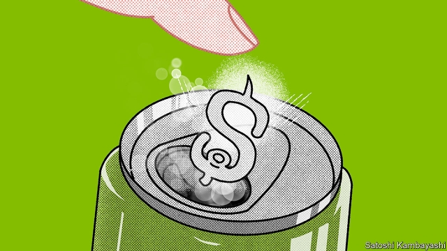

###### Soda stream

# How to tax sugary drinks 

##### Even allowing for the fact that people like sugar, a tax is desirable 

 

> May 23rd 2019 

SUGAR TAXES are on a high. Around 40 countries and seven American cities have started to tax sugary drinks, mostly in the past few years. Supporters say such levies compensate for the costs imposed on health services by higher rates of obesity, diabetes and heart disease. They might also help short-termist buyers avoid the long-term consequences of sugary indulgences. Opponents counter that such levies are a fun-killer, souring people’s pleasure, and regressive, because poorer people spend a bigger share of their incomes on soft drinks. 

Two working papers published on May 20th seek to help policymakers find the sweet spot. Hunt Allcott of New York University, Benjamin Lockwood of the University of Pennsylvania and Dmitry Taubinsky of the University of California, Berkeley, compute the “optimal” tax rate that maximises social well-being, taking into account differences in consumers’ income and behavioural biases. 

Consumer data show that a soda tax does indeed have regressive effects. American households earning less than $10,000 a year buy twice as much sugary drink as those earning $100,000. Weighed against that, the gap between desired and actual consumption is wider for poorer people than it is for richer ones. The authors surveyed households to gauge their knowledge of sweet drinks’ nutritional content and how much their consumption outstrips what they regard as ideal. The average household, they conclude, would consume a third less if it had expert nutritional knowledge and perfect self-control. That rises to a half for poorer households. 

One of the main determinants of the optimal tax rate turns out to be the price elasticity of demand for sugary drinks. If demand is sensitive to changes in price, then a tax will change behaviour, benefiting poorer people’s health and aligning their behaviour more closely with what they say they desire. Those gains would offset the regressive effects. But if consumers really have a sweet tooth—that is, demand is price-inelastic—then the regressivity effects dominate and a sugar subsidy would actually help redistribute income from the rich to the poor. 

By analysing shoppers’ behaviour, the authors find that demand is elastic enough that a tax, and not a subsidy, is socially beneficial. They compute an optimal tax rate of 1-2 cents per ounce of soft drink in America. That is higher than the average rate of 1 cent in those cities with a tax. 

But there is a wrinkle. In the real world, if taxes in one place get too high shoppers will arbitrage the rules by travelling to buy soft drinks elsewhere. Taking this into account they reckon that the optimal rate for cities is 0.5 cents, although a more efficient system would be a state or national tax to control America’s sugar rush. 
<<<<<<< HEAD

-- 

 单词注释:

1.sugary['ʃugәri]:a. 含糖的, 糖一般的, 甜的 

2.supporter[sә'pɒ:tә]:n. 支持者, 后盾, 迫随者, 护身织物 [法] 支持者, 赡养者, 抚养者 

3.levy['levi]:n. 税款, 所征的人数, 征收 vi. 征税, 课税 vt. 征收, 强求, 召集 

4.obesity[әu'bi:siti]:n. 肥胖 [医] 肥胖, 多脂 

5.diabetes[daiә'bi:ti:z]:n. 糖尿病, 多尿症 [医] 糖尿病; 多尿症 

6.buyer['baiә]:n. 买主, 买方 [经] 买主, 买方, 买手 

7.indulgence[in'dʌldʒәns]:n. 沉溺, 放纵, 嗜好 [法] 宽容, 纵容, 赎罪券 

8.regressive[ri'gresiv]:a. 后退的, 退化的, 回归的 [医] 退化的, 退行的, 消退的, 回归的 

9.policymaker['pɔlisi.meikә]:n. 政策制定者；决策人 

10.york[jɔ:k]:n. 约克郡；约克王朝 

11.benjamin['bendʒәmin]:[医] 安息香 

12.Lockwood[]:洛克伍德 

13.Pennsylvania[.pensil'veinjә]:n. 宾夕法尼亚 

14.Dmitry[]:n. 德米特里（俄罗斯钢琴家） 

15.California[.kæli'fɒ:njә]:n. 加利福尼亚 

16.berkeley['bɑ:kli, 'bә:kli]:n. 伯克利（姓氏）；贝克莱（爱尔兰主教及哲学家）；伯克利（美国港市） 

17.optimal['ɒptimәl]:a. 最佳的, 最理想的 [化] 最优的 

18.maximise['mæksimaiz]:vt. 把...增加到最大限度, 把...扩大到最大限度, 充分重视, 找出...的最高值 

19.behavioural[bi'heivjәrәl]:a. 行为的 

20.biase[]:[网络] 偏差；偏向；偏离 

21.datum['deitәm]:n. 论据, 材料, 资料, 已知数 [医] 材料, 资料, 论据 

22.les[lei]:abbr. 发射脱离系统（Launch Escape System） 

23.nutritional[nju: 'triʃәnәl]:a. 营养的, 滋养的 [医] 营养的 

24.outstrip[.aut'strip]:vt. 追过, 胜过, 凌驾 

25.determinant[di'tә:minәnt]:n. 决定物, 决定因素 a. 决定性的 [计] 判定 

26.elasticity[i.læs'tisiti]:n. 弹力, 弹性 [化] 弹性 

27.align[ә'lain]:vi. 排列, 排成一行, 结盟 vt. 使结盟, 使成一行, 校正 

28.offset['ɒ:fset]:n. 抵消, 把...并列, 旁系, 支管, 用胶印法印 vt. 弥补, 抵消, 胶印 vi. 装支管 n. 偏移量 [计] 偏移量 

29.regressivity[]:燃烧面递减性 

30.redistribute[.ri:di'stribjut]:vt. 重新分配, 再分发 [经] 再分配, 重新分配 

31.socially['sәuʃәli]:adv. 在社会上, 在社交上, 以社会生活方式 

32.shopper['ʃɒpә]:n. 购物者 [经] 顾客, 购物的人 

33.arbitrage[.ɑ:bi'trɑ:ʒ]:n. 套利, 套汇, 仲裁 [经] 套汇, 套利, 公断 

34.reckon['rekәn]:vt. 计算, 总计, 估计, 认为, 猜想 vi. 数, 计算, 估计, 依赖, 料想 
=======
>>>>>>> 50f1fbac684ef65c788c2c3b1cb359dd2a904378

