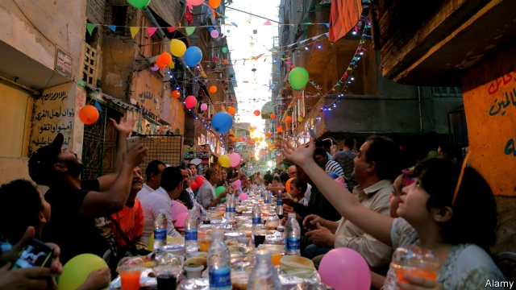

###### Full bellies and full bins

# Arab states waste heaps of food during Ramadan 

##### Hotels and restaurants have come up with some novel solutions 

 

> May 23rd 2019 

AS MUSLIMS HAVE for centuries, Ahmed Toufiq broke his Ramadan fast by nibbling a date while the call to prayer echoed across the Nile. Then he turned to the heaped plates in front of him. He made short work of a fragrant lentil soup, but his pace slowed as he picked through salads and scooped dips with steaming pita bread. When he walked outside for a cigarette 20 minutes after sunset, a server collected half a plate of untouched kebab and rice. “Before iftar, you feel like you want to eat for two,” he said. 

Arab states waste a lot of food. A study in 2016 by the Economist Intelligence Unit, our sister company, found that Saudi Arabia bins 427kg per person annually, triple the average in Europe and North America. Some may chalk this up to traditions of hospitality: even a “light lunch” in Cairo or Beirut leaves guests in a torpor. The reasons are more varied, though. Half of the fruits and vegetables grown in Egypt are never eaten because they are often moved to market in open-air trucks and wilt quickly in the heat. 

The problem gets worse during Ramadan. Residents of the United Arab Emirates each produce an extra 1.8kg of waste per day in the holy month, a 67% increase. Food accounts for 55% of Dubai’s trash, up from 22% in other months. Bahrain’s food waste increases by half to 600 tonnes daily. Buffets are a major culprit, especially in the Gulf, where hotels and restaurants often serve through the night. A study by researchers at Masdar, a state-owned renewable-energy firm in Abu Dhabi, found that just 53% of food at iftar buffets is eaten. 

This is an expensive waste. Some governments see it as a security risk, too. The region is a net food importer. In the weeks before Ramadan, state-run media admonish their citizens to be less wasteful. On social media diners now swap recommendations not on lavish buffets but on à la carte options. Autocratic regimes that frown on civil society are happy for their citizens to take up the cause of food waste. Wahab, a Qatari startup, sends volunteers to collect leftovers from hotels and restaurants. 

A few hotels in Dubai have installed cameras and scales to track what winds up in the bin. Chefs use the data to cook less of the unpopular dishes. One Hilton property says the system cut buffet waste by 70%. Others are doing away with the buffet altogether—if not for iftar then for suhour, the pre-dawn “dinner”. A growing number of restaurants advertise prix fixe menus as a waste-free way to break fasts. These meals are also cheaper. A lavish hotel buffet might cost 200 dirhams ($54). Set menus are about half that. 

Egypt’s national food bank feeds about 1.8m families during Ramadan. Some of the food is sourced from hotels that package leftovers. For health reasons, though, uneaten food from a customer’s plate must be thrown away. After 15 hours of fasting, eyes are bigger than stomachs. Cameras will not help. So one Cairo hotel found a low-tech solution for its buffet: it made the plates smaller. 
<<<<<<< HEAD

-- 

 单词注释:

1.bin[bin]:n. (贮存谷物等的)容器, 箱子 [计] 二进制, 商业信息网 

2.Ramadan[,ræmә'dɑ:n]:n. 斋戒月 

3.Muslim['mjzlim; (?@) 'mʌzlem]:n. 伊斯兰教, 伊斯兰教教徒 

4.ahmed[]:n. 艾哈迈德（男子名） 

5.nibble['nibl]:n. 少量食物, 细咬, 轻咬, 啃 v. 一点一点地咬, 细咬, 吹毛求疵 [计] 半字节 

6.Nile[nail]:n. 尼罗河 

7.lentil['lentil]:n. 兵豆 

8.scoop[sku:p]:n. 铲子, 勺子, 穴, 口, 独家新闻 vt. 汲取, 舀取, 挖空, 抢先报道 

9.pita['pi:tə]:n. （希腊和中东地区的）皮塔饼 

10.server['sә:vә]:n. 服伺者, 上菜用具, 发球员 n. 服务器 [计] 服务器, 服务器启动程序, 服务台程序 

11.untouched[.ʌn'tʌtʃt]:a. 未触摸过的, 未改变的, 未受影响的 

12.kebab[kә'bɑ:b]:n. 烤肉串配蔬菜 

13.economist[i:'kɒnәmist]:n. 经济学者, 经济家 [经] 经济学家 

14.saudi['sajdi]:a. 沙乌地阿拉伯（人或语）的 

15.Arabia[ә'reibiә]:n. 阿拉伯半岛 

16.annually['ænjuәli]:adv. 一年一次, 每年 [经] 年度的, 每年的 

17.triple['tripl]:n. 三倍数, 三个一组 a. 三倍的 vt. 使增至三倍 vi. 增至三倍 

18.Cairo['kaiәrәu]:n. 开罗 

19.Beirut[.bei'ru:t]:n. 贝鲁特 

20.torpor['tɒ:pә]:n. 麻木, 无感觉, 迟钝 [医] 迟钝, 不活泼 

21.Egypt['i:dʒipt]:n. 埃及 

22.wilt[wilt]:v. (使)枯萎, (使)衰弱, (使)畏缩 n. 枯萎, 衰弱, 憔悴 

23.quickly['kwikli]:adv. 很快地 

24.emirate[e'miәrit]:n. 埃米尔的地位, 酋长国 

25.trash[træʃ]:n. 垃圾, 废物 vt. 丢弃 

26.tonne[tʌn]:n. 吨, 公吨 [经] 吨 

27.culprit['kʌlprit]:n. 犯人, 罪犯, 刑事被告 [法] 犯罪者, 犯人, 罪犯 

28.masdar[]:[网络] 马斯达尔；马斯达尔城；阿布扎比未来能源公司 

29.abu[]:abbr. 亚洲广播联盟（Asian Broadcast Union） 

30.importer[im'pɒ:tә]:n. 输入者, 进口商 [法] 进口商, 输入者 

31.admonish[әd'mɒniʃ]:vt. 警告, 劝告, 训诫, 告诫 

32.les[lei]:abbr. 发射脱离系统（Launch Escape System） 

33.wasteful['weistful]:a. 浪费的, 不经济的 

34.diner['dainә]:n. 用餐者 

35.lavish['læviʃ]:a. 大方的, 丰富的, 浪费的 vt. 浪费, 滥用, 慷慨给予 

36.La[lɔ:, lɑ:]:[医] 镧(57号元素) 

37.carte[kɑ:t]:n. (附有价目的)菜单 

38.autocratic[.ɒ:tә'krætik]:a. 独裁的, 专制的 

39.regime[rei'ʒi:m]:n. 政权, 当权期间, 政体, 社会制度, 体制, 情态 [医] 制度, 生活制度 

40.wahab[]: [人名] 沃布 

41.Qatari['kɑ:təri]:n. 卡塔尔人 a. 卡塔尔的 

42.startup[]:[计] 启动 

43.dubai['dju:bai]:n. 迪拜（阿拉伯联合酋长国的酋长国之一）；迪拜港（阿拉伯联合酋长国港市） 

44.datum['deitәm]:n. 论据, 材料, 资料, 已知数 [医] 材料, 资料, 论据 

45.unpopular['ʌn'pɔpjulә]:a. 不得人心的, 不受欢迎的, 不流行的 

46.hilton['hiltәn]:n. 希尔顿（姓氏）；希尔顿集团（主营酒店和香烟等） 

47.dirham[diә'hæm]:n. 迪拉姆(摩洛哥、阿联酋、埃及等国之货币单位) 

48.uneaten[ʌnˈi:tn]:a. 没吃的, 剩下的 
=======
>>>>>>> 50f1fbac684ef65c788c2c3b1cb359dd2a904378

