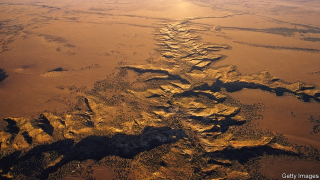

###### Human evolution

# Did cooking in hot springs make humans brainy? 

##### Geothermal springs could help explain how early humans evolved such big brains 

 

> May 25th 2019 

HOW AND WHY, roughly 2m years ago, early human ancestors evolved large brains and began fashioning relatively advanced stone tools, is one of the great mysteries of evolution. Some researchers argue these changes were brought about by the invention of cooking. They point out that our bite weakened around the same time as our larger brains evolved, and that it takes less energy to extract nutrients from cooked food. As a result, once they had mastered the art, early chefs could pare back their digestive systems and invest the resulting energy savings in building larger brains capable of complex thought. There is, however, a problem with the cooking hypothesis. Most archaeologists believe the evidence of controlled fire stretches back no more than 790,000 years. 

Roger Summons of the Massachusetts Institute of Technology has a solution. Together with his team of geomicrobiologists, he analysed 1.7m-year-old sandstones that formed in an ancient river at Olduvai Gorge in Tanzania. The region is famous for the large number of human fossils that have been discovered there, alongside an impressive assembly of stone tools. The sandstones themselves have previously yielded some of the world’s earliest sophisticated Acheulean hand axes: large tear-drop-shaped stone tools that are associated with Homo erectus. Creating an Acheulean axe by repeatedly knocking flakes off of a raw stone in order to create two sharp cutting edges requires a significant amount of planning. Their appearance is therefore thought to mark an important moment in cognitive evolution. 

Trapped inside the Olduvai sandstones, the researchers found distinctive but unusual biological molecules that are often interpreted as biomarkers for heat-tolerant bacteria. Some of these thrive in water between 85 and 95°C. The molecules’ presence suggests that an ancient river within the gorge was once fed by one or more hot springs, fitting nicely with its location within the geologically active East African Rift. The findings are published in a paper posted to the online bioRxiv preprint server. 

Dr Summons and his colleagues say the hot springs would have provided a convenient “pre-fire” means of cooking food. In Rotorua in New Zealand, the Maori have traditionally cooked food in geothermal springs (see picture), either by lowering it into the boiling water or by digging a hole in the hot earth. Similar methods exist in Japan and Iceland, so it is plausible, if difficult to prove, that early humans might have used hot springs to simmer meat and roots. 

Richard Wrangham, a primatologist at Harvard University who devised the cooking hypothesis, is intrigued by the idea. Nonetheless, fire would have offered a distinct advantage to humans, once they had mastered the art of controlling it since, unlike a hot spring, it is a portable resource. 
<<<<<<< HEAD

-- 

 单词注释:

1.geothermal[,dʒi(:)әu'θәmәl]:a. 地温的, 地热的 

2.les[lei]:abbr. 发射脱离系统（Launch Escape System） 

3.extract[ik'strækt]:n. 榨出物, 精汁, 摘录, 选段 vt. (费力地)取出, 采掘, 榨取, 摘录, 吸取 [计] 提取 

4.nutrient['nju:triәnt]:a. 营养的, 滋养的 n. 营养物, 滋养物 

5.pare[pєә]:vt. 剥, 削, 消减 

6.digestive[di'dʒestiv]:a. 消化的, 助消化的 n. 助消化药 

7.hypothesis[hai'pɒθәsis]:n. 假设 [化] 假设 

8.archaeologist[.ɑ:ki'ɒlәdʒist]:n. 考古学家 

9.roger['rɔdʒә]:interj. 对!, 行!, 好! 

10.summon['sʌmәn]:vt. 召唤, 召集, 号召, 振奋, 唤起, 鼓起 [经] 传唤, 传讯 

11.Massachusetts[.mæsә'tʃu:sits]:n. 麻萨诸塞州 

12.sandstone['sændstәun]:n. 沙岩 [化] 砂岩 

13.olduvai[]: [地名] [坦桑尼亚] 奥杜瓦伊 

14.gorge[gɒ:dʒ]:n. 峡谷, 凹槽, 塞饱, 咽喉 vi. 狼吞虎咽 vt. 塞饱, 狼吞虎咽地吃 

15.Tanzania[.tænzә'ni:ә]:n. 坦桑尼亚 

16.fossil['fɒsәl]:n. 化石, 古物 a. 化石的, 陈腐的, 守旧的 

17.sophisticate[sә'fistikeit]:n. 久经世故的人, 精于...之道的人 vt. 篡改, 曲解, 使变得世故, 掺合, 弄复杂 vi. 诡辩 

18.Acheulean[ә'ʃu:liәn]:a. 阿舍利文化的 

19.HOMO['hәumәu]:[化] 最高占据轨道; 最高占据分子轨道; 最高已占分子轨道 [医] 人属 

20.erectus[]:a. 直立的 

21.axe[]:n. 斧, 斧头 vt. 削减(人员、经费、计划、机构等) 

22.flake[fleik]:n. 小薄片, 扁薄的一层, 火星, 晒鱼架子 vt. 使成薄片 vi. 剥落 

23.cognitive['kɒgnitiv]:a. 认知的, 认识的 

24.distinctive[di'stiŋktiv]:a. 有特色的, 出众的 

25.biological[.baiәu'lɒdʒikәl]:a. 生物学的 [医] 生物学的 

26.biomarker['baɪɒmɑ:kər]: 生物标记 

27.gorge[gɒ:dʒ]:n. 峡谷, 凹槽, 塞饱, 咽喉 vi. 狼吞虎咽 vt. 塞饱, 狼吞虎咽地吃 

28.nicely['naisli]:adv. 漂亮地, 谨慎地, 恰好地 

29.geologically[ˌdʒi:ə'lɒdʒɪklɪ]:adv. 从地质上来说 

30.rift[rift]:n. 裂口, 空隙 vi. 裂开 vt. 使分开, 使割开 

31.online[]:[计] 联机 

32.preprint['pri:.print. pri:'print]:vt. 预印 

33.server['sә:vә]:n. 服伺者, 上菜用具, 发球员 n. 服务器 [计] 服务器, 服务器启动程序, 服务台程序 

34.Rotorua[]:n. 罗托鲁瓦（纽西兰北岛著名的地热区） 

35.zealand['zi:lәnd]:n. 西兰岛（丹麦最大的岛） 

36.Maori['mauri]:n. 毛利人, 毛利语 a. 毛利人的, 毛利语的 

37.traditionally[]:adv. 传统上；传说上；习惯上 

38.geothermal[,dʒi(:)әu'θәmәl]:a. 地温的, 地热的 

39.plausible['plɒ:zibl]:a. 貌似真实的, 貌似合理的, 说得煞有其事的 [法] 花言巧语的, 似乎有理的 

40.simmer['simә]:vt. 煨 vi. 炖, 内心充满 n. 即将沸腾的状态, 即将发作 

41.richard['ritʃәd]:n. 理查德（男子名） 

42.wrangham[]: [人名] 兰厄姆 

43.primatologist[]:n. 灵长类动物学家 (primatology的变形) 

44.Harvard['hɑ:vәd]:n. 哈佛大学 

45.intrigue[in'tri:g]:n. 阴谋, 复杂的事 vi. 密谋, 私通 vt. 激起...的兴趣, 用诡计取得 

46.nonetheless[,nʌnðә'les]:conj. 然而, 尽管, 不过 adv. 不过, 仍然, 尽管如此, 然而 
=======
>>>>>>> 50f1fbac684ef65c788c2c3b1cb359dd2a904378

