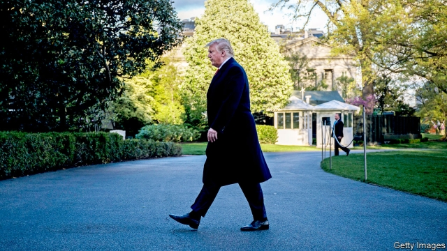

###### Donald Trump’s financial records

# Congress is winning the legal battle against the White House 

##### If the president defies a court order, it’s game on 

 

> May 23rd 2019 

THE BARRICADES are up at the White House, where President Donald Trump has vowed to fight “all the subpoenas” flying from Democrats in the House of Representatives. Early engagements have not gone well for Mr Trump. This week he lost two crucial skirmishes. 

On May 20th a judge in Washington rejected Mr Trump’s request to block a subpoena instructing Mazars USA, his accounting firm, to hand over financial records stretching back to 2011. Two days later a judge in New York thwarted an attempt by Mr Trump, three of his children and the Trump Organisation to stop Deutsche Bank and Capital One from delivering banking records to two House committees. 

In the first case, a committee demanded records after Michael Cohen, Mr Trump’s longtime lawyer, testified in February that his former boss altered the estimated value of his assets and liabilities to suit his needs. These allegations, legislators said, may point to conflicts of interest that “impair his ability to make impartial policy decisions”. They could also provide evidence that Mr Trump has profited from his office, in violation of the constitution’s foreign-emoluments clause. 

The president assured reporters that the ruling was “crazy” and “totally the wrong decision by, obviously, an Obama-appointed judge”. Judge Amit Mehta was indeed appointed by Mr Trump’s predecessor. But his 41-page ruling is a straightforward application of a 90-year-old Supreme Court precedent recognising that Congress’s power to secure “needed information” is “an attribute of the power to legislate”. It is not “fathomable”, Mr Mehta wrote, that the constitution would grant Congress “the power to remove a president for reasons including criminal behaviour” but deny it “the power to investigate him for unlawful conduct”. Both Mr Mehta and Judge Edgardo Ramos, who said the Deutsche Bank suit did not raise “any serious questions”, refused to put their rulings on hold while Mr Trump appeals. 

The cases could eventually go to the Supreme Court, where Mr Trump has installed two justices. But Laurence Tribe, a scholar of constitutional law at Harvard University, cannot imagine the president prevailing there. And if the president defies a court order, the constitutional crisis that some Americans have predicted since 2016 will arrive at last. 
<<<<<<< HEAD

-- 

 单词注释:

1.defy[di'fai]:vt. 藐视, 挑衅, 使落空 n. 挑战 

2.barricade[.bæri'keid]:n. 路障, 障碍 vt. 设路障于, 阻碍 

3.vow[vau]:n. 誓约, 誓言, 许愿 vi. 起誓, 发誓, 郑重宣言 vt. 立誓, 起誓要, 郑重地宣布 

4.subpoena[sәb'pi:nә]:n. 传票 vt. 传审, 传唤 

5.democrat['demәkræt]:n. 民主人士, 民主主义者, 民主党党员 [经] 民主党 

6.engagement[in'geidʒdmәnt]:n. 诺言, 约会, 婚约, 交战 [医] 衔接 

7.skirmish['skә:miʃ]:n. 前哨战, 小争论, 小冲突 vi. 发生小争论, 侦察 

8.Washington['wɒʃiŋtn]:n. 华盛顿 

9.USA[ju: es 'ei]:美国, 美利坚合众国, 美国陆军 

10.york[jɔ:k]:n. 约克郡；约克王朝 

11.thwart[θwɒ:t]:a. 横放的 vt. 反对, 阻挠, 横过 prep. 横过 adv. 横过 

12.organisation[,ɔ: ^әnaizeiʃən; - ni'z-]:n. 组织, 团体, 体制, 编制 

13.deutsche[]:n. 德意志联邦共和国马克 

14.michael['maikl]:n. 迈克尔（男子名） 

15.cohen['kәuin]:科恩（姓氏） 

16.longtime['lɔŋtaim;'lɔ:ŋ-]:a. (已持续)长时间的,为时甚久的 adv. 长久 

17.testify['testifai]:v. 证明, 作证, 声明, 表明 

18.asset['æset]:n. 资产, 有益的东西 

19.liability[laiә'biliti]:n. 责任, 债务, 倾向 [经] 责任, 义务, 负债 

20.allegation[.æli'geiʃәn]:n. 断言, 主张, 申辩 [法] 声明, 事实陈述, 断言 

21.legislator['ledʒisleitә]:n. 立法者, 立法官, 立法委员 [法] 立法者, 立法机关成员, 立法委员 

22.impair[im'pєә]:vt. 损害, 减少, 削弱 [法] 损害, 伤害, 减少 

23.impartial[im'pɑ:ʃәl]:a. 公平的, 不偏不倚的 [法] 公正无私的, 不偏袒的, 公平的 

24.violation[.vaiә'leiʃәn]:n. 违反, 违背, 妨碍 [法] 违犯, 违背, 违反 

25.clause[klɒ:z]:n. 子句, 条款 [计] 子句 

26.amit[]:n. 阿米特（男子名） 

27.Mehta[]:n. 梅塔（人名） 

28.predecessor[.predi'sesә]:n. 前任, 先辈, 前身 [医] 初牙, 前辈, 祖先 

29.precedent['presidәnt]:n. 先例, 前例 a. 在先的, 在前的 

30.legislate['ledʒisleit]:vi. 制定法律 vt. 用立法规定 

31.fathomable['fæðәmәbl]:a. 深度可测明的, 可以了解的 

32.unlawful[.ʌn'lɒ:ful]:a. 非法的, 不正当的 [法] 不法, 不法的, 非法的 

33.edgardo[]:埃德加多（人名） 

34.Ramos[]:n. 拉莫斯（男子名）；蓝魔（数码产品品牌） 

35.ruling['ru:liŋ]:n. 判决, 裁定, 统治 a. 统治的, 支配的, 普遍的 

36.laurence['lɔrәns]:n. 劳伦斯（男子名）；闪烁景 

37.constitutional[.kɒnsti'tju:ʃәnl]:a. 宪法的, 立宪的, 体质的 [医] 全身的; 体质的 

38.Harvard['hɑ:vәd]:n. 哈佛大学 

39.cannot['kænɒt]:aux. 无法, 不能 
=======
>>>>>>> 50f1fbac684ef65c788c2c3b1cb359dd2a904378

