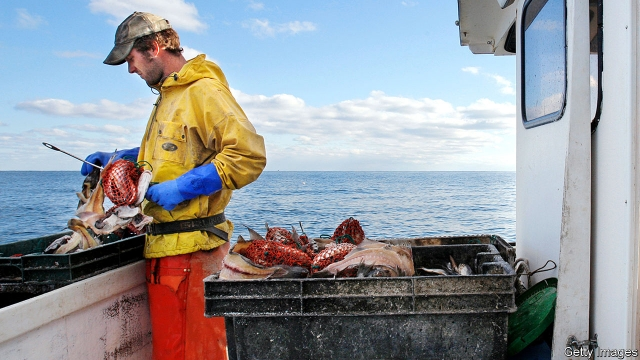

###### The travails of lobstermen

# Maine’s best-known industry is being pinched 

##### Blame tariffs and the endangered right whale 

 

> May 23rd 2019 

CHRIS WELCH has been experimenting for months. Restrictive fishing quotas designed to protect herring, the preferred bait for lobster, have pushed him and other Maine lobstermen to various expediencies—less herring, different bait, different bait bags. Nothing is working well so far. Some lobstermen are stockpiling herring, expecting prices to rise during the summer. 

Last year Maine’s 4,500 lobstermen hauled in 54,000 tonnes of the critters, one of the highest landings in the state’s history. So important is it to Maine’s economy and self-image that the state offers a licence plate depicting the crustacean. Demand remains strong, says John Sackton, an analyst and publisher of Seafood News. Lobster is not just for posh restaurants and New England lobster shacks any more. McDonald’s, a fast-food chain, offers lobster rolls. But this season has been stormy. 

The bait shortage is only one problem. In 2017 the European Union lifted the 8% tariff on Canadian lobster while keeping it for the American kind. Last year China imposed 25% tariffs on American goods including lobster. “We lost 80% of our business in mainline China and saw 50% of EU sales erode,” says Tom Adams of Maine Coast, one of the largest live-lobster shippers. 

Maine’s lobstermen will soon have to rethink how they catch lobsters. For more than 200 years they have used baited traps, also known as pots, to snare lobsters crawling on the ocean floor. Lines connect the traps to buoys on the water surface. Scientists say that these lines have trapped and killed some North Atlantic right whales, an endangered species. Maine must cut the number of lines by 50% to adhere to new federal regulations designed to save the whales. 

How this will be achieved has yet to be determined. One possibility is to insist that many traps are attached to a single line to the surface—something that is easier for big boats to handle. Ropeless options are expensive and time-consuming. A collapsible buoy that could inflate itself using compressed air might work better. Lobstermen have a history of conservation and self-regulation—in 1872 they stopped catching egg-bearing females. Kristan Porter, a lobsterman, is sympathetic to the plight of the right whales, of which there are only 400, “but I’ve never even seen one.” 

Patrice McCarron, founder of the Maine Lobstermen’s Association, an advocacy group, has not witnessed such a tumultuous year in her 20 years in the industry. As for Mr Welch, whose grandfather was a lobsterman and who has been fishing since he was 14, he is not sure that the industry as he knows it will exist for his son. That is often the fisherman’s lament. 
<<<<<<< HEAD

-- 

 单词注释:

1.travail['træveil]:n. 分娩的痛苦, 阵痛, 辛劳 vi. 发生阵痛, 辛劳 

2.lobsterman['lɔbstәmәn]:n. 捕龙虾的渔夫 

3.tariff['tærif]:n. 关税, 关税表, 价格表, 收费表 vt. 课以关税 [计] 价目表 

4.endanger[in'deindʒә]:vt. 危及 [法] 使危险, 危及 

5.chris[kris]:n. 克里斯（男子名）；克莉丝（女子名） 

6.welch[welʃ]:n. 韦尔奇（姓氏） 

7.restrictive[ri'striktiv]:a. 限制的, 约束的, 限定的 n. 限制词 

8.quota['kwәutә]:n. 配额, 限额 [化] 定额 

9.herring['heriŋ]:n. 青鱼, 鲱 

10.bait[beit]:n. 饵 vt. 以饵引诱, 欺负 vi. 中途休息 

11.lobster['lɒbstә]:n. 龙虾 

12.Maine[mein]:n. 缅因州 

13.stockpile['stɒkpail]:n. 储蓄, 积蓄, 库存 vt. 储蓄, 贮存 

14.haul[hɒ:l]:n. 用力拖拉, 拖运, 强拉, 捕获量, 拖运距离 vi. 拖, 拉, 改变方向, 改变主意 vt. 拖拉, 拖运 

15.tonne[tʌn]:n. 吨, 公吨 [经] 吨 

16.critter['kritә]:n. [方][谑]家畜；马；牛；[贬]人 

17.depict[di'pikt]:vt. 描述, 描写 

18.crustacean[krʌ'steiʃjәn]:a. 甲壳纲的 n. 甲壳纲动物 

19.john[dʒɔn]:n. 盥洗室, 厕所, 嫖客 

20.analyst['ænәlist]:n. 分析者, 精神分析学家 [化] 分析员; 化验员 

21.publisher['pʌbliʃә]:n. 出版者, 发行人 [法] 发行人, 出版者, 报刊发行者 

22.seafood['si:fu:d]:n. 海味, 海鲜, 鱼类 

23.lobster['lɒbstә]:n. 龙虾 

24.posh[pɒʃ]:a. 豪华的, 漂亮的, 优雅的, 极好的 interj. 呸 

25.shack[ʃæk]:n. 陋屋, 棚屋 vi. 居住, 暂住 

26.mainline[]:n. 主线, 干线 vt.vi. (美)(非正式)把(毒品)直接注射入静脉 

27.EU[]:[化] 富集铀; 浓缩铀 [医] 铕(63号元素) 

28.erode[i'rәud]:vt. 腐蚀, 侵蚀 vi. 受腐蚀 

29.tom[tɒm]:n. 雄性动物, 雄猫 

30.Adam['ædәm]:n. 亚当 [计] 自动直接存取管理 

31.shipper['ʃipә]:n. 托运人, 发货人 [经] 货主, 运货者, 装货人 

32.rethink[ri:'θiŋk]:v. 再想, 重想 

33.snare[snєә]:n. 陷阱, 诱惑, 圈套 vt. 以陷阱捕获, 诱惑 

34.buoy[bɒi. 'bu:i]:n. 浮标, 航标, 救生圈 vt. 使浮起, 鼓励 

35.specie['spi:ʃi]:n. 硬币 [经] 硬币 

36.ropeless[]:[网络] 无光泽 

37.collapsible[kә'læpsibl]:a. 可折叠的 [建] 可收缩的, 可折叠的 

38.inflate[in'fleit]:vt. 使膨胀, 使得意, 使通货膨胀, 使充气 vi. 充气, 膨胀 

39.kristan[]:n. 【女名】女子名 [网络] 柯蕊丝敦；克里斯坦 

40.plight[plait]:n. 困境, 窘境 vt. 宣誓, 保证 

41.Patrice[pə'tri:s]:n. 帕特里斯（男子名）；特指足球运动员帕特里斯·埃弗拉；特指法国著名导演帕特里斯•夏洛尔 

42.McCarron[]:n. (McCarron)人名；(英)麦卡伦 

43.founder['faundә]:n. 创立者, 建立者 vt. 使沉没, 使摔倒, 弄跛, 浸水, 破坏 vi. 沉没, 摔到, 变跛, 倒塌, 失败 

44.advocacy['ædvәkәsi]:n. 拥护, 支持, 鼓吹, 辩护, 辩护术 [法] 辩护, 拥护, 提倡 

45.tumultuous[tju:'mʌltʃuәs]:a. 吵闹的, 纷乱的, 骚乱的 [法] 喧嚣的, 骚乱的, 凶猛的 

46.welch[welʃ]:n. 韦尔奇（姓氏） 

47.lament[lә'ment]:n. 悲叹, 悔恨, 恸哭, 挽歌, 悼词 vt. 哀悼 vi. 悔恨, 悲叹 
=======
>>>>>>> 50f1fbac684ef65c788c2c3b1cb359dd2a904378

