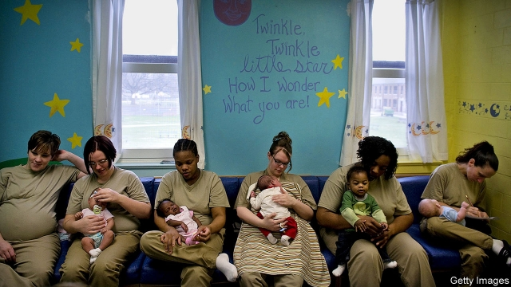

###### Prison childcare

# Why some American states are locking up toddlers 

##### It is probably better than separating mothers and children 

 

> May 23rd 2019 

LIKE MANY people in prison, Ada Lynn listens more than she speaks, spends most of her time with people she knows best and is deeply wary of strangers. In fact, when she sees one she tends to burst into tears—because, unlike most people in prison, she is ten months old. Natalie Myers, Ada Lynn’s 23-year-old mother, was pregnant when she was imprisoned for vehicular homicide. Washington is one of just a few states that offer residential nurseries for women who give birth while behind bars. Ms Myers loves the programme. “This is the best thing that has ever happened to me,” she says. “I always thought I’d never be a functional person because I dug myself into such a hole. But here I’m figuring out who I am with my daughter.” 

Not everyone shares her optimism. Carolyn Sufrin, a professor at Johns Hopkins University, worries about the effects on children’s development. Prison is prison, no matter how prettily the nurseries are decorated. Others believe that the programmes would not survive a court challenge brought on behalf of a baby imprisoned without due process. 

According to the Bureau of Justice, 225,000 women were behind bars in 2017, 99,000 of them in state prisons (jails contain people awaiting trial or serving short sentences, whereas prisons house people convicted of more serious crimes). That is around one-tenth the total number of people incarcerated, but it is nearly ten times as many women as were locked up in 1978. As the number of convicts in America has fallen since 2008, in most states the female prison population has either continued to grow or declined more slowly than the male population. 

According to Dr Sufrin’s study, as of December 2016, 3.8% of newly admitted women prisoners were pregnant. In 1976 the Supreme Court ruled that states must provide health care for prisoners, but what that means in practice varies, particularly for pregnant women. They are sometimes shackled while giving birth—a practice that often continues, according to Amy Fettig, a lawyer with the American Civil Liberties Union, even after states outlaw it. 

New York opened the first prison nursery in 1901; today 11 states have them. Admission rules vary, but in general women convicted of child-related or violent crimes are ineligible, as are women with behavioural or mental-health problems, or with a poor disciplinary record in prison. To be accepted into Washington state’s scheme, women must be pregnant at the time of their imprisonment and have less than 30 months to serve from the time of delivery; mothers and children are released together. 

Prison nurseries seem to be the best of several bad options facing pregnant inmates. Researchers have found that they are associated with lower rates of reoffending, compared with women forced to give up their children, and with fewer behavioural and disciplinary problems than among women in the general prison population. But whether that is because of the programmes, or because women capable of complying with the strictures that prison-nursery programmes impose were heading down the right path anyway, is unclear. That raises another question. “If women meet these conditions, what are they doing in prison?” wonders Dr Sufrin. “I think it’s essential to find ways to maintain family bonds. I just think we need to do it in ways that don’t involve barbed wire.” 

-- 

 单词注释:

1.childcare['tʃaildkεә]:n. 儿童照管；儿童保育 

2.toddler['tɔdlә]:n. 蹒跚行走的人, 学步的小孩, 学步的幼儿, (非正式)信步走的人 

3.ADA['eidә]:[计] 数据自动采集程序, 自动动态分析程序 

4.lynn[lin]:n. 林恩（姓氏） 

5.wary['wєәri]:a. 谨慎的, 小心的, 机警的, 周到的, 唯恐的 

6.natalie['nætәli]:n. 纳塔利（女子名） 

7.myer[]:n. 玛雅（澳大利亚一百货公司名）；迈尔（姓氏） 

8.vehicular[vi'hikjulә]:a. 车的, 作为媒介的, 用车辆运载的 

9.homicide['hɒmisaid]:n. 杀人, 杀人者 [医] 杀人, 杀人者 

10.Washington['wɒʃiŋtn]:n. 华盛顿 

11.residential[.rezi'denʃәl]:a. 住宅的, 与居住有关的 [法] 有关居住的, 房产的:居所的, 适于居住的 

12.alway['ɔ:lwei]:adv. 永远；总是（等于always） 

13.functional['fʌŋkʃәnәl]:a. 功能的 [医] 机能的, 功能的, 官能的 

14.optimism['ɒptimizm]:n. 乐观主义, 乐观, 乐天 [医] 乐观主义, 乐观 

15.carolyn[]:n. 卡洛琳（女子名） 

16.john[dʒɔn]:n. 盥洗室, 厕所, 嫖客 

17.hopkins['hɔpkinz]:n. 霍普金（姓氏） 

18.prettily['pritili]:adv. 悦人地 

19.convict[kәn'vikt]:n. 囚犯, 罪犯 vt. 宣告有罪, 使知罪 

20.incarcerate[in'kɑ:sәreit]:vt. 下狱, 监禁, 禁闭 [法] 监禁, 使下狱, 禁闭 

21.shackle['ʃækl]:n. 桎梏, 束缚物 vt. 加枷锁, 束缚 

22.amy['eimi]:n. 艾米（女子名） 

23.fettig[]: [人名] 费蒂格 

24.outlaw['autlɒ:]:n. 被剥夺法律保护的人, 罪犯 vt. 使...失去法律保护, 将...逐出社会, 宣告非法, 取缔 

25.york[jɔ:k]:n. 约克郡；约克王朝 

26.ineligible[in'elidʒәbl]:a. 无被选任资格的, 不适任的, 无益的 n. 无被选任资格的人, 不合录用资格的人 

27.behavioural[bi'heivjәrәl]:a. 行为的 

28.disciplinary['disiplinәri]:a. 训练的, 纪律的, 训诫的 [法] 纪律的, 惩戒性的 

29.imprisonment[im'priznmәnt]:n. 监禁, 下狱, 坐牢 [法] 监禁, 徒刑, 拘禁 

30.les[lei]:abbr. 发射脱离系统（Launch Escape System） 

31.inmate['inmeit]:n. 同住者, 被收容者 [法] 内部的, 接近中心的, 内在的 

32.reoffend[]: 再犯罪；再犯法 

33.comply[kәm'plai]:vi. 顺从, 依从 [法] 遵守, 承诺, 照做 

34.stricture['striktʃә]:n. 狭窄, 指责, 束缚 [医] 狭窄 

35.unclear[.ʌn'kliә]:a. 不易了解的, 不清楚的, 含混的 

36.barbed[bɑ:bd]:a. 有倒刺的 

