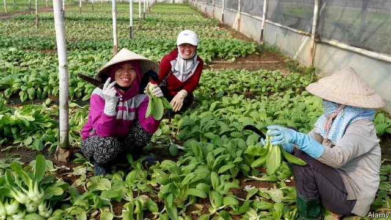
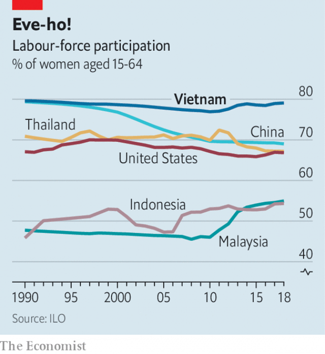

###### More than half the sky

# Vietnam has one of the highest shares of women in work in the world 

 

> print-edition iconPrint edition | Asia | Jun 8th 2019 

DONG THI VINH strides proudly across a patchwork of green fields at her farm just south of Hanoi, Vietnam’s capital. Every now and then she pauses to yank up a weed or prune a pomelo tree. Along with a friend, she started an organic fruit-and-vegetable company seven years ago. Since then, the annual tonnage of produce sold has increased tenfold, partly thanks to contracts the firm has won to supply nearby schools. Women are the financial “pillar of the family”, says Ms Dong. She employs 19 full-time workers, all women. Her daughter has quit a job in the civil service to join the family firm.  

Vietnam has one of the highest female labour-force participation rates (ie, the proportion of women who are in paid work or looking for it) in the world. Some 79% of women aged 15 to 64 are in the labour force, compared with 86% of men. That figure is higher than in all the members of the OECD except Iceland, Sweden and Switzerland, and ten percentage points above China, Vietnam’s northern neighbour (see chart). 

 

Many scholars believe that Vietnam was a largely matriarchal society before a period of Chinese conquest that began in 111 BC. A long history of wars with China, and later France and America, sucked women into the workforce, as more men than women were maimed or killed. In 1960 there were 97 Vietnamese men aged 25 to 54 for every 100 Vietnamese women. By 1975 the war between north and south had reduced that number to 93. Many survivors find it hard to hold down a job. Ms Dong says the war has left her husband with a weak immune system. Even short periods of manual labour trouble him. There are hundreds of others like him in their village. 

Vietnamese-style Confucianism also plays a part. Combined with nationalism fostered by war, it helps to create a feeling that women have a moral duty to make money. Communist ideology reinforces this norm. Government posters exhorting women to work show them wearing hard hats or military uniforms. Supportive government policies help, too. Maternity leave was increased to six months in 2013, high by regional standards. 

The different sexes gravitate towards different types of work. Men tend to take jobs in corporations or organisations that confer status, whereas women tend to be more enterprising. The Global Entrepreneurship Monitor looks at, among other measures, the sex of new business owners across 54 countries. Vietnam had the highest ratio of women to men: 1.14 to 1. This is partly because mothers still do most child care, so they have to work flexible hours. 

Businesses owned by women tend to be informal. Women make up 55% of the self-employed. They typically start a business just to make ends meet. Nguyen Thi Hong chops up and sells chickens for ten hours a day in a sweltering market in Hanoi. Along with her husband, she supports three children, her parents-in-law and her husband’s brother. As she puts it, if she did not work, “How else could we live?” 

Even in the formal sector, work is not always smooth. Misogyny is rife. Many women complain about the glass ceiling, even though young Vietnamese women are now better educated than men. Wives still do the bulk of the housekeeping, too. 

But as the economy shifts from farming to manufacturing, working women are becoming more independent. A recent report from the Mekong Development Research Institute, a think-tank, finds that new roads in the Mekong Delta over the past decade have made it easier for women to work in nearby textile and packaging factories, while their husbands stay at home and tend the family farm. Women in the region now earn more than men, and the balance of power between them and their husbands has shifted. Divorces have become more common and reported rates of domestic violence have fallen. Vietnamese women’s labour may at last be beginning to work for them. ◼ 
<<<<<<< HEAD

-- 

 单词注释:

1.Vietnam[.vjet'næm]:n. 越南 

2.Jun[dʒʌn]:六月 

3.dong[dɔŋ]:n. 盾（越南货币单位） 

4.thi[]:abbr. 温度-湿度指数（Temperature Humidity Index） 

5.vinh[]: [地名] [越南] 荣市 

6.stride[straid]:n. 大步, 步幅, 步态, 进步 v. 迈大步走, 跨过, 跨 

7.proudly['praudli]:adv. 傲慢地, 自大地, 得意洋洋地 

8.patchwork['pætʃwә:k]:n. 拼缝物, 拼凑物 

9.hanoi[hæ'nɔi]:n. 河内（越南首都） 

10.yank[jæŋk]:v. 猛拉 

11.wee[wi:]:a. 很小的, 微小的 n. 一点点 

12.prune[pru:n]:n. 洋李, 李子干, 深紫红色, 傻瓜 vt. 修剪, 砍掉, 删除 vi. 删除, 删节 

13.pomelo['pɒmәlәu]:n. 柚子, 文旦 

14.tonnage['tʌnidʒ]:n. 吨位 [化] 吨位 

15.tenfold['tenfәuld]:a. 十倍的, 十重的 adv. 十倍地, 十重地 

16.dong[dɔŋ]:n. 盾（越南货币单位） 

17.participation[.pɑ:tisi'peiʃәn]:n. 参与, 分享 [经] 参与, 参股 

18.Oecd[]:[经] 已开发国家组织 

19.Sweden['swi:dn]:n. 瑞典 

20.matriarchal['meitriɑ:kl]:a. 女家长的 

21.BC[]:公元前 

22.maim[meim]:vt. 使残废, 使不能工作, 使伤残 [医] 伤残, 残废 

23.vietnamese['vjetnә'mi:z]:n. 越南人；越南语 

24.survivor[sә'vaivә]:n. 生还者, 幸存者 [法] 生还者, 生存者, 辛存者 

25.immune[i'mju:n]:a. 免疫的, 免除的, 不受影响的 n. 免疫者 

26.Confucianism[kәn'fju:ʃjәnizm]:n. 孔子思想, 儒家思想 

27.nationalism['næʃәnәlizm]:n. 民族主义, 民族特性 

28.foster['fɒstә]:a. 收养的, 养育的 vt. 养育, 抚育, 培养, 鼓励, 抱(希望) 

29.ideology[.aidi'ɒlәdʒi]:n. 思想体系, 意识形态, 观念学, 空论 [医] 观念学, 观念形态 

30.norm[nɒ:m]:n. 基准, 模范, 标准, 准则, 平均数 [化] 定额 

31.exhort[ig'zɒ:t]:v. 劝诫, 忠告 

32.supportive[sә'pɔ:tiv]:a. 支撑, 支承, 资助, 赞助, 支援, 经受, 忍受, 扶养, 证实, 鼓励, 维持, 伴奏 

33.maternity[mә'tә:niti]:n. 母性, 怀孕, 妇产科医院 a. 产妇的 

34.regional['ri:dʒәnәl]:a. 地方的, 地域性的 [医] 区的, 部位的 

35.gravitate['græviteit]:vi. 被重力吸引, 沉下, 下降 vt. 使受重力吸引 

36.organisation[,ɔ: ^әnaizeiʃən; - ni'z-]:n. 组织, 团体, 体制, 编制 

37.confer[kәn'fә:]:vt. 授予, 带来 vi. 协商 

38.statu[]:[网络] 状态查看；雕像；特级雪花白 

39.enterprising['entәpraiziŋ]:a. 有魄力的, 有进取心的, 有事业心的 

40.entrepreneurship[,ɑntrəprə'nɝʃɪp]: 企业家能力/职能; 企业家[主办人等]的身份[地位、职权、能力] 

41.informal[in'fɒ:mәl]:a. 非正式的, 不拘礼的, 通俗的 [经] 非正式的, 日常使用的 

42.typically['tipikәli]:adv. 代表性地；作为特色地 

43.nguyen[]:n. 阮（越南姓氏） 

44.thi[]:abbr. 温度-湿度指数（Temperature Humidity Index） 

45.hong[hɔŋ]:n. （中国、日本的）行, 商行 

46.swelter['sweltә]:vi. 闷热, 被暑气所苦, 汗流浃背 vt. 使闷热, 使热得出汗 n. 闷热 

47.sector['sektә]:n. 扇形, 部门, 部分, 函数尺, 象限仪, 段, 区段 vt. 把...分成扇形 [计] 扇面; 扇区; 段; 区段 

48.alway['ɔ:lwei]:adv. 永远；总是（等于always） 

49.misogyny[mai'sɒdʒini]:n. 厌恶女人 [医] 厌女症, 厌恶女人 

50.rife[raif]:a. 流行的, 盛传的, 充满的 

51.housekeeping['hauski:piŋ]:n. 家事, 家政, 持家 [计] 内务处理 

52.manufacturing[.mænju'fæktʃәriŋ]:n. 制造业 a. 制造业的 

53.Mekong['mei'kɒŋ]:n. 湄公河 

54.delta['deltә]:n. 三角洲, 希腊字母的第四个字 [医] δ(希腊文的第四个字母), 丁种, 三角, 三角形区 

55.packaging['pækidʒiŋ]:n. 包装, 包装业, 包装术 [计] 组装; 封装 
=======
>>>>>>> 50f1fbac684ef65c788c2c3b1cb359dd2a904378

