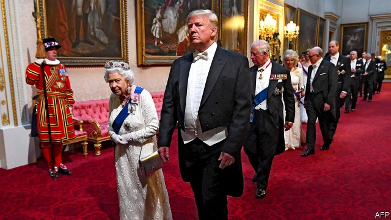

###### The president in the palace

# Donald Trump’s visit to Britain goes well—at least for him 

 

> print-edition iconPrint edition | Britain | Jun 6th 2019 

DONALD TRUMP saw only people cheering, not protests, reports of which the president branded “fake news”. They did not seem so fake on Whitehall. Placards said “Dump Trump”, “Trump: Climate Disaster” and “Keep Trump away from our NHS”. One optimistic poster proposed “Stop Brexit, stop Trump”. Most bizarre was a banner saying “Man Utd fans against apartheid”. The mood was cheerful, even carnival-like—at least until it rained. 

As ever, Labour’s Jeremy Corbyn came out to back the protests. But his disdain was diluted after Mr Trump revealed that he had rejected a meeting request from Mr Corbyn, whom he dubbed a “negative force”. He said the same of Sadiq Khan, London’s mayor, calling him a “stone-cold loser”. This contrasted with his enthusiasm for Brexiteers, singling out Boris Johnson as a great potential successor to Theresa May as prime minister. He also met Nigel Farage, whose new Brexit Party is eating into Tory support, and suggested that he should be one of the Brexit negotiators. 

The president clearly valued hobnobbing with royalty and feasting in Buckingham Palace with the queen (whom he called a “fantastic woman”) more than bilateral discussions with Mrs May. But although he said he would have negotiated Brexit differently, by suing the European Union, he also praised Mrs May’s deal. And he glossed over differences on Huawei, a Chinese telecoms giant mistrusted by America but cautiously accepted in Britain, by saying that the two countries would soon reach an agreement. 

Trade was trickier. Mr Trump promised a “phenomenal” post-Brexit deal that would double or even triple bilateral trade. But he also echoed his ambassador by saying that everything should be on the table. That includes not just farm products but access to the NHS. When most Tory leadership candidates instantly said the health service was not for sale, Mr Trump backtracked. But his own trade negotiating documents make clear that America will look for more NHS contracts and higher drug prices. What’s more, Congress has said it will not ratify any trade deal if Brexit is seen to threaten peace in Northern Ireland. A bilateral deal looks both hard and far off. 

The British managed to get in a few subtle digs of their own, with the queen and Mrs May going out of their way to praise the role of international institutions, which Mr Trump has criticised or in some cases abandoned. The prime minister openly admitted to differences on climate change and Iran, and she used this week’s D-Day commemoration to remind the president of the value of NATO in upholding the global order. Mr Trump’s response was to repeat his demand that NATO allies spend more on defence. 

Besides praising Mr Johnson, with whom he spoke by phone, Mr Trump sought meetings with Jeremy Hunt, the foreign secretary, who he said would make a good prime minister, and with Michael Gove, the environment secretary, whom he claimed not to know. The White House has clearly decided these are the three strongest candidates to succeed Mrs May. It is not obvious that Mr Trump’s support will prove helpful, any more than did Barack Obama’s backing for the Remain campaign in 2016. Yet it could weigh with some Tory party members. Certainly Mr Hunt and Mr Gove seemed pleased. ◼ 

-- 

 单词注释:

1.Jun[dʒʌn]:六月 

2.fake[feik]:n. 假货, 欺骗, 诡计 a. 假的 vt. 假造, 仿造 vi. 伪装 

3.Whitehall['waithɔ:l]:n. 白厅, 英国政府 

4.placard['plækɑ:d]:n. 公告, 布告, 小牌, 海报 vt. 公布, 布告, 张帖, 贴海报于 

5.nh[]:abbr. 不吸湿的（nonhygroscopic）；全日空航空公司；美国地名, 新罕布什尔（New Hampshire） 

6.Brexit[]:[网络] 英国退出欧盟 

7.bizarre[bi'zɑ:]:a. 奇异的 

8.utd[]:abbr. united 联合的, 统一的 

9.apartheid[ә'pɑ:theit]:n. 种族隔离 

10.jeremy['dʒerimi]:n. 杰里米（男子名） 

11.Corbyn[]:科尔宾（人名） 

12.disdain[dis'dein]:n. 蔑视 vt. 蔑视, 鄙弃 

13.dilute[dai'lju:t]:vt. 冲淡, 稀释 a. 淡的, 稀释的 

14.dub[dʌb]:vt. 配音, 轻点, 授予称号, 击 n. 一下击鼓声, 笨蛋 

15.Sadiq[]:n. (Sadiq)人名；(阿拉伯、印)萨迪克 

16.khan[kɑ:n]:n. 可汗, 商队宿店 

17.loser['lu:zә]:n. 失败者, 遗失者 [法] 失败者, 失物者, 遗失者 

18.Brexiteers[]:支持英国退欧的人（Brexiteer的复数） 

19.boris['bɔris]:n. 鲍里斯（男子名） 

20.johnson['dʒɔnsn]:n. 约翰逊（姓氏） 

21.successor[sәk'sesә]:n. 继承者, 接任者 [计] 后继 

22.theresa[ti'ri:zә]:n. 特丽萨（女子名） 

23.nigel['naidʒәl]:n. 奈杰尔（男子名） 

24.farage[]:[网络] 人B淋巴瘤细胞系；法拉格 

25.Tory['tɒ:ri]:n. 托利党党员, 保守党员, 亲英分子 a. 保守分子的 

26.negotiator[ni'gәuʃieitә]:n. 磋商者, 交涉者, 议定者 [经] 谈判者, 交易者, 协商者 

27.hobnob['hɒbnɒb]:vi. 过从甚密, 共饮, 交谈 n. 共饮, 交谈 

28.royalty['rɒiәlti]:n. 皇室, 王族成员, 王权, 特权阶层, 庄严 [经] 特许权, 使用费, 使用税 

29.Buckingham['bʌkiŋәm]:白金汉郡[英国英格兰郡名] 

30.bilateral[bai'lætәrәl]:a. 有两边的, 双边的, 双方的 [医] 两侧的 

31.Mr['mistә(r)]:先生 [计] 存储器回收程序, 多重请求 

32.differently['difrentli]:adv. 差异, 不同, 各别, 各种 

33.sue[su:]:vt. 控告, 起诉, 请求 vi. 提出诉讼, 提出请求 

34.gloss[glɒs]:n. 光彩, 假象, 注释 vt. 使光彩, 掩盖, 上光于, 注释, 曲解 vi. 发光, 作注释 

35.huawei[]: 华为 

36.telecom['telәkɔm]:telecommunication 电信 

37.mistrust[.mis'trʌst]:n. 不信任, 疑惑 v. 不信任, 疑惑 

38.cautiously['kɒ:ʃәsli]:adv. 慎重地 

39.tricky['triki]:a. 狡猾的, 机敏的 

40.phenomenal[fi'nɒminәl]:a. 现象的, 能知觉的, 异常的, 显著的, 惊人的 

41.triple['tripl]:n. 三倍数, 三个一组 a. 三倍的 vt. 使增至三倍 vi. 增至三倍 

42.backtrack['bæktræk]:vi. 返回, 退走, 撤退, 放弃 [化] 回溯 

43.ratify['rætifai]:vt. 批准, 认可 [经] 证实, 肯定, 确认 

44.subtle['sʌtl]:a. 敏锐的, 精细的, 狡猾的, 稀薄的, 灵巧的, 微妙的 [医] 锐敏的; 精细的 

45.criticise['kritisaiz]:v. 批评, 吹毛求疵, 非难 

46.openly['әjpәnli]:adv. 公开地, 坦率地, 直率地, 公然地 

47.Iran[i'rɑ:n]:n. 伊朗 

48.commemoration[kә.memә'reiʃәn]:n. 纪念, 纪念物, 庆典 

49.NATO['neitәj]:北大西洋公约组织, 北约组织 [经] 北大西洋公约组织 

50.uphold[ʌp'hәuld]:vt. 支撑, 赞成, 鼓励, 举起, 坚持 [法] 确认, 赞成, 支持 

51.ally['ælai. ә'lai]:n. 同盟者, 同盟国, 助手 vt. 使联盟, 使联合, 使有关系 vi. 结盟 

52.michael['maikl]:n. 迈克尔（男子名） 

53.gove[]: [人名] 戈夫; [地名] [澳大利亚、美国] 戈夫 

54.barack[bɑ:'ræk]:n. 巴拉克（男子名） 

