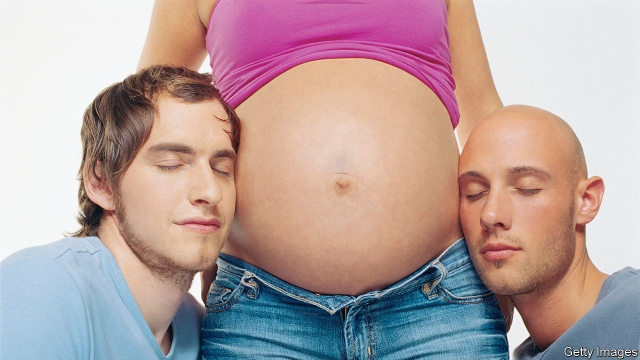

###### Pro-creation

# New proposals to regulate Britain’s surrogacy boom 

 

> print-edition iconPrint edition | Britain | Jun 6th 2019 

KATIE TAYLOR loathes being pregnant. “Morning sickness is horrible,” groans the 34-year-old. “Heartburn is horrible. Sleeping is an absolute nightmare.” Funny, then, that she keeps on having babies. After giving birth to three of her own, she became a surrogate to four more. She is now carrying a fifth. “We’ve only got 11 weeks to go,” she says, “then my part will be over.” 

The baby will be one of a tiny but growing number born by surrogacy in Britain, where the practice is legal so long as nobody profits. Until the late 2000s only a few dozen such children were registered in England and Wales each year. By 2016, a recent peak, the number had risen to 400, following a rise in demand driven partly by gay men. Yet the law has failed to keep pace. On June 6th the Law Commission, which helps Parliament tidy up its legislation, published proposals to change it. 

Its most radical suggestion is the introduction of pre-conception agreements. At the moment, a birth certificate lists the surrogate as the baby’s mother. Legal parenthood cannot be transferred for at least six weeks, and then only by court order. In the meantime, there is a risk that the surrogate might try to keep the child, or that the proposed parents might drop out. Nurses are sometimes unsure who should take the baby home. In one case, says Ms Taylor, an infant had to be handed over in a hospital car park. Under the new agreements, the child’s future parents would take over at birth, though the surrogate would retain the right to object for a few weeks. 

Such agreements might stem the flow of British couples choosing surrogates from countries where the prospective parents’ rights are clearer. Ukraine is popular, as are some American states. In a survey by Cambridge University, two-thirds of those who considered surrogacy at home before going abroad rejected Britain because of its lack of legal framework. “They go somewhere like California because they know where they stand,” says Andrew Powell, a barrister who specialises in surrogacy. 

But the report dodges the question of whether the law should allow commercial surrogacy. Many existing surrogates favour keeping it altruistic. Ms Taylor is motivated by a desire to help those who might otherwise struggle to conceive. She had her own children after four rounds of in vitro fertilisation and likes to help others in a similar predicament. “The specialness would go out of it” if she were paid, she says. “It’d be just another job.” Others are squeamish about a process they liken to selling babies. 

Yet some argue this already happens by default. Courts grant rights to parents who paid for commercial surrogacy abroad. In Britain, surrogates are entitled to “reasonable expenses”, an ill-defined category that can stretch to recuperative holidays. Payments of £15,000 ($19,000) are typical. “If it’s in the child’s best interests to live with the intended parents, it’s hard to imagine a sum of money that would make a judge think the child should be taken into care,” says Emily Jackson of the London School of Economics. Relaxing the law would make payments more transparent and might encourage more surrogates to come forward. 

As teenagers, Matthias Nijs and his partner Janno thought their sexuality meant they would never be able to raise a family. Now they are preparing for Ms Taylor to hand them their baby. “We are 29 weeks,” says Mr Nijs, beaming. Nappies, clothes and toys are heaped in a pile in their living room. A sign in the kitchen proclaims the due date. But Ms Taylor is always happy to remind them of the hard work ahead. “I say, ‘Your child kept me awake from 12 until three last night,’” she chuckles. “‘I hope that when your child comes out, she gives you enough crap too.’” ◼ 
<<<<<<< HEAD

-- 

 单词注释:

1.surrogacy[ˈsʌrəgəsi]:n. 代孕 

2.Jun[dʒʌn]:六月 

3.katie['keiti]:n. 卡蒂（女子名, 等于Kate） 

4.taylor['teilә]:n. 泰勒 

5.loathe[lәuð]:vt. 厌恶, 憎恶 

6.heartburn['hɑ:tbә:n]:n. 胃灼热, 心痛, 妒忌 [医] 胃灼热 

7.nightmare['naitmєә]:n. 梦魇, 恶梦, 可怕的事物(或情景、人物) [医] 梦魇, 恶梦 

8.surrogate['sʌrәgit]:n. 替代者, 代用品 vt. 代理, 替代 

9.wale[weil]:n. 隆起的伤痕, 鞭痕, 凸条纹, 精华, 选择 vt. 在...上留下鞭痕, 织成棱纹, 挑选, 撑住 vi. 挑选 

10.parenthood['perәnthud]:n. 父母身分 

11.cannot['kænɒt]:aux. 无法, 不能 

12.unsure[.ʌn'ʃuә]:a. 不肯定的, 不确定的, 没有自信的 

13.taylor['teilә]:n. 泰勒 

14.prospective[prәs'pektiv]:a. 预期的, 将来的 [经] 预期的, 未来的 

15.ukraine[ju(:)'krein]:n. 乌克兰（原苏联一加盟共和国, 现已独立） 

16.Cambridge['keimbridʒ]:n. 剑桥 

17.California[.kæli'fɒ:njә]:n. 加利福尼亚 

18.andrew['ændru:]:n. 安德鲁（男子名） 

19.powell['pәuәl, 'pauәl]:n. 鲍威尔（英国物理学家） 

20.barrister['bæristә]:n. 出庭律师, 律师 [法] 律师, 专门律师, 大律师 

21.specialise['speʃә,laiz]:vt. 特加指明, 列举, 使专门化, 限定...的范围 vt.vi. (使)特化, (使)专化 vi. 成为专家, 专务, 专攻, 专门研究, 逐条详述 

22.dodge[dɒdʒ]:v. 避开, 躲避 n. 诡计, 躲藏 

23.altruistic[.æltru'istik]:a. 利他的, 无私心的 

24.conceive[kәn'si:v]:vt. 构思, 认为 vi. 怀孕 

25.vitro[]:n. 在试管内 

26.fertilisation[,f\\:tilai'zeiʃən;-li'z-]:n. <主英>=fertilization 

27.predicament[pri'dikәmәnt]:n. 处境, 穷境, 困局 

28.specialness[]:n. 特殊, 专门 

29.squeamish['skwi:miʃ]:a. 过于拘谨的, 神经质的, 易呕吐的 

30.liken['laikәn]:vt. 比喻, 比拟 

31.default[di'fɒ:lt]:n. 违约, 不履行责任, 缺席, 默认值 v. 疏怠职责, 缺席, 拖欠, 默认 [计] 默认; 默认值; 缺省值 

32.recuperative[ri'kju:pәreitiv]:a. 恢复的, 有恢复力的 [医] 复原的, 恢复的 

33.emily['emәli]:n. 埃米莉（女子名） 

34.jackson['dʒæksn]:n. 杰克逊（男子名）；杰克逊（美国密西西比州的城市） 

35.Matthias[mә'θaiәs]:n. [宗]马提亚(耶稣受洗时所得诸使徒之一) 

36.nij[]:abbr. National Institute of Justice 全国司法学会 

37.sexuality[.sekʃu'æliti]:n. 性征, 性行为, 性欲 [医] 性别, 性欲 

38.nappy['næpi]:n. 尿布, 菜盆 a. 起毛的, 多毛的, 酒精含量高的 

39.alway['ɔ:lwei]:adv. 永远；总是（等于always） 

40.chuckle['tʃʌkl]:n. 咯咯的笑声, 轻笑 vi. 咯咯的笑, 咕咕叫 

41.crap[kræp]:n. 废物, 废话 vi. 掷骰子 
=======
>>>>>>> 50f1fbac684ef65c788c2c3b1cb359dd2a904378

